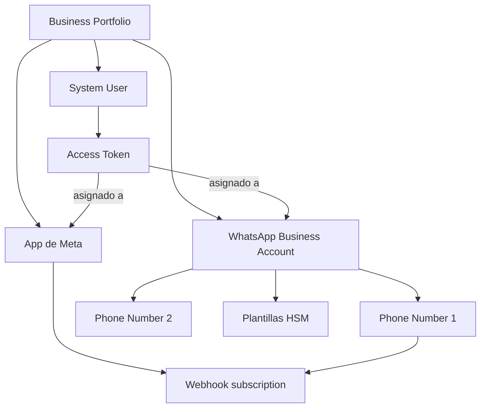

# Arquitectura y roles

> **TL;DR:** Cinco capas anidadas: **Business Portfolio → WABA → Phone Number → App → Token**. Cada una con un identificador propio que vas a usar en los endpoints. Cuatro roles: **Meta** (provee), **integrador** (construye), **BSP** (revende, opcional), **cliente final** (dueño del negocio).

## Contexto

Antes de tocar un solo endpoint hay que tener el mapa mental claro. La Cloud API tiene una jerarquía estricta donde cada recurso vive dentro de otro. Si te falta un permiso en una capa intermedia, el endpoint final tira 401 / 403 sin explicación útil. Este documento es ese mapa.

## Jerarquía de recursos



## Capa por capa

### 1. Business Portfolio (Business Manager)

| Atributo | Detalle |
|---|---|
| Qué es | Contenedor de máximo nivel para activos comerciales de una empresa en Meta |
| Identificador | `business_id` |
| Cuántos | Una empresa puede tener varios (legacy: uno por marca, mercado, etc.) |
| Verificación | Requiere documentación comercial; sin esto, varias features quedan limitadas |
| Acceso | URL: `https://business.facebook.com/settings` |

Contiene: Apps, WABAs, Páginas de Facebook, cuentas publicitarias, catálogos de Commerce, datasets de eventos, System Users.

### 2. WhatsApp Business Account (WABA)

| Atributo | Detalle |
|---|---|
| Qué es | Cuenta lógica donde viven los números de WhatsApp y sus plantillas |
| Identificador | `waba_id` (alias: `whatsapp_business_account_id`) |
| Cuántas por Portfolio | Múltiples, sin límite estricto |
| Independientes entre sí | Cada WABA tiene sus propias plantillas, números, configuración |

Es el "scope" donde se aprueban las plantillas y se administra la calidad.

### 3. Phone Number

| Atributo | Detalle |
|---|---|
| Qué es | Un número de teléfono concreto conectado a una WABA |
| Identificador | `phone_number_id` (numérico largo, NO el número en E.164) |
| Cuántos por WABA | Varios (multi-número soportado) |
| Display | `display_phone_number` muestra el número en formato humano |
| Estado | `quality_rating`, `messaging_limit_tier`, `name_status` |

Casi todos los endpoints de envío usan `phone_number_id`:

```
POST /v21.0/{{PHONE_NUMBER_ID}}/messages
```

### 4. App de Meta

| Atributo | Detalle |
|---|---|
| Qué es | Aplicación registrada en Meta Developers que actúa como cliente OAuth |
| Identificador | `app_id` + `app_secret` |
| Para qué | Suscribir webhooks, generar tokens (en flujos OAuth), App Review |
| Cuántas por Portfolio | Varias, pero típicamente una por integración |

Si solo vas a operar con un cliente y System User propio, una sola App alcanza.

### 5. System User y tokens

| Atributo | Detalle |
|---|---|
| System User | Usuario no humano que genera tokens permanentes server-to-server |
| Identificador | `system_user_id` |
| Tipos de token | Temporales (user token, ~60min), permanentes (system user token) |
| Scopes típicos | `whatsapp_business_messaging`, `whatsapp_business_management`, `business_management` |

Producción: siempre System User token. Ver [`01-onboarding-meta/system-users-tokens.md`](../01-onboarding-meta/system-users-tokens.md).

## Cómo se relacionan los identificadores en una request

Ejemplo concreto enviando un mensaje:

```bash
curl -X POST \
  "https://graph.facebook.com/v21.0/{{PHONE_NUMBER_ID}}/messages" \
  -H "Authorization: Bearer {{ACCESS_TOKEN}}" \
  -H "Content-Type: application/json" \
  -d '{ "messaging_product": "whatsapp", "to": "...", ... }'
```

| Elemento de la request | Capa de origen |
|---|---|
| `{{PHONE_NUMBER_ID}}` | Phone Number, dentro de la WABA |
| `Authorization: Bearer ...` | Token del System User asociado al Portfolio que contiene la WABA |
| Endpoint Graph API | App registrada en Developers (la API key vive en su contexto) |

Si cualquiera de esas piezas pertenece a otro Portfolio, falla con 401/403.

## Roles humanos / organizacionales

| Rol | Responsabilidad | Ejemplo |
|---|---|---|
| **Meta** | Proveedor de la plataforma, define políticas y precios | — |
| **Cliente final** | Dueño legal del Portfolio y del número | "La óptica de la calle X" |
| **Integrador** | Construye la solución sobre la API | "Nuestra consultora" |
| **BSP** (opcional) | Provee acceso a Cloud API y servicios encima, oficial | 360dialog, Twilio, Gupshup |
| **SaaS partner** (opcional) | Vende producto chiquito sobre WA (CRM, omnichannel) | Kommo, Respond.io |
| **Usuario final** | Persona que conversa por WhatsApp con el negocio | — |

### Quién es dueño de qué

Punto importante en contratos:

| Activo | Dueño recomendado |
|---|---|
| Business Portfolio | Cliente final |
| WABA | Cliente final |
| Phone Number | Cliente final |
| App de Meta | Integrador (si es proyecto chico) o cliente (si quiere portabilidad) |
| System User | Dentro del Portfolio del cliente, **administrado por el integrador** |

Si el integrador es dueño del Portfolio del cliente, hay riesgo de lock-in: cuando termine la relación, mover el número a otro proveedor se vuelve un dolor. **Recomendación: el cliente siempre es dueño del Portfolio y del número.**

## Tres patrones de despliegue típicos

### Patrón A: Un integrador, un cliente

- Portfolio del cliente.
- App de Meta del integrador (o del cliente).
- System User dentro del Portfolio del cliente.
- Webhook apunta a la infraestructura del integrador.

Para 1-5 clientes con onboardings manuales.

### Patrón B: Embedded Signup (multi-cliente)

- App de Meta del integrador (con permisos de WhatsApp Business Management).
- Cada cliente entra al flujo embebido y autoriza al integrador.
- El integrador almacena tokens por cliente.

Para escalar a decenas o cientos de clientes. Ver [`01-onboarding-meta/embedded-signup.md`](../01-onboarding-meta/embedded-signup.md).

### Patrón C: BSP

- El BSP es el dueño técnico del acceso a Cloud API.
- El cliente sigue siendo dueño del Portfolio y del número, pero opera vía la plataforma del BSP.
- El integrador construye encima del BSP.

Conviene si querés servicios extras (soporte premium, mensajería con extras, billing consolidado) o si Meta no opera directo en tu mercado.

## Errores comunes

| Error | Causa | Solución |
|---|---|---|
| `401` con token aparentemente válido | Token de un Portfolio distinto al del recurso | Verificar `business_id` del token vs el del recurso |
| `Permissions error` al crear plantilla | Falta scope `whatsapp_business_management` | Re-generar token con scopes correctos |
| Webhook no llega | Suscripción está en la App pero no en la WABA | Subscribir la WABA a la App vía API |
| No puedo agregar un segundo número a la WABA | Verificación pendiente o limit del Portfolio | Completar verificación y/o usar otra WABA |
| El cliente quiere irse y no puede llevarse el número | Portfolio a nombre del integrador | (Prevención) Crear Portfolio a nombre del cliente desde el día 1 |

## Referencias

- [Cloud API Overview](https://developers.facebook.com/docs/whatsapp/cloud-api/overview) — Verificado 2026-05-20.
- [Business Manager · Help](https://www.facebook.com/business/help) — Verificado 2026-05-20.
- [`01-onboarding-meta/`](../01-onboarding-meta/) — pasos prácticos para crear cada capa.
