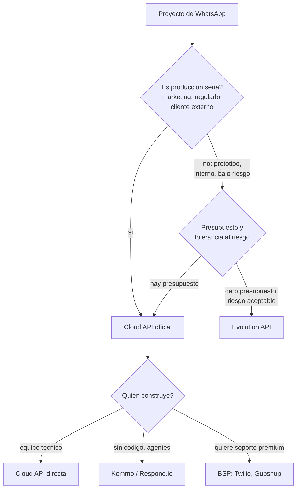

# Cloud API vs alternativas

> **TL;DR:** Para un proyecto serio: Cloud API oficial (directa, BSP, o vía SaaS como Kommo/Respond.io). Para prototipos o casos internos de bajo riesgo: Evolution API u otras soluciones no oficiales, asumiendo el riesgo de ban. Este documento es la decisión de alto nivel; el detalle operativo está en [`03-formas-de-uso/comparativa.md`](../03-formas-de-uso/comparativa.md).

## Contexto

Antes de elegir BSP vs SaaS vs Evolution, hay una decisión más fundamental: **oficial o no oficial**. De ahí se desprende todo lo demás.

## El eje principal: oficial vs no oficial

## Oficial (Cloud API)

Cualquier camino que use la Cloud API de Meta:

| Camino | Quién opera |
|---|---|
| Directa | El integrador, con su propia App |
| Vía BSP | Un Business Solution Provider |
| Vía SaaS partner | Kommo, Respond.io, HubSpot, etc. |

| Característica | Detalle |
|---|---|
| HSM reales | Sí |
| Quality rating + tiers | Sí |
| Riesgo de ban | Nulo (cumpliendo políticas) |
| Costo | Conversaciones según pricing + (fees si hay intermediario) |
| Soporte | Docs + comunidad (directa) o el partner |
| Apto para producción | Sí |

## No oficial (Evolution API y similares)

Soluciones basadas en Baileys / whatsapp-web.js que se conectan como un cliente de WhatsApp Web.

| Característica | Detalle |
|---|---|
| HSM reales | No (texto plano simulado) |
| Quality rating + tiers | No |
| Riesgo de ban | Alto |
| Costo | Solo hosting |
| Soporte | Comunidad |
| Apto para producción seria | No |

## Tabla de decisión rápida

| Situación | Recomendación |
|---|---|
| Cliente externo que paga por el servicio | Cloud API oficial |
| Marketing / campañas | Cloud API oficial |
| Industria regulada (salud, finanzas) | Cloud API oficial |
| El número es la cara del negocio | Cloud API oficial |
| Prototipo para validar una idea | Evolution API |
| Bot interno para empleados | Evolution API |
| Cero presupuesto, riesgo asumido por el dueño | Evolution API |
| Migración futura prevista a oficial | Empezar en Evolution, diseñar portable |

## Dentro de lo oficial: directa vs BSP vs SaaS

| Opción | Cuándo |
|---|---|
| **Cloud API directa** | Tenés equipo técnico, querés costo mínimo y control total |
| **BSP** (Twilio, Gupshup) | Querés soporte premium, billing consolidado, o Meta no opera directo en tu mercado |
| **SaaS partner** (Kommo, Respond.io) | Querés UI de agentes lista, cero desarrollo, time-to-market |

Detalle de cada uno:

- [`03-formas-de-uso/cloud-api-oficial.md`](../03-formas-de-uso/cloud-api-oficial.md)
- [`03-formas-de-uso/kommo-crm.md`](../03-formas-de-uso/kommo-crm.md)
- [`03-formas-de-uso/respond-io.md`](../03-formas-de-uso/respond-io.md)
- BSPs: [`03-formas-de-uso/bsps/`](../03-formas-de-uso/bsps/)

## Por qué Evolution aparece tanto en esta wiki

Aunque no es oficial, Evolution API está muy extendida en LATAM porque:

- Onboarding sin fricción (sin verificación de Meta).
- Costo casi nulo.
- Buena para prototipar y para casos internos.

La wiki la cubre con honestidad: útil dentro de su nicho, peligrosa fuera de él. Ver [`03-formas-de-uso/evolution-api.md`](../03-formas-de-uso/evolution-api.md) para el análisis completo de riesgos.

## El costo real de elegir mal

| Error de decisión | Consecuencia |
|---|---|
| Evolution para marketing masivo | Ban del número en horas/días |
| Evolution para un cliente que paga | Reclamos, pérdida de reputación |
| Cloud API directa sin equipo técnico | Proyecto trabado, no se entrega |
| BSP cuando alcanzaba directa | Pagás fees innecesarios |
| SaaS cuando el cliente quería control | Lock-in y costo recurrente no deseado |

## Camino de migración

Un patrón común y sano:

1. **Prototipo en Evolution** para validar la idea rápido y barato.
2. Si valida, **migrar a Cloud API oficial** para producción.
3. Diseñar el prototipo **portable** desde el inicio (lógica en n8n, transporte abstraído) para que la migración sea cambiar el transporte, no reescribir todo.

Ver [`10-troubleshooting/evolution-desconexion.md`](../10-troubleshooting/evolution-desconexion.md) para las señales de "es hora de migrar".

## Errores comunes

| Error | Causa | Solución |
|---|---|---|
| Quedarse en Evolution "porque funciona" | Inercia | Migrar antes de que un ban corte la operación |
| Elegir BSP sin necesitarlo | Desconocimiento | Evaluar Cloud API directa primero |
| Prototipo no portable | No se abstrajo el transporte | Diseñar con la migración en mente |
| Vender Evolution como si fuera oficial | Mala práctica comercial | Ser transparente con el cliente sobre el riesgo |

## Referencias

- [`03-formas-de-uso/comparativa.md`](../03-formas-de-uso/comparativa.md) — tabla operativa detallada.
- [`00-fundamentos/que-es-wa-business-platform.md`](./que-es-wa-business-platform.md)
- [`03-formas-de-uso/evolution-api.md`](../03-formas-de-uso/evolution-api.md)
- [Cloud API · Meta](https://developers.facebook.com/docs/whatsapp/cloud-api) — Verificado 2026-05-20.
