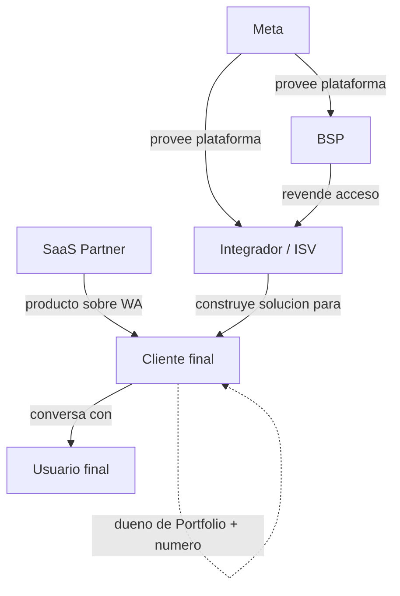

# Roles en el ecosistema WhatsApp Business

> **TL;DR:** Seis roles: **Meta** (provee la plataforma), **cliente final** (dueño del negocio y del número), **integrador / ISV** (construye la solución), **BSP** (revende acceso oficial con servicios), **SaaS partner** (producto sobre WA: CRM, omnicanal), **usuario final** (la persona que conversa). Clave contractual: el cliente final debe ser dueño de su Portfolio y número, siempre.

## Contexto

Cuando aparece un problema ("el número no envía", "perdimos el acceso"), la primera pregunta es: ¿quién es dueño de qué? Tener claros los roles evita conflictos contractuales y dependencias peligrosas.

## Los seis roles

### 1. Meta

| Aspecto | Detalle |
|---|---|
| Qué hace | Provee la WhatsApp Business Platform, define políticas y pricing |
| Relación | Es la autoridad: aprueba plantillas, verifica negocios, banea |
| No hace | Soporte hands-on para cuentas chicas; construir tu solución |

### 2. Cliente final

| Aspecto | Detalle |
|---|---|
| Qué es | La empresa que vende un producto/servicio y quiere usar WhatsApp |
| Debe ser dueño de | Business Portfolio, WABA, número de teléfono |
| Ejemplo | "La clínica", "el e-commerce", "la inmobiliaria" |

### 3. Integrador / ISV

| Aspecto | Detalle |
|---|---|
| Qué hace | Construye la solución técnica sobre la API |
| Puede ser | Una consultora, un freelancer, un equipo interno |
| Administra | App de Meta, System Users, infraestructura, workflows |
| ISV | Independent Software Vendor: integrador que vende un producto a varios clientes |

### 4. BSP (Business Solution Provider)

| Aspecto | Detalle |
|---|---|
| Qué hace | Revende acceso oficial a la Cloud API con servicios añadidos |
| Ejemplos | Twilio, Gupshup, Infobip, MessageBird |
| Aporta | Soporte premium, billing consolidado, a veces features extra |
| Cuándo aparece | Cuando el integrador o el cliente prefiere un intermediario oficial |

### 5. SaaS Partner

| Aspecto | Detalle |
|---|---|
| Qué hace | Vende un producto terminado sobre WhatsApp (CRM, omnicanal) |
| Ejemplos | Kommo, Respond.io, HubSpot |
| Aporta | UI lista, sin desarrollo |
| Diferencia con BSP | El BSP da acceso a la API "cruda"; el SaaS da un producto completo |

### 6. Usuario final

| Aspecto | Detalle |
|---|---|
| Qué es | La persona que conversa por WhatsApp con el negocio |
| Su rol | Inicia conversaciones, da opt-in, puede bloquear/reportar |
| Poder | Su comportamiento determina el quality rating |

## Tech Provider y Solution Partner

Dentro del rol de integrador/BSP, Meta usa designaciones específicas:

| Designación | Significado |
|---|---|
| **Tech Provider** | Empresa que provee tecnología sobre la Cloud API; puede ofrecer Embedded Signup |
| **Solution Partner** | Partner con un rol más amplio, puede manejar billing de clientes |

Para un integrador que onboardea muchos clientes con Embedded Signup, configurarse como Tech Provider es el camino. Ver [`01-onboarding-meta/embedded-signup.md`](../01-onboarding-meta/embedded-signup.md).

## Quién es dueño de qué

La tabla más importante de este documento:

| Activo | Dueño recomendado | Por qué |
|---|---|---|
| Business Portfolio | **Cliente final** | Portabilidad, control, el cliente no queda atrapado |
| WABA | **Cliente final** | Idem |
| Número de teléfono | **Cliente final** | Es su número, su marca |
| App de Meta | Integrador (proyecto chico) o cliente | Según preferencia de portabilidad |
| System User | Dentro del Portfolio del cliente, administrado por el integrador | Control operativo sin lock-in |
| Infraestructura (n8n, DB, servidores) | Integrador | Es la solución técnica |
| Workflows / código | Según contrato | Definir explícitamente |

## El anti-patrón del lock-in

**Mal:** el integrador crea el Business Portfolio a su propio nombre y mete al cliente adentro.

Consecuencia: cuando la relación termina, el cliente no puede llevarse su número fácilmente. Genera conflicto, mala reputación, y a veces es irreversible sin soporte de Meta.

**Bien:** el cliente crea (o es dueño de) su Portfolio desde el día 1. El integrador entra como administrador/empleado. Si la relación termina, el cliente revoca el acceso y sigue operando con otro proveedor.

Ver [`01-onboarding-meta/business-portfolio.md`](../01-onboarding-meta/business-portfolio.md).

## Flujos de responsabilidad típicos

### Proyecto chico (integrador + 1 cliente)

| Responsabilidad | Quién |
|---|---|
| Crear Portfolio | Cliente (asistido por el integrador) |
| Verificación comercial | Cliente aporta docs, integrador gestiona |
| App, System User, webhooks | Integrador |
| Infraestructura | Integrador |
| Contenido de plantillas | Cliente define, integrador implementa |
| Operación de agentes | Cliente |

### ISV multi-cliente (Embedded Signup)

| Responsabilidad | Quién |
|---|---|
| App de Meta + Tech Provider | ISV |
| Cada Portfolio/WABA | Cada cliente |
| Onboarding | Embedded Signup, automático |
| Tokens por cliente | ISV los almacena |
| Infraestructura multi-tenant | ISV |

### Con BSP

| Responsabilidad | Quién |
|---|---|
| Acceso a la Cloud API | BSP |
| Portfolio/número | Cliente |
| Solución sobre el BSP | Integrador |
| Soporte de plataforma | BSP |

## Cláusulas contractuales recomendadas

Para el integrador, dejar por escrito:

| Cláusula | Por qué |
|---|---|
| El cliente es dueño del Portfolio y número | Evita disputas |
| Declaración de cumplimiento de políticas por el cliente | Protege al integrador si el cliente viola Commerce/Business Policy |
| Declaración de opt-in válido de la base | Idem |
| Propiedad de los workflows / código | Definir si quedan para el cliente o el integrador |
| Qué pasa al terminar la relación | Traspaso ordenado de accesos |
| Responsabilidad sobre costos de Meta | Quién paga las conversaciones |

## Errores comunes

| Error | Consecuencia | Prevención |
|---|---|---|
| Portfolio a nombre del integrador | Lock-in del cliente | Cliente dueño desde el día 1 |
| No definir propiedad de los workflows | Disputa al terminar | Cláusula explícita |
| Cliente sin admin de su Portfolio | Pierde acceso si el integrador desaparece | Cliente siempre admin |
| Asumir que el BSP es dueño del número | Confusión | El número es del cliente aunque opere vía BSP |
| Compartir credenciales personales | Riesgo de seguridad | System Users con roles |

## Referencias

- [Cloud API Overview](https://developers.facebook.com/docs/whatsapp/cloud-api/overview) — Verificado 2026-05-20.
- [`00-fundamentos/arquitectura.md`](./arquitectura.md)
- [`01-onboarding-meta/business-portfolio.md`](../01-onboarding-meta/business-portfolio.md)
- [`01-onboarding-meta/embedded-signup.md`](../01-onboarding-meta/embedded-signup.md)
