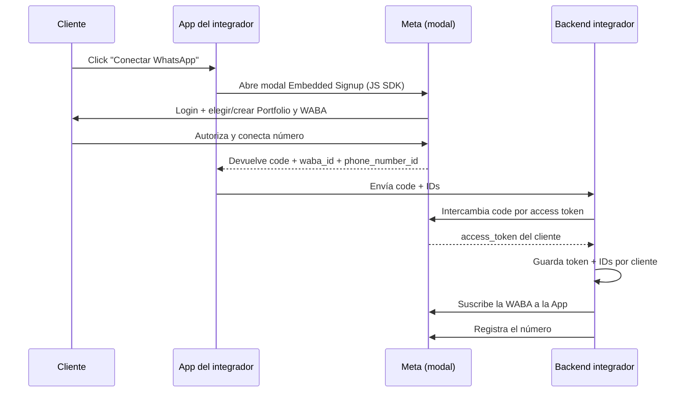

# Embedded Signup

> **TL;DR:** Embedded Signup es el flujo de onboarding embebido de Meta para que un integrador (Tech Provider / ISV) conecte la WABA de un cliente **sin que el cliente salga de la app del integrador**. El cliente cliquea un botón, autoriza en un modal de Meta, y el integrador recibe los IDs y un token. Es la vía para escalar a decenas o cientos de clientes; el onboarding manual no escala.

## Contexto

Conectar un cliente a mano (crear Portfolio, App, WABA, System User, token) lleva una hora y conocimiento que el cliente no tiene. Para 2-3 clientes está bien. Para 50, necesitás Embedded Signup: el cliente hace clic, autoriza, y listo.

## Onboarding manual vs Embedded Signup

| Aspecto | Manual | Embedded Signup |
|---|---|---|
| Esfuerzo por cliente | ~1 hora | ~5 minutos del cliente |
| Conocimiento técnico del cliente | Alto | Ninguno |
| Escala | 1-10 clientes | Decenas / cientos |
| Quién maneja los tokens | Manual | Programático, por cliente |
| Requisitos previos | Bajos | App Review, ser Tech Provider |
| Cuándo usarlo | Pocos clientes, proyecto único | Producto SaaS multi-cliente |

## Requisitos para ofrecer Embedded Signup

| Requisito | Detalle |
|---|---|
| App de Meta del integrador | Con producto WhatsApp + Facebook Login |
| Configuración como Tech Provider / Solution Partner | Según el rol en el ecosistema de Meta |
| App Review | Meta revisa la App antes de habilitar producción |
| Permisos avanzados | `whatsapp_business_management`, `whatsapp_business_messaging`, `business_management` |
| Verificación del negocio del integrador | El Portfolio del integrador verificado |
| Endpoint de OAuth | Para intercambiar el código por token |

## Cómo funciona el flujo



## Pasos de implementación

### 1. Integrar el JS SDK de Facebook

En tu frontend, cargar el SDK y configurar el botón:

```html
<script async defer src="https://connect.facebook.net/en_US/sdk.js"></script>
<script>
  window.fbAsyncInit = function () {
    FB.init({
      appId: '{{APP_ID}}',
      autoLogAppEvents: true,
      xfbml: true,
      version: 'v21.0'
    });
  };
</script>
```

### 2. Lanzar el flujo

```javascript
function launchWhatsAppSignup() {
  FB.login(function (response) {
    if (response.authResponse) {
      const code = response.authResponse.code;
      // Enviar el code al backend
      fetch('/api/wa/onboard', {
        method: 'POST',
        headers: { 'Content-Type': 'application/json' },
        body: JSON.stringify({ code })
      });
    }
  }, {
    config_id: '{{CONFIG_ID}}',       // configuración de Embedded Signup
    response_type: 'code',
    override_default_response_type: true,
    extras: {
      setup: {},
      featureType: '',
      sessionInfoVersion: '3'
    }
  });
}
```

Además, escuchar el `message` event para capturar `waba_id` y `phone_number_id`:

```javascript
window.addEventListener('message', (event) => {
  if (event.origin !== 'https://www.facebook.com') return;
  try {
    const data = JSON.parse(event.data);
    if (data.type === 'WA_EMBEDDED_SIGNUP') {
      // data.data.waba_id, data.data.phone_number_id
    }
  } catch (e) { /* no es JSON */ }
});
```

### 3. Intercambiar el code por token (backend)

```bash
curl -X GET \
  "https://graph.facebook.com/v21.0/oauth/access_token?client_id={{APP_ID}}&client_secret={{APP_SECRET}}&code={{CODE}}"
```

Respuesta:

```json
{
  "access_token": "{{TOKEN_DEL_CLIENTE}}",
  "token_type": "bearer"
}
```

Este token es **business-scoped** sobre la WABA del cliente.

### 4. Suscribir la WABA a tu App

```bash
curl -X POST \
  "https://graph.facebook.com/v21.0/{{WABA_ID}}/subscribed_apps" \
  -H "Authorization: Bearer {{TOKEN_DEL_CLIENTE}}"
```

### 5. Registrar el número

```bash
curl -X POST \
  "https://graph.facebook.com/v21.0/{{PHONE_NUMBER_ID}}/register" \
  -H "Authorization: Bearer {{TOKEN_DEL_CLIENTE}}" \
  -H "Content-Type: application/json" \
  -d '{ "messaging_product": "whatsapp", "pin": "{{PIN_6_DIGITOS}}" }'
```

El `pin` es un PIN de 2FA de 6 dígitos que el integrador define para el número.

### 6. Guardar todo por cliente

```sql
CREATE TABLE wa_clients (
  id UUID PRIMARY KEY DEFAULT gen_random_uuid(),
  client_name TEXT,
  business_id TEXT,
  waba_id TEXT NOT NULL,
  phone_number_id TEXT NOT NULL,
  access_token TEXT NOT NULL,           -- mejor: referencia a un vault
  display_phone_number TEXT,
  status TEXT DEFAULT 'active',         -- active | revoked
  onboarded_at TIMESTAMPTZ DEFAULT now()
);
```

A partir de acá, cada mensaje que llega por webhook trae `phone_number_id`; con eso resolvés qué cliente es y qué token usar.

## Tokens en Embedded Signup

| Tipo | Detalle |
|---|---|
| Token del intercambio OAuth | Business-scoped, larga duración |
| System User token | Alternativa: crear un System User en el Portfolio del cliente (más control) |

Para producción robusta, muchos integradores tras el Embedded Signup crean un System User token. Otros usan directo el token del OAuth. Ambos válidos; el System User da más control sobre revocación.

## Multi-cliente: resolución de tenant

```javascript
// En el webhook handler
const phoneNumberId = body.entry[0].changes[0].value.metadata.phone_number_id;
const client = await db.wa_clients.findOne({ phone_number_id: phoneNumberId, status: 'active' });
if (!client) {
  // webhook de un cliente desconocido o revocado
  return;
}
const token = await vault.get(client.id);
// usar token y client.waba_id para esta request
```

## Manejo de revocación

El cliente puede revocar el acceso desde su Business Settings. Cuando pasa:

| Síntoma | Detalle |
|---|---|
| Requests con `190.463` | Token invalidado |
| Webhooks dejan de llegar | WABA desuscrita |

Acción:

1. Marcar `status='revoked'` en `wa_clients`.
2. Dejar de intentar enviar.
3. Notificar al cliente que debe re-conectar (re-correr Embedded Signup).

No hay forma de recuperar el token: el cliente tiene que volver a pasar por el flujo.

## App Review

Para usar Embedded Signup en producción (con clientes reales, no de test), la App necesita pasar App Review por los permisos de WhatsApp Business. Meta pide:

- Demostración del flujo (screencast).
- Descripción del caso de uso.
- Política de privacidad publicada.
- A veces, llamada / revisión adicional.

Hasta aprobar el Review, Embedded Signup funciona solo con cuentas con rol en la App (developers, testers).

## Ventajas

| Ventaja | Detalle |
|---|---|
| Onboarding en minutos | El cliente no necesita saber nada técnico |
| Escala | Decenas/cientos de clientes |
| Tokens programáticos | Sin copiar/pegar manual |
| Experiencia de marca | Todo dentro de tu app |

## Desventajas / costos

| Aspecto | Detalle |
|---|---|
| App Review | Proceso que lleva tiempo |
| Complejidad de implementación | OAuth, manejo de tokens multi-cliente, vault |
| Mantenimiento | Manejar revocaciones, re-onboarding |
| Requiere ser Tech Provider | Configuración previa con Meta |

## Cuándo NO usar Embedded Signup

| Caso | Mejor |
|---|---|
| 1-3 clientes, proyecto único | Onboarding manual |
| Cliente quiere control total de su Portfolio/App | Manual, cliente crea todo |
| No tenés capacidad para App Review + vault de tokens | Manual o BSP |

## Errores comunes

| Error | Causa | Solución |
|---|---|---|
| Modal no abre | `config_id` o `appId` mal | Verificar configuración de Embedded Signup |
| Code expira antes de intercambiarlo | Demora del backend | Intercambiar el code de inmediato |
| No recibo `waba_id` / `phone_number_id` | No escuchás el `message` event | Implementar el listener |
| Funciona con tu cuenta, falla con clientes | App Review pendiente | Completar App Review |
| Webhooks de un cliente no llegan | Falta `subscribed_apps` para esa WABA | Suscribir tras el onboarding |
| Número no envía | Falta `register` con PIN | Registrar el número post-signup |

## Referencias

- [Embedded Signup · Meta](https://developers.facebook.com/docs/whatsapp/embedded-signup) — Verificado 2026-05-20.
- [Solution Partner / Tech Provider](https://developers.facebook.com/docs/whatsapp/embedded-signup/steps) — Verificado 2026-05-20.
- [`01-onboarding-meta/business-portfolio.md`](./business-portfolio.md)
- [`01-onboarding-meta/system-users-tokens.md`](./system-users-tokens.md)
