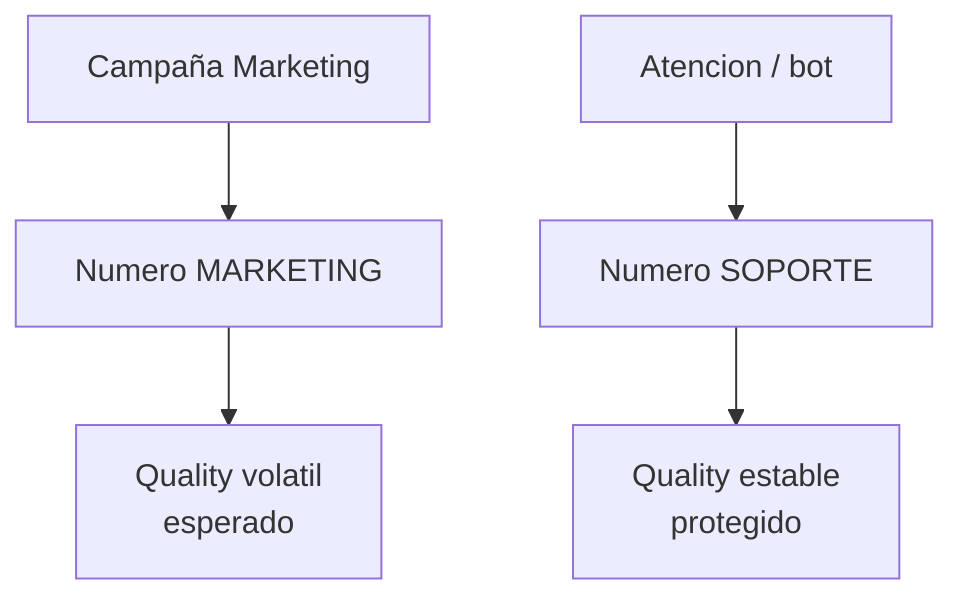

# Multi-número en una WABA

> **TL;DR:** Una WABA puede tener varios números. Comparten las **plantillas** (a nivel WABA) pero cada uno tiene su propio **display name, quality rating y tier**. Todos envían webhooks al mismo endpoint: se distinguen por `phone_number_id`. Útil para separar marketing/soporte, multi-país o multi-marca.

## Contexto

Casi cualquier operación que crece necesita más de un número: para no mezclar la calidad de marketing con la de soporte, para tener un número local por país, o para servir a varios clientes. Saber qué se comparte y qué no evita sorpresas.

## Qué se comparte y qué no

| Elemento | Nivel | ¿Compartido entre números de la WABA? |
|---|---|---|
| Plantillas (HSM) | WABA | **Sí** — se crean una vez, sirven para todos |
| Display name | Número | No — cada uno el suyo |
| Quality rating | Número | No — independiente |
| Messaging tier | Número | No — independiente |
| Webhooks | App / WABA | Sí — un endpoint para todos |
| Business verification | Portfolio | Sí |
| Pricing | Por conversación / país | Aplica por número según destino |

Implicancia clave: **una plantilla aprobada en la WABA la pueden usar todos los números**. No hay que aprobar la misma plantilla N veces.

## Cuándo usar multi-número

| Caso | Por qué |
|---|---|
| Separar marketing de soporte | Marketing tiene calidad volátil; aislarla protege el número de soporte |
| Multi-país | Un número local (+54, +52, +55) por mercado mejora confianza |
| Multi-marca bajo una empresa | Cada marca con su número y display name |
| Multi-cliente (un integrador, varios clientes) | Un número por cliente |
| Superar capacidad de un tier | Repartir volumen entre números |
| Redundancia | Un número de backup si uno cae en calidad |

## Cuándo NO hace falta

| Caso | Mejor |
|---|---|
| Operación chica con un solo flujo | Un número alcanza |
| Marketing y soporte de bajo volumen | Un número, segmentar por lógica |

Cada número agrega gestión (display name, monitoreo de calidad): no multiplicar sin razón.

## Multi-número vs multi-WABA

| Necesidad | Solución |
|---|---|
| Varios números de la misma empresa, plantillas compartidas | Multi-número en una WABA |
| Entidades legales distintas | WABAs (o Portfolios) distintas |
| Aislamiento total de plantillas y calidad | WABAs distintas |
| Multi-cliente con Embedded Signup | Una WABA por cliente |

## Cómo agregar un número

WABA → Phone numbers → Add phone number → verificar (ver [`requisitos-numero.md`](./requisitos-numero.md)).

Cada número agregado obtiene su propio `phone_number_id`.

## Routing en el webhook

Todos los números de la WABA mandan eventos al **mismo** endpoint. Distinguir por `phone_number_id`:

```javascript
const phoneNumberId = body.entry[0].changes[0].value.metadata.phone_number_id;
```

### Tabla de routing

```sql
CREATE TABLE wa_numbers (
  phone_number_id TEXT PRIMARY KEY,
  display_phone_number TEXT,
  purpose TEXT,                          -- marketing | soporte | ventas | cliente_x
  tenant_id TEXT,
  country TEXT,
  active BOOLEAN DEFAULT true
);
```

En el handler:

```javascript
const number = await db.wa_numbers.findOne({ phone_number_id: phoneNumberId });
// number.purpose, number.tenant_id -> enrutar al flujo correcto
```

## Patrón: marketing aislado de soporte



Si el número de marketing cae en calidad por una campaña, el de soporte sigue intacto. El cliente nunca se queda sin canal de atención.

| Número | Uso | Display name |
|---|---|---|
| Marketing | Campañas, promociones | `Ofertas Acme` o el principal |
| Soporte | Atención, transaccional | `Atención Acme` |

Trade-off: el usuario ve dos números distintos. Para algunos negocios eso es aceptable; para otros conviene un solo número y asumir el riesgo.

## Patrón: multi-país

| Número | País | Display name |
|---|---|---|
| +54 9 11 ... | Argentina | `Acme Argentina` |
| +52 1 55 ... | México | `Acme México` |
| +55 11 ... | Brasil | `Acme Brasil` |

Routing por `phone_number_id` → idioma, contexto local, equipo de agentes correspondiente.

## Patrón: multi-cliente (integrador)

Si un integrador maneja varios clientes, dos enfoques:

| Enfoque | Detalle |
|---|---|
| WABA por cliente | Aislamiento total; recomendado con Embedded Signup |
| Multi-número en una WABA del integrador | Solo si los clientes aceptan compartir WABA; raro, no recomendado |

Para multi-cliente serio: **una WABA (y Portfolio) por cliente**. Ver [`01-onboarding-meta/embedded-signup.md`](../01-onboarding-meta/embedded-signup.md).

## Envío: elegir el número correcto

Al enviar, el `phone_number_id` en la URL define qué número emite:

```
POST /v21.0/{{PHONE_NUMBER_ID}}/messages
```

El sistema debe resolver qué número usar según el propósito:

```javascript
function resolveSenderNumber(purpose, country) {
  // marketing -> numero de marketing
  // soporte/transaccional -> numero de soporte
  // por pais -> numero local
  return db.wa_numbers.findOne({ purpose, country, active: true });
}
```

**Consistencia:** responder a un usuario siempre desde el mismo número con el que se inició la conversación. Cambiar de número a mitad confunde.

## Distribución de carga entre números

Si usás varios números para superar límites de tier:

| Estrategia | Detalle |
|---|---|
| Hash del número del usuario | `usuario % N` → siempre el mismo número para el mismo usuario (consistencia) |
| Round-robin | Reparte parejo, pero un usuario puede recibir de números distintos |

Preferir **hash consistente**: el usuario siempre ve el mismo número.

## Quality y tier por número

Cada número escala su tier de forma independiente. Un número nuevo agregado a una WABA madura **igual arranca en tier bajo** y hay que calentarlo. Ver [`tiers-mensajeria.md`](./tiers-mensajeria.md).

Monitorear quality **por número**, no agregado:

```bash
curl -X GET \
  "https://graph.facebook.com/v21.0/{{WABA_ID}}/phone_numbers?fields=display_phone_number,quality_rating,messaging_limit_tier" \
  -H "Authorization: Bearer {{ACCESS_TOKEN}}"
```

## Errores comunes

| Error | Causa | Solución |
|---|---|---|
| Webhooks de varios números se mezclan | No se filtra por `phone_number_id` | Tabla de routing |
| Respondés a un usuario desde otro número | Sin lógica de consistencia | Guardar `phone_number_id` por conversación |
| Número nuevo no envía volumen | Arranca en tier bajo | Calentarlo |
| Plantilla "no existe" en un número | Confusión: las plantillas son de la WABA | Verificar la WABA, no el número |
| Marketing quema el número de soporte | Un solo número para todo | Separar números |
| Display name de un número aplicado a otro | Son independientes | Configurar cada uno |

## Referencias

- [Cloud API Overview](https://developers.facebook.com/docs/whatsapp/cloud-api/overview) — Verificado 2026-05-20.
- [`02-numeros-y-conexion/requisitos-numero.md`](./requisitos-numero.md)
- [`02-numeros-y-conexion/tiers-mensajeria.md`](./tiers-mensajeria.md)
- [`07-integraciones/n8n/patrones.md`](../07-integraciones/n8n/patrones.md)
