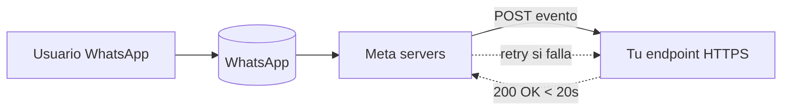
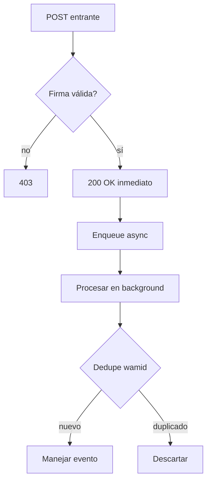

# Webhooks de Cloud API

> **TL;DR:** Meta envía eventos a tu endpoint HTTPS público vía POST con `application/json`. Hay que: 1) responder un GET de verificación con `hub.challenge`, 2) validar la firma `X-Hub-Signature-256`, 3) responder 200 en < 20s, 4) suscribir la WABA a la App. Retries hasta 7 días con backoff.

## Contexto

Sin webhooks no llegan mensajes entrantes ni eventos de estado. Configurarlos correctamente es el primer paso de cualquier integración. Errores acá son la causa #1 de tickets "el bot no responde".

## Arquitectura



## Setup paso a paso

### 1. Crear endpoint HTTPS público

Requisitos:

| Requisito | Detalle |
|---|---|
| HTTPS válido | Certificado público (Let's Encrypt, Cloudflare, etc.) |
| Acepta GET y POST en la misma URL | GET = verificación inicial; POST = eventos |
| Timeout de respuesta | < 20s (idealmente < 3s, procesar async) |
| IP / firewall | Permitir IPs de Meta o no filtrar por IP |
| Body limit | Aceptar hasta ~1 MB (mensajes con media base64 son grandes) |

Ejemplos de URLs típicas:

- n8n: `https://n8n.midominio.com/webhook/wa-incoming`
- Express: `https://api.midominio.com/wa/webhook`
- Cloud Function: `https://region-project.cloudfunctions.net/wa-webhook`

### 2. Responder al GET de verificación

Cuando configurás la URL en Meta, primero te llega un GET:

```
GET /webhook?hub.mode=subscribe&hub.verify_token={{VERIFY_TOKEN}}&hub.challenge=1234567890
```

Tenés que devolver **exactamente** el valor de `hub.challenge` como texto plano (status 200) si el `hub.verify_token` coincide con el que configuraste.

Ejemplo (n8n Webhook trigger en modo "Response: First Entry JSON"):

```javascript
// Code node previo al response
const mode = $input.first().json.query?.['hub.mode'];
const token = $input.first().json.query?.['hub.verify_token'];
const challenge = $input.first().json.query?.['hub.challenge'];

if (mode === 'subscribe' && token === $env.WA_VERIFY_TOKEN) {
  return [{ json: { challenge }, headers: { 'Content-Type': 'text/plain' } }];
}
return [{ json: { error: 'forbidden' }, statusCode: 403 }];
```

| Placeholder | Descripción |
|---|---|
| `VERIFY_TOKEN` | String arbitrario que vos elegís. Debe coincidir con el que ponés en Meta. |

### 3. Suscribir la WABA a la App

Tener la App con webhook configurado **no alcanza**. Hay que suscribir la WABA específicamente:

```bash
curl -X POST \
  "https://graph.facebook.com/v21.0/{{WABA_ID}}/subscribed_apps" \
  -H "Authorization: Bearer {{ACCESS_TOKEN}}"
```

Verificar suscripciones activas:

```bash
curl -X GET \
  "https://graph.facebook.com/v21.0/{{WABA_ID}}/subscribed_apps" \
  -H "Authorization: Bearer {{ACCESS_TOKEN}}"
```

### 4. Suscribir los campos (fields) que querés recibir

En el panel de la App → Webhooks → WhatsApp Business Account:

| Field | Cuándo se dispara | Importancia |
|---|---|---|
| `messages` | Mensajes entrantes y status (sent/delivered/read/failed) | Crítica |
| `message_template_status_update` | Plantilla aprobada/rechazada/pausada | Alta |
| `phone_number_quality_update` | Cambio de quality rating | Alta |
| `account_update` | Cambios en la cuenta (verificación, restricciones) | Media |
| `phone_number_name_update` | Display name aprobado o rechazado | Media |
| `template_category_update` | Meta re-categoriza una plantilla | Media |
| `business_capability_update` | Cambios de tier u otras capabilities | Media |

Para producción suscribir mínimo: `messages`, `message_template_status_update`, `phone_number_quality_update`.

## Payload de un mensaje entrante

Forma típica de `messages` (texto):

```json
{
  "object": "whatsapp_business_account",
  "entry": [{
    "id": "{{WABA_ID}}",
    "changes": [{
      "field": "messages",
      "value": {
        "messaging_product": "whatsapp",
        "metadata": {
          "display_phone_number": "5491100000000",
          "phone_number_id": "{{PHONE_NUMBER_ID}}"
        },
        "contacts": [{
          "profile": { "name": "Juan Pérez" },
          "wa_id": "5491133334444"
        }],
        "messages": [{
          "from": "5491133334444",
          "id": "wamid.HBgL...",
          "timestamp": "1716200000",
          "type": "text",
          "text": { "body": "Hola, quería consultar..." }
        }]
      }
    }]
  }]
}
```

Campos a leer siempre:

| Campo | Para qué |
|---|---|
| `entry[0].id` | `waba_id` de la cuenta que recibió |
| `value.metadata.phone_number_id` | Número de tu lado que recibió (multi-número) |
| `value.messages[0].id` | `wamid.*` único, **usar para deduplicación** |
| `value.messages[0].from` | E.164 sin `+` del usuario |
| `value.messages[0].timestamp` | Unix seconds |
| `value.messages[0].type` | `text`, `image`, `audio`, `interactive`, `button`, etc. |

Ver más payloads en [`examples/webhooks/`](../examples/) (pendiente).

## Validación de firma

Meta firma cada POST con HMAC-SHA256 usando el `App Secret`:

| Header | Valor |
|---|---|
| `X-Hub-Signature-256` | `sha256={{HEX}}` |

Validar en el receptor:

```javascript
const crypto = require('crypto');

function isValid(rawBody, signatureHeader, appSecret) {
  if (!signatureHeader?.startsWith('sha256=')) return false;
  const expected = crypto
    .createHmac('sha256', appSecret)
    .update(rawBody, 'utf8')
    .digest('hex');
  const received = signatureHeader.slice('sha256='.length);
  return crypto.timingSafeEqual(
    Buffer.from(expected, 'hex'),
    Buffer.from(received, 'hex')
  );
}
```

| Detalle crítico | |
|---|---|
| Usar **raw body** | No `JSON.parse` y stringify de nuevo, cambia la firma |
| `App Secret`, no el token | El secret se ve una sola vez en la App de Meta |
| Comparación segura | `timingSafeEqual` para evitar timing attacks |

En n8n se hace en un Code node después del Webhook trigger, antes de cualquier procesamiento.

## Retries y entrega

| Aspecto | Comportamiento |
|---|---|
| Retry trigger | Tu endpoint no responde, responde no-200, o tarda > 20s |
| Backoff | Exponencial |
| Duración total | Hasta 7 días |
| Orden | **No garantizado**: usar `timestamp` y `id` para reordenar |
| Duplicados | Posibles: deduplicar con `wamid` en Redis o DB |

## Estados de mensajes salientes (statuses)

El mismo evento `messages` trae `value.statuses[]` para mensajes que vos enviaste:

```json
"statuses": [{
  "id": "wamid.HBgL...",
  "recipient_id": "5491133334444",
  "status": "delivered",
  "timestamp": "1716200005",
  "conversation": {
    "id": "abc...",
    "origin": { "type": "service" }
  },
  "pricing": {
    "billable": true,
    "pricing_model": "CBP",
    "category": "service"
  }
}]
```

| `status` | Significado |
|---|---|
| `sent` | Meta aceptó el mensaje |
| `delivered` | Entregado al dispositivo del usuario |
| `read` | Leído (si el usuario tiene confirmaciones activadas) |
| `failed` | Falló; revisar `errors[]` |
| `deleted` | Mensaje eliminado |

`failed` viene con `errors[].code` que mapeás contra [`10-troubleshooting/codigos-error.md`](../10-troubleshooting/codigos-error.md).

## Patrón de procesamiento recomendado



**Reglas:**

1. Responder 200 **antes** de procesar para no chocar con timeout.
2. Encolar el procesamiento (queue de n8n, BullMQ, SQS, etc.).
3. Deduplicar por `wamid`.
4. Reordenar por `timestamp` si el orden importa.

## Configuración multi-número

Si una WABA tiene varios números, **todos** envían eventos al mismo webhook. Diferenciar en el handler con `value.metadata.phone_number_id`:

```javascript
const phoneNumberId = body.entry[0].changes[0].value.metadata.phone_number_id;
const tenant = TENANTS_BY_PHONE_NUMBER_ID[phoneNumberId];
```

## Errores comunes

| Error | Causa | Solución |
|---|---|---|
| GET de verificación falla con 403 | `verify_token` mal escrito o env no propagada | Revisar variable, redeployar |
| Webhook configurado pero no llega nada | WABA no suscrita a la App | `POST /{{WABA_ID}}/subscribed_apps` |
| Llega el primer mensaje y nada más | Suscribiste solo a la App, no a la WABA | Idem anterior |
| Webhook llega duplicado | Sin dedup por `wamid` | Implementar `SETNX wamid 1 EX 86400` en Redis |
| Firma siempre inválida | Estás validando contra el body parseado, no el raw | Capturar raw body antes del JSON parser |
| n8n responde tarde y Meta reintenta | Procesamiento sync largo | Responder 200 y encolar |
| Media (imágenes/audio) llegan sin URL accesible | Necesitás llamar al endpoint `/{media-id}` con token | Implementar download flow |
| Mensaje "leído" no se reporta | El usuario tiene read receipts apagados | No hay solución, comportamiento de WhatsApp |

## Referencias

- [Webhooks · Cloud API](https://developers.facebook.com/docs/whatsapp/cloud-api/webhooks) — Verificado 2026-05-20.
- [Webhooks Getting Started · Graph API](https://developers.facebook.com/docs/graph-api/webhooks/getting-started) — Verificado 2026-05-20.
- [Webhooks Payload Examples · Cloud API](https://developers.facebook.com/docs/whatsapp/cloud-api/webhooks/payload-examples) — Verificado 2026-05-20.
- [`10-troubleshooting/webhooks-no-llegan.md`](../10-troubleshooting/webhooks-no-llegan.md)
- [`07-integraciones/n8n/webhook-entrante.md`](../07-integraciones/n8n/webhook-entrante.md)
