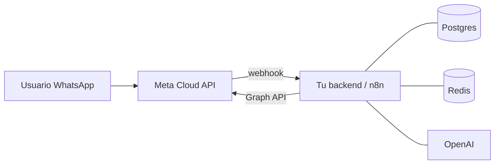

# Cloud API oficial directa

> **TL;DR:** Conectarse directo a la Cloud API de Meta, sin BSP ni SaaS intermediario. Máximo control, mínimo costo de fees, requiere equipo técnico. Es el default recomendado para integradores con capacidad de desarrollo. Endpoints REST sobre Graph API, webhooks propios, plantillas y calidad gestionadas por uno mismo.

## Contexto

"Directa" significa que el integrador crea su propia App de Meta y opera la Cloud API sin un Business Solution Provider de por medio. Es la vía más barata y flexible, a cambio de que vos te hacés cargo de toda la infraestructura y el conocimiento.

## Cuándo elegirla

| Elegir Cloud API directa si... | Evitarla si... |
|---|---|
| Tenés equipo técnico (o sos el integrador) | El cliente quiere "todo llave en mano sin código" |
| Querés control total del stack | Necesitás UI lista para agentes ya |
| El costo importa (sin fees de BSP) | Querés soporte premium con SLA |
| Vas a automatizar fuerte (n8n, IA) | Tu mercado no tiene Cloud API directa de Meta |
| Querés portabilidad y cero lock-in | El cliente exige facturación consolidada por un tercero |

## Qué necesitás

| Requisito | Detalle |
|---|---|
| Business Portfolio del cliente | Ver [`01-onboarding-meta/business-portfolio.md`](../01-onboarding-meta/business-portfolio.md) |
| App de Meta con producto WhatsApp | Creada en developers.facebook.com |
| WABA + número conectado | |
| System User + token permanente | Ver [`01-onboarding-meta/system-users-tokens.md`](../01-onboarding-meta/system-users-tokens.md) |
| Endpoint HTTPS para webhooks | Ver [`02-numeros-y-conexion/webhooks.md`](../02-numeros-y-conexion/webhooks.md) |
| Método de pago en Meta | Para conversaciones billable |

## La API en una página

### Base

```
https://graph.facebook.com/v21.0/{{RECURSO}}
```

Versión: usar la más reciente estable (`v21.0` o superior). Las versiones se deprecan; pinear y actualizar planificadamente.

### Operaciones principales

| Operación | Método + Path |
|---|---|
| Enviar mensaje | `POST /{{PHONE_NUMBER_ID}}/messages` |
| Subir media | `POST /{{PHONE_NUMBER_ID}}/media` |
| Descargar media | `GET /{{MEDIA_ID}}` → URL → GET |
| Marcar leído | `POST /{{PHONE_NUMBER_ID}}/messages` con `status: read` |
| Crear plantilla | `POST /{{WABA_ID}}/message_templates` |
| Listar plantillas | `GET /{{WABA_ID}}/message_templates` |
| Datos del número | `GET /{{PHONE_NUMBER_ID}}?fields=...` |
| Suscribir webhook WABA | `POST /{{WABA_ID}}/subscribed_apps` |
| Registrar número | `POST /{{PHONE_NUMBER_ID}}/register` |

### Enviar un texto (hola mundo)

```bash
curl -X POST \
  "https://graph.facebook.com/v21.0/{{PHONE_NUMBER_ID}}/messages" \
  -H "Authorization: Bearer {{ACCESS_TOKEN}}" \
  -H "Content-Type: application/json" \
  -d '{
    "messaging_product": "whatsapp",
    "to": "{{DESTINATION_E164}}",
    "type": "text",
    "text": { "body": "Hola desde Cloud API" }
  }'
```

## Arquitectura típica de una integración directa



El integrador es responsable de: backend/orquestador, base de datos, manejo de webhooks, retries, dedup, lógica de negocio.

## Costos

| Concepto | Costo |
|---|---|
| Acceso a la API | $0 (no hay fee de plataforma) |
| Conversaciones | Según pricing por categoría y país. Ver [`06-politicas-y-calidad/pricing.md`](../06-politicas-y-calidad/pricing.md) |
| Infraestructura propia | Hosting del backend / n8n / DB |
| Sin fees de BSP | Es la ventaja económica principal |

## Ventajas

| Ventaja | Detalle |
|---|---|
| Costo | Sin markup de intermediarios |
| Control | Todo el stack es tuyo |
| Flexibilidad | Cualquier feature de la API disponible apenas Meta la libera |
| Portabilidad | Cero lock-in con un proveedor |
| Datos | Todo pasa por tu infraestructura |

## Desventajas

| Desventaja | Mitigación |
|---|---|
| Requiere desarrollo | Usar n8n para bajar la barrera |
| Sin UI de agentes | Construir o integrar Kommo/Respond.io encima |
| Soporte: solo docs + comunidad | Documentar bien internamente |
| Vos manejás la complejidad (webhooks, retries, dedup) | Seguir los patrones de esta wiki |
| Cambios de la API impactan directo | Suscribir changelog de Meta, pinear versiones |

## Directo + capa de UI

Una combinación frecuente: Cloud API directa **como transporte** y un CRM/SaaS solo para la UI de agentes:

| Componente | Rol |
|---|---|
| Cloud API directa | Transporte, plantillas, calidad |
| n8n | Orquestación y automatización |
| OpenAI | IA conversacional |
| Kommo / panel propio | UI para que humanos atiendan |

Esto da lo mejor de los dos mundos: costo bajo + experiencia de agente decente. Ver recetas en [`09-recetas/`](../09-recetas/).

## Versionado de la API

| Práctica | Detalle |
|---|---|
| Pinear versión en la URL | `v21.0`, no "la última" implícita |
| Suscribir el changelog de Graph API | Meta avisa deprecaciones |
| Plan de actualización | Cada versión vive ~2 años |
| Testear en versión nueva antes de migrar | Sandbox / test number |

## Migrar desde On-Premise API

La On-Premise API está deprecada. Si heredás un proyecto con On-Premise:

1. Crear/usar la WABA correspondiente en Cloud.
2. Migrar el número (proceso guiado por Meta).
3. Reapuntar webhooks al nuevo endpoint.
4. Adaptar el código (los endpoints difieren).
5. Las plantillas se mantienen a nivel WABA.

## Checklist de puesta en producción

| Ítem | ✓ |
|---|---|
| Token de System User permanente | |
| Webhooks verificados y WABA suscrita | |
| Validación de firma HMAC implementada | |
| Dedup por wamid | |
| Manejo de errores 131x/132x | |
| Lógica de ventana 24h + fallback a plantilla | |
| Plantillas core aprobadas | |
| Método de pago configurado en Meta | |
| Monitoreo de quality rating | |
| Alertas de plantillas pausadas | |
| Backup de la base de conversaciones | |

## Errores comunes

| Error | Causa | Solución |
|---|---|---|
| Funciona con test number, falla con número real | Número productivo no registrado / no suscrito | `POST /register` + `subscribed_apps` |
| Webhooks no llegan | WABA no suscrita a la App | Ver [`10-troubleshooting/webhooks-no-llegan.md`](../10-troubleshooting/webhooks-no-llegan.md) |
| API responde 200 pero "Permissions" | Scopes faltantes | Regenerar token |
| Plantilla no se envía | Estado no `APPROVED` o variables mal | Verificar status, ver [`05-plantillas-hsm/`](../05-plantillas-hsm/) |

## Referencias

- [Cloud API · Meta](https://developers.facebook.com/docs/whatsapp/cloud-api) — Verificado 2026-05-20.
- [Get Started](https://developers.facebook.com/docs/whatsapp/cloud-api/get-started) — Verificado 2026-05-20.
- [`03-formas-de-uso/comparativa.md`](./comparativa.md)
- [`00-fundamentos/que-es-wa-business-platform.md`](../00-fundamentos/que-es-wa-business-platform.md)
