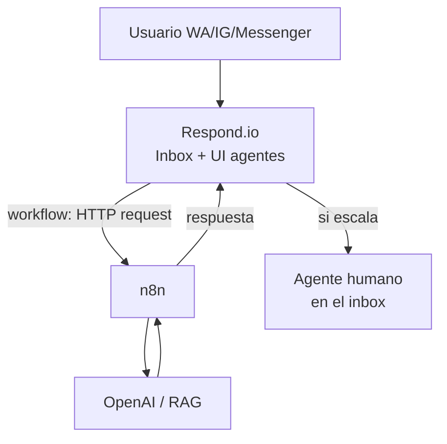

# Respond.io

> **TL;DR:** Respond.io es una plataforma SaaS omnicanal partner oficial de Meta. Conecta WhatsApp Cloud API + Instagram + Messenger + Telegram + más, con UI lista para agentes, workflows visuales, AI agent nativo y API REST. Cobra por suscripción + MAU (Monthly Active Contacts). Ideal cuando el cliente quiere agentes humanos + automatización sin desarrollar nada.

## Contexto

Respond.io ocupa el mismo nicho que Kommo: SaaS sobre WhatsApp con UI de agentes. Diferencias clave: Respond.io es **más fuerte en omnicanalidad y workflows**, mientras que Kommo es **más CRM** (pipelines, leads, ventas). Para soporte multicanal con automatización, Respond.io suele ganar.

## Qué ofrece

| Capacidad | Detalle |
|---|---|
| Canales | WhatsApp Cloud API, WhatsApp Business app, Instagram, Messenger, Telegram, WeChat, LINE, email, webchat, SMS |
| Inbox unificado | Todos los canales en una bandeja |
| Workflows | Constructor visual de automatizaciones (alternativa a n8n para casos medios) |
| AI Agent | Agente de IA nativo configurable |
| Contacts | Gestión de contactos con campos custom y tags |
| Broadcasts | Envíos masivos con plantillas |
| Reports | Analítica de conversaciones, agentes, conversiones |
| API REST | Para integraciones server-to-server |
| Webhooks | Eventos salientes |

## Modelo de licenciamiento

| Concepto | Detalle |
|---|---|
| Suscripción | Plan mensual / anual por niveles |
| MAU (Monthly Active Contacts) | Se cobra por contacto único con el que hubo conversación en el mes |
| Usuarios / agentes | Según plan, con add-ons |
| Conversaciones de Meta | Aparte: el pricing de WhatsApp lo cobra Meta directamente |

Importante para presupuestar: el costo total = **suscripción Respond.io + MAU + conversaciones de Meta**.

## Cuándo elegir Respond.io

| Elegir si... | Evitar si... |
|---|---|
| Cliente necesita soporte multicanal (WA + IG + Messenger) | Solo usa WhatsApp y nada más |
| Quiere UI de agentes lista, sin desarrollo | Quiere control total del stack |
| Equipo de soporte mediano-grande | Operación 100% automatizada sin humanos |
| Workflows medios alcanzan (sin lógica ultra-compleja) | Necesita orquestación muy custom (mejor n8n) |
| Prefiere foco en conversación/soporte | Necesita CRM de ventas con pipelines fuertes (mejor Kommo) |

## Respond.io vs Kommo vs n8n directo

| Dimensión | Respond.io | Kommo | n8n + Cloud API |
|---|---|---|---|
| Foco | Soporte omnicanal | CRM de ventas | Automatización pura |
| UI agentes | Excelente | Buena (CRM) | Ninguna (DIY) |
| Workflows | Buenos, visuales | Salesbot (más limitado) | Ilimitados |
| Omnicanal | Muy fuerte | Bueno | DIY |
| Pipelines de venta | Básico | Excelente | DIY |
| Costo | Suscripción + MAU | Suscripción + conv | Solo hosting |
| Curva | Baja | Baja-media | Media |
| AI nativa | Sí (AI Agent) | Vía integración | OpenAI directo |

## Conectar WhatsApp

Respond.io conecta WhatsApp de dos formas:

| Modo | Detalle |
|---|---|
| **WhatsApp Business Platform (Cloud API)** | Vía Respond.io como partner. HSM reales, multi-agente, oficial. Recomendado. |
| **WhatsApp Business App (QR)** | Conexión tipo no oficial, limitada. Para casos chicos. |

Para producción: siempre Cloud API.

## Workflows

El constructor de workflows de Respond.io cubre:

| Trigger | Ejemplo |
|---|---|
| Conversation opened | Primer mensaje del contacto |
| Contact created / updated | Nuevo contacto |
| Webhook recibido | Disparo externo |
| Manual / scheduled | Por agente o programado |

Bloques: enviar mensaje, branch por condición, esperar respuesta, asignar a agente/equipo, actualizar campo, llamar API externa (HTTP request), AI Agent step, etc.

**Cuándo alcanza Respond.io workflows vs cuándo ir a n8n:**

| Caso | Herramienta |
|---|---|
| Routing por palabra clave, FAQ, asignación | Respond.io workflows |
| Branching simple con condiciones | Respond.io workflows |
| Integración con 1-2 APIs externas | Respond.io HTTP request |
| Orquestación con muchas APIs, RAG, function calling complejo | n8n |
| Procesamiento async pesado | n8n |

Patrón híbrido: Respond.io para UI + workflows simples, y un webhook a n8n para lo complejo.

## API REST

Respond.io expone API para:

| Operación | Uso |
|---|---|
| Enviar mensaje a un contacto | Notificaciones desde sistemas externos |
| Crear / actualizar contacto | Sync con CRM o ERP |
| Disparar un workflow | Automatización desde fuera |
| Consultar conversaciones | Reporting |
| Gestionar tags / campos custom | Segmentación |

Autenticación por API token. Detalle en [developers.respond.io](https://developers.respond.io/).

## Webhooks salientes

Respond.io envía eventos a una URL del integrador:

| Evento | Uso típico |
|---|---|
| New incoming message | Procesar en n8n / sistema propio |
| New contact | Sync con CRM |
| Conversation status changed | Tracking |
| Workflow completed | Disparar siguiente paso |

Combinado con **Dynamic Variables**, permite que un workflow de Respond.io llame a n8n, reciba respuesta y continúe.

## Patrón híbrido recomendado

Respond.io para inbox/UI/omnicanal; n8n para el cerebro complejo.

## AI Agent nativo

Respond.io trae un AI Agent configurable sin código:

| Capacidad | Detalle |
|---|---|
| Knowledge base | Subir documentos / FAQs |
| Tono y comportamiento | Configurable |
| Handoff a humano | Built-in |
| Idiomas | Multilingüe |

Para casos estándar de soporte, puede evitar tener que armar todo en n8n + OpenAI. Para casos con function calling complejo o integraciones profundas, conviene el AI propio vía n8n.

## Ventajas

| Ventaja | Detalle |
|---|---|
| Time-to-market | Operativo en horas, no semanas |
| Omnicanalidad real | Muchos canales, un inbox |
| UI de agentes pulida | Sin desarrollo |
| Partner oficial | Sin riesgo de plataforma |
| Reporting incluido | Métricas listas |

## Desventajas

| Desventaja | Mitigación |
|---|---|
| Costo recurrente (suscripción + MAU) | Calcular ROI vs equipo / herramientas |
| Menos control que stack propio | Aceptar el trade-off o ir a Cloud API directa |
| Workflows tienen techo de complejidad | Delegar lo complejo a n8n |
| Lock-in moderado con la plataforma | El número/WABA siguen siendo del cliente, portables |

## Errores comunes

| Error | Causa | Solución |
|---|---|---|
| Costo mensual mayor al esperado | MAU subestimado | Estimar contactos activos reales |
| Workflow no dispara | Trigger mal configurado | Revisar condiciones del trigger |
| Webhook a n8n con timeout | n8n lento | Responder rápido, procesar async |
| Plantillas no aparecen | No sincronizadas con Meta | Forzar sync del canal WA |
| Mensajes duplicados al integrar con n8n | Doble procesamiento | Dedup por message id |

## Referencias

- [Respond.io Docs](https://docs.respond.io/) — Verificado 2026-05-20.
- [Respond.io Developers / API](https://developers.respond.io/) — Verificado 2026-05-20.
- [`03-formas-de-uso/comparativa.md`](./comparativa.md)
- [`03-formas-de-uso/kommo-crm.md`](./kommo-crm.md)
