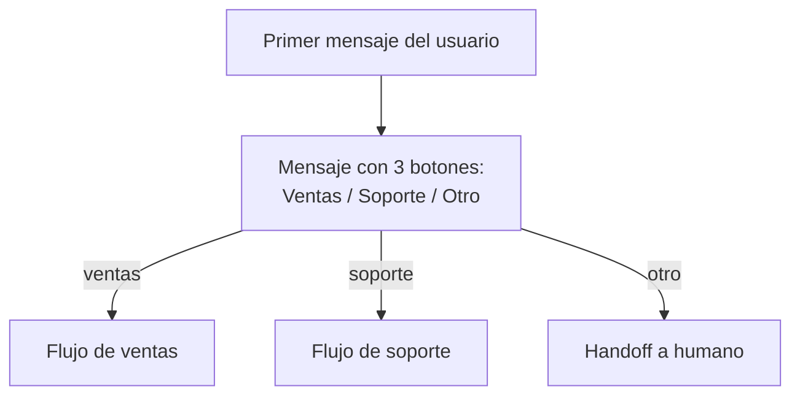

# Mensajes interactivos

> **TL;DR:** Tres familias: **reply buttons** (hasta 3, perfectos para sí/no/cancelar), **list** (hasta 10 opciones agrupadas en secciones), **CTA URL** (un botón que abre una URL). La respuesta del usuario llega como `interactive` en el webhook con el `id` que vos definiste. Reducen errores y aceleran la conversación.

## Contexto

El texto libre es flexible pero ambiguo. Los interactivos resuelven sin trade-offs: estructuran la respuesta, evitan typos y dejan el resultado parseable directamente. Para flujos guiados (menúes, calificación inicial, derivación), son obligatorios.

## Reply buttons

Hasta **3 botones** de respuesta rápida. El usuario los toca y vos recibís el `id` que setteaste.

```json
{
  "type": "interactive",
  "interactive": {
    "type": "button",
    "header": { "type": "text", "text": "Reserva de turno" },
    "body": { "text": "¿Para qué día querés agendar?" },
    "footer": { "text": "Respondé tocando una opción" },
    "action": {
      "buttons": [
        { "type": "reply", "reply": { "id": "hoy", "title": "Hoy" } },
        { "type": "reply", "reply": { "id": "manana", "title": "Mañana" } },
        { "type": "reply", "reply": { "id": "otro", "title": "Otro día" } }
      ]
    }
  }
}
```

| Restricción | Valor |
|---|---|
| Cantidad de botones | 1-3 |
| `id` | Máx 256 chars; usar slugs `snake_case` |
| `title` | Máx 20 chars; lo que ve el usuario |
| Header | Opcional: text, image, video, document |
| Footer | Opcional: solo texto, máx 60 chars |

## List

Hasta **10 opciones** agrupadas en hasta **10 secciones**. Se muestra como dropdown.

```json
{
  "type": "interactive",
  "interactive": {
    "type": "list",
    "header": { "type": "text", "text": "Nuestro catálogo" },
    "body": { "text": "Elegí una categoría:" },
    "footer": { "text": "Tocá ver opciones" },
    "action": {
      "button": "Ver opciones",
      "sections": [
        {
          "title": "Calzado",
          "rows": [
            { "id": "zapatillas", "title": "Zapatillas", "description": "Running y casual" },
            { "id": "botas", "title": "Botas", "description": "Invierno" }
          ]
        },
        {
          "title": "Indumentaria",
          "rows": [
            { "id": "remeras", "title": "Remeras" },
            { "id": "buzos", "title": "Buzos" }
          ]
        }
      ]
    }
  }
}
```

| Restricción | Valor |
|---|---|
| Total filas | Hasta 10 entre todas las secciones |
| Secciones | Hasta 10 |
| `action.button` | Máx 20 chars; texto del botón que abre la lista |
| `row.title` | Máx 24 chars |
| `row.description` | Opcional, máx 72 chars |
| `row.id` | Máx 200 chars |

Cuándo elegir list vs buttons:

| Caso | Mejor |
|---|---|
| 2-3 opciones rápidas | Buttons |
| 4-10 opciones | List |
| Más de 10 opciones | Romper en 2 mensajes con sub-menú |
| Opciones con descripción larga | List (tiene `description`) |
| Quiero un solo botón con acción | CTA URL (ver abajo) |

## CTA URL

Un único botón que abre una URL en el navegador del usuario.

```json
{
  "type": "interactive",
  "interactive": {
    "type": "cta_url",
    "header": { "type": "text", "text": "Tu pedido está listo" },
    "body": { "text": "Podés ver el detalle y descargar la factura desde el portal." },
    "footer": { "text": "Acceso seguro" },
    "action": {
      "name": "cta_url",
      "parameters": {
        "display_text": "Ver mi pedido",
        "url": "https://midominio.com/orders/{{ORDER_ID}}"
      }
    }
  }
}
```

| Detalle | Valor |
|---|---|
| `display_text` | Máx 20 chars |
| `url` | URL HTTPS; sin shortener |

Útil para confirmar pagos, ver tracking, abrir flow custom en tu web.

## Webhook de respuesta

Cuando el usuario toca un reply button o una row de list, llega:

```json
{
  "from": "5491133334444",
  "id": "wamid.HBgL...",
  "timestamp": "1716200000",
  "type": "interactive",
  "interactive": {
    "type": "button_reply",
    "button_reply": {
      "id": "hoy",
      "title": "Hoy"
    }
  }
}
```

Para list:

```json
"interactive": {
  "type": "list_reply",
  "list_reply": {
    "id": "zapatillas",
    "title": "Zapatillas",
    "description": "Running y casual"
  }
}
```

**Para parsear en n8n:** mirar `interactive.type` y leer el `id` del `*_reply` correspondiente. Switch sobre el `id` para enrutar.

CTA URL **no** genera webhook de "el usuario tocó el botón" porque solo abre URL.

## Patrón: menú principal con botones



En el workflow de n8n:

1. Webhook → identificar `interactive.button_reply.id`.
2. Switch sobre el `id`.
3. Cada rama dispara su sub-flujo.

## Patrón: catálogo con list

Si tenés muchos productos:

1. Mensaje con list de **categorías**.
2. Al elegir categoría, mensaje con list de **subcategorías o productos**.
3. Al elegir producto, mensaje con imagen + CTA URL al producto.

Combinado con el endpoint de **WhatsApp Catalog** (catálogo nativo de Commerce), se puede mostrar productos con foto + precio sin escribir cada list a mano.

## Restricciones a recordar

- Los interactivos **no funcionan en plantillas** (HSM) excepto los botones declarados como parte del template.
- Solo se pueden enviar **dentro de la ventana de 24h** o como parte de una plantilla aprobada.
- No combinables: no podés mezclar buttons y list en el mismo mensaje.
- No se pueden encadenar interactivos automáticamente; cada respuesta del usuario dispara un nuevo mensaje del bot.

## Anti-patterns

| Anti-pattern | Por qué |
|---|---|
| Listas de 10 ítems sin secciones | Mala UX, mejor agrupar |
| Botones con título genérico ("Opción 1", "Opción 2") | Confunde, usar texto descriptivo |
| `id` con espacios o emojis | Difícil de parsear; usar `snake_case` |
| Repetir el menú principal en cada turno | Spam visual; mostrar solo cuando aplica |
| Botón "Cancelar" como salida única | Mejor "Hablar con un humano" |

## Errores comunes

| Error | Causa | Solución |
|---|---|---|
| `Title too long` | `title` > 20 chars | Acortar |
| Botones no aparecen | Cliente WhatsApp Web viejo | Cliente del usuario debe estar actualizado |
| List `Row id too long` | `id` > 200 chars | Usar slugs cortos |
| Respuesta del usuario llega como `text` en vez de `interactive` | El usuario escribió en vez de tocar | Implementar fallback que parsee texto |
| Webhook no trae `interactive` | Field `messages` no suscrito | Suscribir |

## Buenas prácticas

- Mantener `id` estable: cambiarlos en producción rompe analíticas históricas.
- Loggear `interactive.*_reply.id` para tracking de funnel.
- Fallback de texto: si el usuario escribe "1", "2", "3" o el título del botón, manejarlo igual.
- Header con imagen para mensajes importantes (mejora atención).
- Footer corto recordando cómo responder ("Tocá una opción").

## Referencias

- [Interactive Messages · Cloud API](https://developers.facebook.com/docs/whatsapp/cloud-api/reference/messages#interactive-object) — Verificado 2026-05-20.
- [`04-mensajeria/tipos-de-mensaje.md`](./tipos-de-mensaje.md)
- [`04-mensajeria/flows.md`](./flows.md)
