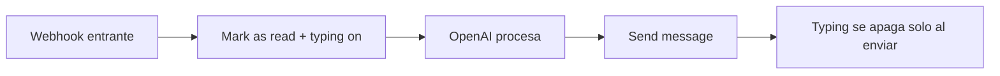

# Marcar como leído y typing indicator

> **TL;DR:** Marcar el mensaje del usuario como leído (doble check azul) y mostrar "escribiendo..." mejora drásticamente la UX percibida del bot, sobre todo cuando OpenAI tarda unos segundos. Ambos se hacen vía `POST /{{PHONE_NUMBER_ID}}/messages` con `status: "read"`. Aplicar siempre en bots.

## Por qué importan

| UX sin esto | UX con esto |
|---|---|
| Doble check gris: "no lo leyeron" | Doble check azul: "te leyeron" |
| Silencio mientras el bot procesa | "Escribiendo..." mientras procesa |
| Usuario reenvía el mensaje | Usuario espera tranquilo |

## Marcar como leído

Endpoint: `POST /{{PHONE_NUMBER_ID}}/messages`.

```bash
curl -X POST \
  "https://graph.facebook.com/v21.0/{{PHONE_NUMBER_ID}}/messages" \
  -H "Authorization: Bearer {{ACCESS_TOKEN}}" \
  -H "Content-Type: application/json" \
  -d '{
    "messaging_product": "whatsapp",
    "status": "read",
    "message_id": "{{WAMID}}"
  }'
```

| Campo | Detalle |
|---|---|
| `status` | `"read"` |
| `message_id` | `wamid.*` del mensaje entrante a marcar |

Llamar apenas llega el webhook, antes de empezar a procesar.

## Typing indicator

Cloud API soporta indicar que el bot está "escribiendo". La forma de habilitarlo viene evolucionando en la API: en versiones recientes se hace con un campo `typing_indicator` en el mismo POST de mark-as-read, o vía un endpoint específico. **Verificar la versión vigente** en docs oficiales.

Ejemplo (formato típico, validar con la versión que uses):

```bash
curl -X POST \
  "https://graph.facebook.com/v21.0/{{PHONE_NUMBER_ID}}/messages" \
  -H "Authorization: Bearer {{ACCESS_TOKEN}}" \
  -H "Content-Type: application/json" \
  -d '{
    "messaging_product": "whatsapp",
    "status": "read",
    "message_id": "{{WAMID}}",
    "typing_indicator": { "type": "text" }
  }'
```

El typing aparece durante unos segundos (~25s) o hasta que enviás un mensaje, lo que ocurra primero.

## Flujo completo en bots con IA



En n8n:

1. Webhook trigger.
2. (Después de validar firma y dedup) llamada async a Cloud API para mark-as-read + typing.
3. Llamada a OpenAI.
4. Enviar la respuesta.

## Cuándo NO marcar como leído

Casos puntuales:

| Caso | Por qué |
|---|---|
| Bot pausado (`mode='human'`) | Que el agente decida cuándo "leer" |
| Mensaje detectado como spam / inválido | Tal vez no querés confirmar lectura |
| Mensajes en grupos (raro en Business) | Comportamiento puede variar |

Para el caso default de un bot operando: **siempre** marcar como leído.

## Respetar la configuración del usuario

Si el usuario en su WhatsApp tiene **desactivadas** las confirmaciones de lectura, vos podés mandar el `read` igual, pero el usuario no verá el doble check azul porque WhatsApp respeta su preferencia.

Esto significa: marcar como leído no garantiza que el usuario vea la confirmación. Pero del lado del negocio sí podemos saber cuándo el usuario leyó nuestros mensajes (solo si **el negocio** tiene read receipts activos a nivel cuenta y el usuario también).

## Subflow recomendado en n8n

`wa-mark-as-read`:

```javascript
// INPUT: { phoneNumberId, accessToken, wamid, withTyping }
// OUTPUT: { ok }
```

Llamar siempre al recibir un mensaje, antes de procesar:

```
Execute Workflow: wa-mark-as-read
  phoneNumberId: {{ $json.phone_number_id }}
  accessToken: {{ $env.WA_ACCESS_TOKEN }}
  wamid: {{ $json.wa_message_id }}
  withTyping: true
```

## Cuánto dura el typing

El indicador se mantiene hasta:

- Enviás un mensaje (se apaga al recibir el usuario tu respuesta).
- Pasan ~25 segundos sin actividad.
- Llega otro `read` sin typing.

Por eso, si OpenAI demora más de 25s (caso raro), conviene re-enviar el typing antes de que se apague.

## Errores comunes

| Error | Causa | Solución |
|---|---|---|
| Typing no aparece | Versión de la API no lo soporta o config | Verificar versión |
| Marca como leído fuera de tiempo | Hicimos la llamada después de procesar | Llamarla apenas llega el webhook |
| Marcaste leído y el usuario lo perdió | Mensaje muy viejo | No afecta funcionalidad |
| Doble check no se pone azul aunque mandaste read | El usuario desactivó read receipts | Comportamiento de WhatsApp; no hay solución |

## Referencias

- [Messages · Cloud API](https://developers.facebook.com/docs/whatsapp/cloud-api/reference/messages) — Verificado 2026-05-20.
- [`04-mensajeria/tipos-de-mensaje.md`](./tipos-de-mensaje.md)
- [`07-integraciones/openai/streaming.md`](../07-integraciones/openai/streaming.md)
