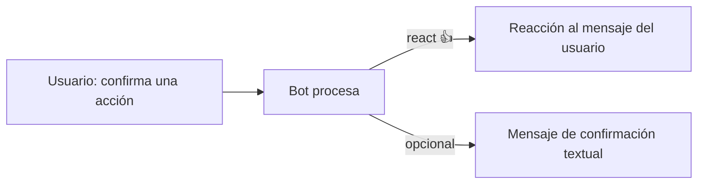

# Reply (citar mensaje) y React (reaccionar)

> **TL;DR:** Cualquier mensaje saliente puede ser un **reply** (citar un mensaje anterior) agregando `context.message_id`. Las **reacciones** son un tipo de mensaje aparte (`type: reaction`). Ambos mejoran la legibilidad de conversaciones largas y permiten respuestas asíncronas precisas (responder al mensaje exacto del usuario, no al último).

## Reply: responder a un mensaje específico

Cualquier mensaje (texto, media, interactivo, plantilla) puede citar otro:

```bash
curl -X POST \
  "https://graph.facebook.com/v21.0/{{PHONE_NUMBER_ID}}/messages" \
  -H "Authorization: Bearer {{ACCESS_TOKEN}}" \
  -H "Content-Type: application/json" \
  -d '{
    "messaging_product": "whatsapp",
    "to": "{{DESTINATION}}",
    "context": { "message_id": "{{WAMID_DEL_MENSAJE_A_CITAR}}" },
    "type": "text",
    "text": { "body": "Te respondo sobre la consulta que hiciste antes..." }
  }'
```

| Campo | Detalle |
|---|---|
| `context.message_id` | `wamid.*` del mensaje a citar |
| Compatible con todos los tipos | text, image, interactive, etc. |

El usuario ve la cita arriba del mensaje, igual que cuando uno responde manualmente desde la app.

## Cuándo usar reply

| Caso | Beneficio |
|---|---|
| Conversaciones largas con varios temas | Aclara qué se está respondiendo |
| Respuestas async (bot que tarda en responder uno de muchos mensajes recientes) | Indica a qué se refiere |
| Conversación con varios participantes (grupos) | Imprescindible |
| Multi-turno con tools | El bot puede citar el mensaje del usuario al confirmar una acción |

## Cuándo NO

| Caso | Por qué |
|---|---|
| Conversación lineal de un solo tema | Citar es ruido visual |
| Mensaje muy reciente (acaba de escribir) | Obvio sin cita |

## Receive reply

Cuando el **usuario** te responde citando uno de tus mensajes, llega:

```json
{
  "from": "...",
  "id": "wamid.NEW...",
  "type": "text",
  "text": { "body": "Sí" },
  "context": {
    "from": "5491100000000",
    "id": "wamid.ORIGINAL..."
  }
}
```

| Campo | Para qué |
|---|---|
| `context.id` | `wamid` del mensaje del bot que el usuario citó |
| `context.from` | Quién mandó el mensaje citado (vos) |

Útil para vincular respuestas con preguntas específicas: si mandaste 3 mensajes y el usuario responde a uno, sabés exactamente a cuál.

## React: reacción a un mensaje

Mensaje de tipo `reaction`:

```bash
curl -X POST \
  "https://graph.facebook.com/v21.0/{{PHONE_NUMBER_ID}}/messages" \
  -H "Authorization: Bearer {{ACCESS_TOKEN}}" \
  -H "Content-Type: application/json" \
  -d '{
    "messaging_product": "whatsapp",
    "to": "{{DESTINATION}}",
    "type": "reaction",
    "reaction": {
      "message_id": "{{WAMID_A_REACCIONAR}}",
      "emoji": "👍"
    }
  }'
```

| Campo | Detalle |
|---|---|
| `message_id` | El mensaje al que se reacciona |
| `emoji` | El emoji a poner |

Para **remover** una reacción, mandar `"emoji": ""` (vacío).

## Cuándo usar react

| Caso | Beneficio |
|---|---|
| Confirmar recepción sin mandar otro mensaje | Menos ruido |
| El usuario confirma con "ok" / "👍" y vos reaccionás "👍" | Cierre amigable |
| Marcar mensajes (visto, importante) | UX cálida |

Cuidado: no abusar. Una reacción ocasional suma; reaccionar a todo se siente artificial.

## Receive reaction

El usuario reaccionando a uno de tus mensajes llega como:

```json
{
  "from": "...",
  "id": "wamid.NEW...",
  "type": "reaction",
  "reaction": {
    "message_id": "wamid.ORIGINAL...",
    "emoji": "👍"
  }
}
```

**Una reacción cuenta como mensaje entrante**: reinicia la ventana de 24h. Tener en cuenta al trackear ventana.

## Patrón: confirmación con reaction



Para acciones simples (confirmar entendido), reaction + texto breve es más amigable que solo texto.

## Reply + React combinados

Ejemplo: el usuario manda 3 mensajes rápido. El bot:

1. Reacciona 👀 al primero (te leí).
2. Procesa.
3. Responde con reply citando el mensaje principal.

Sutil pero muy humano.

## Errores comunes

| Error | Causa | Solución |
|---|---|---|
| Reply no aparece como cita | `context.message_id` mal | Usar el `wamid` exacto |
| El mensaje a citar fue borrado | El usuario lo eliminó | Mandar sin cita |
| Reacción no aparece | Emoji no soportado o `message_id` viejo (> N días) | Probar con emoji estándar |
| Reaccionar a tu propio mensaje saliente | Permitido, raro pero válido | OK |
| Olvidar que reaction reinicia la ventana 24h | Tracking incorrecto | Actualizar `last_inbound_at` ante reactions |

## Referencias

- [Messages · Cloud API · Reactions](https://developers.facebook.com/docs/whatsapp/cloud-api/reference/messages#reaction-object) — Verificado 2026-05-20.
- [Context Object](https://developers.facebook.com/docs/whatsapp/cloud-api/reference/messages) — Verificado 2026-05-20.
- [`04-mensajeria/tipos-de-mensaje.md`](./tipos-de-mensaje.md)
