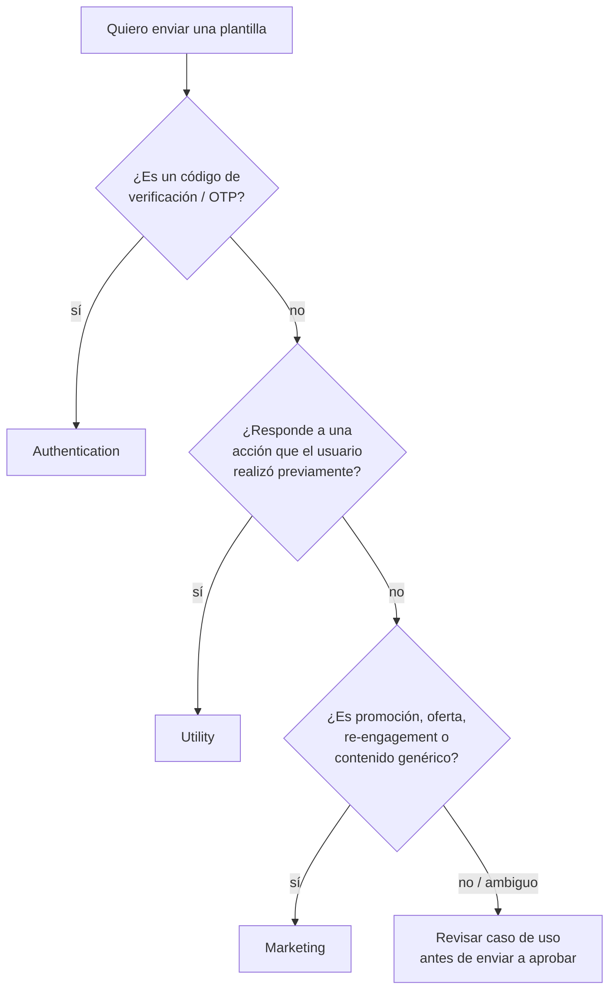
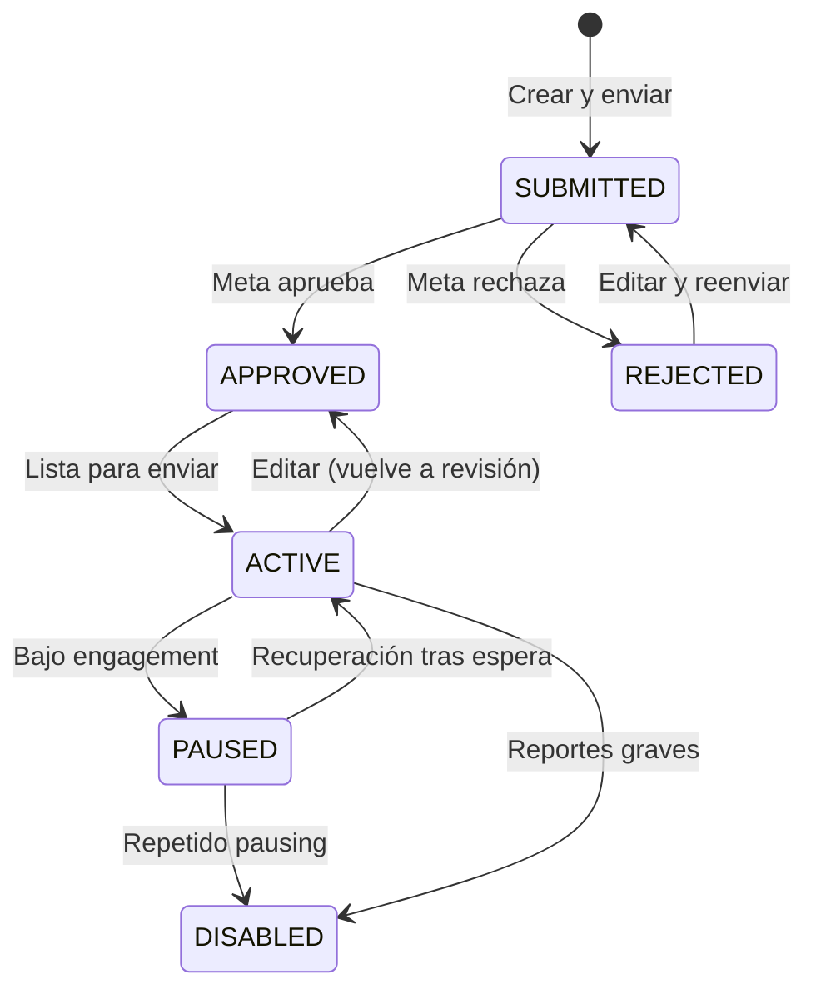

# Categorías de plantillas y pricing

> **TL;DR:** Tres categorías oficiales: **Marketing** (promociones, re-engagement), **Utility** (transaccional, post-acción del usuario), **Authentication** (códigos OTP). El pricing depende de la categoría y la región. Marketing es la más cara; Utility tiene exenciones en algunos países; Authentication tiene reglas especiales (botón Copy code, etc.).

## Contexto

Toda plantilla aprobada por Meta vive bajo una categoría. La categoría determina:

- **Pricing** de cada conversación business-initiated que se origina con esa plantilla.
- **Reglas de aprobación** (qué se puede decir y qué no).
- **Estructura permitida** (botones, header, footer).
- **Riesgo de re-categorización** si el contenido no coincide.

Elegir mal la categoría es la causa #1 de rechazos. Ver [`rechazos.md`](./rechazos.md).

## Las tres categorías

### Marketing

| Aspecto | Detalle |
|---|---|
| Cuándo usarla | Promociones, ofertas, novedades, contenido educativo, re-engagement, lanzamientos |
| Ejemplos | "Tenemos un 20% off esta semana", "Conocé nuestra nueva línea de zapatillas" |
| Pricing | Más alto de las tres (varía por país) |
| Requiere opt-in | Sí, explícito y verificable |
| Botones | Quick Reply + URL + Phone permitidos |
| Pausing | Mayor riesgo si el engagement baja |

### Utility

| Aspecto | Detalle |
|---|---|
| Cuándo usarla | Confirmaciones, actualizaciones de cuenta, post-compra, post-evento del usuario, recordatorios accionables |
| Ejemplos | "Tu pedido #123 fue despachado", "Recordatorio: tu turno es mañana a las 10" |
| Pricing | Intermedio; en algunos países **exento de costo** si está en ventana de servicio abierta |
| Requiere opt-in | Sí, pero el opt-in puede ser implícito al usar el servicio |
| Botones | Quick Reply + URL + Phone permitidos |
| Restricción clave | Debe referenciar una acción del usuario, no contenido genérico |

### Authentication

| Aspecto | Detalle |
|---|---|
| Cuándo usarla | Códigos OTP, verificación 2FA, recuperación de cuenta |
| Ejemplos | "Tu código es 482913. No lo compartas." |
| Pricing | Más bajo de las tres en general; pricing especial por país |
| Requiere opt-in | Sí (el usuario solicitó el código activamente) |
| Botones | Solo el botón **Copy code** (en general) |
| Restricciones especiales | No variables en el header; texto del body sigue un template estricto; expirations claras |

## Cuál corresponde: árbol de decisión

## Pricing: cómo funciona

Meta cobra por **conversación**, no por mensaje. Una conversación es una ventana de 24 horas con un mismo usuario, abierta por una plantilla (business-initiated) o por el usuario (reactiva).

| Tipo de conversación | Categoría que la abrió | Cómo se cobra |
|---|---|---|
| Marketing | Plantilla Marketing | Tarifa Marketing del país |
| Utility | Plantilla Utility | Tarifa Utility del país (puede ser 0 en ciertas combinaciones) |
| Authentication | Plantilla Authentication | Tarifa Authentication del país |
| Service | Usuario inició o Free Entry Point | Tarifa Service del país (a menudo $0 hasta cierto cupo) |

**Importante:** las tarifas exactas varían por país y se actualizan. Consultar siempre en la página oficial: [Pricing](https://developers.facebook.com/docs/whatsapp/pricing). Ver también [`06-politicas-y-calidad/pricing.md`](../06-politicas-y-calidad/pricing.md).

## Free tier mensual

Meta ofrece un cupo gratuito de conversaciones de **service** (reactivas o por Free Entry Point) por número y por mes. Esto NO incluye Marketing / Utility / Authentication business-initiated.

**Verificado: 2026-05-20** — el cupo y su existencia pueden cambiar. Consultar pricing oficial.

## Re-categorización por Meta

Meta puede **cambiar la categoría** de una plantilla automáticamente si detecta que el contenido no coincide con lo declarado. Cuando pasa:

- Llega el webhook `template_category_update`.
- La plantilla sigue activa pero ahora bajo la nueva categoría.
- Las próximas conversaciones se cobran con la nueva tarifa.

Ejemplos de re-categorización forzada:

| Declarada como | Re-categorizada a | Razón típica |
|---|---|---|
| Utility | Marketing | Texto promocional encubierto |
| Authentication | Utility | El "código" no era OTP |

## Patrones para reducir costo

| Patrón | Cómo |
|---|---|
| Maximizar conversaciones service | Inviar al usuario a iniciar (CTWA, QR code, link `wa.me`) |
| Consolidar mensajes | Enviar plantilla 1 vez, conversar durante 24h free-form |
| Elegir Utility sobre Marketing cuando aplique | Confirmaciones reales son Utility, no "promo encubierta" |
| Evitar plantillas marketing innecesarias | Usar Free Entry Point para campañas |
| Multi-número por uso | Número distinto para marketing y para soporte (segmentación de calidad y costos) |

## Vida de una plantilla

Estados que vas a ver vía API y webhooks:

| Estado | Significado |
|---|---|
| `PENDING` / `SUBMITTED` | En revisión |
| `APPROVED` | Aprobada y enviable |
| `REJECTED` | Rechazada |
| `PAUSED` | Pausada por bajo engagement |
| `DISABLED` | Deshabilitada |
| `IN_APPEAL` | En apelación |
| `PENDING_DELETION` | Marcada para borrado |

## Multi-idioma

Una plantilla "lógica" es en realidad **N plantillas físicas**, una por idioma. Cada una se aprueba por separado.

| Práctica | Detalle |
|---|---|
| Mismo `name` | Para `es_AR`, `es_MX`, `pt_BR`, etc. usar el mismo nombre interno |
| Variables consistentes | Misma cantidad y orden en cada idioma |
| Idiomas separados, aprobaciones separadas | Uno puede ser aprobado y otro rechazado |
| Fallback | Si el idioma del usuario no tiene plantilla aprobada, Meta puede caer al "default" si está configurado |

## Errores comunes

| Error | Causa | Solución |
|---|---|---|
| Plantilla cara cuando debería ser barata | Categoría incorrecta declarada como Marketing | Re-clasificar a Utility |
| Re-categorización inesperada vía webhook | Contenido promocional en plantilla Utility | Revisar wording |
| Pricing de un país muy distinto al esperado | Tarifas por país varían 5-10x | Consultar pricing oficial por código de país |
| Cliente recibe la misma plantilla 5 veces y se queja del costo | Lógica de retry mal hecha | Limitar reintentos y verificar status antes de reenviar |

## Referencias

- [Message Templates · Categories](https://developers.facebook.com/docs/whatsapp/business-management-api/message-templates) — Verificado 2026-05-20.
- [Pricing actual por país](https://developers.facebook.com/docs/whatsapp/pricing) — Verificado 2026-05-20.
- [Conversation Categories](https://developers.facebook.com/docs/whatsapp/cloud-api/guides/conversations/conversation-categories) — Verificado 2026-05-20.
- [`05-plantillas-hsm/aprobacion.md`](./aprobacion.md)
- [`05-plantillas-hsm/rechazos.md`](./rechazos.md)
