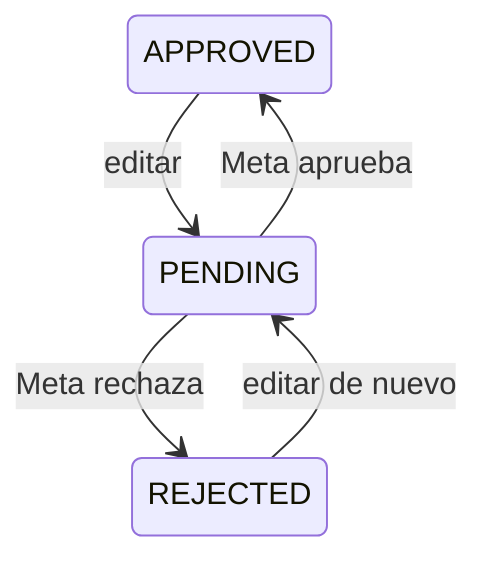

# Versionado y edición de plantillas

> **TL;DR:** Editar una plantilla aprobada la vuelve a poner en revisión (estado `PENDING`). El nombre se mantiene, los `template_id` típicamente sí también. Meta limita la cantidad de ediciones por período. Para cambios grandes o pruebas A/B, crear plantilla nueva con otro nombre. Mantener un registro propio (Git/DB) de qué versión está activa cuándo.

## Qué significa editar

| Acción | Efecto |
|---|---|
| Cambiar texto del body | Vuelve a `PENDING`, requiere re-aprobación |
| Cambiar categoría | Idem + posible re-categorización por Meta |
| Cambiar botones | Idem |
| Agregar / quitar variables | Idem; los envíos viejos pueden fallar |
| Cambiar el nombre | No se puede; hay que crear plantilla nueva |
| Cambiar idioma | No se puede; cada idioma es una plantilla distinta |

## Estados durante una edición



Durante el `PENDING`:

- **No se puede enviar** la versión editada hasta que esté aprobada.
- La versión **anterior** ya no está disponible (la edición la reemplazó).
- Puede haber **downtime** en cualquier flujo que la use.

Por eso: hacer ediciones críticas con plan.

## Patrón: edición segura

| Caso | Estrategia |
|---|---|
| Cambio menor (typo) | Editar fuera de horario pico |
| Cambio mayor (estructura, copy distinto) | Crear plantilla **nueva** con otro nombre, dejar la vieja activa mientras se aprueba la nueva, luego switchear |
| A/B testing | Plantillas distintas, no editar la misma |
| Reversión | Solo posible re-editando hacia atrás (que requiere nueva aprobación); no hay undo automático |

## Límites de edición

Meta limita la cantidad de ediciones por plantilla en una ventana de tiempo (varía; verificar). Si te pasás, la edición es rechazada o queda bloqueada por un período.

| Lección | Cómo |
|---|---|
| No usar la plantilla viva como sandbox | Crear plantillas de test aparte |
| Probar copy en mockups antes | Sin gastar ediciones |
| Pensar bien el copy antes de aprobar | Cada ronda cuesta tiempo |

## Versionado del lado del integrador

Aunque Meta no lo expone como "versiones", conviene mantenerlo internamente.

### Tabla local

```sql
CREATE TABLE templates (
  id UUID PRIMARY KEY DEFAULT gen_random_uuid(),
  name TEXT NOT NULL,
  language TEXT NOT NULL,
  category TEXT NOT NULL,
  meta_template_id TEXT,
  intent TEXT,                          -- agrupar variantes
  version INT NOT NULL DEFAULT 1,
  status TEXT,                          -- PENDING | APPROVED | REJECTED | PAUSED | DISABLED
  body_text TEXT,
  components JSONB,
  active BOOLEAN DEFAULT true,
  created_at TIMESTAMPTZ DEFAULT now(),
  updated_at TIMESTAMPTZ DEFAULT now(),
  UNIQUE(name, language)
);
```

Cada edición ⇒ incrementar `version` (interno) y registrar el cambio. No es lo mismo que la versión de Meta, pero te permite saber qué tenías deployado cuándo.

### Registro de cambios

| Campo | Detalle |
|---|---|
| Quién editó | User del integrador o el cliente |
| Cuándo | Timestamp |
| Diff | Cambio respecto de la versión anterior |
| Motivo | "Acortar copy", "agregar botón", etc. |

Útil para audit y para entender por qué subió/bajó la calidad.

## Sincronización con Meta

n8n / backend debería:

1. **Pull periódico** de plantillas vía `GET /{{WABA_ID}}/message_templates`.
2. Comparar con la tabla local.
3. Detectar cambios de estado (PAUSED, REJECTED, REINSTATED) y reaccionar (alertar, actualizar).

Y suscribirse a webhooks `message_template_status_update` para reaccionar en tiempo real.

## Idiomas distintos: plantillas distintas

Una "misma" plantilla en `es_AR`, `pt_BR`, `en_US` son tres plantillas físicas en Meta. Cada una se aprueba por separado. Ver [`idiomas.md`](./idiomas.md).

| Buena práctica | Detalle |
|---|---|
| Mismo `name` para todos los idiomas | Permite agruparlas |
| Misma cantidad y orden de variables | Para que el código sea simétrico |
| Aprobar la principal primero | Y replicar a las otras |

## Editar vs crear nueva: decisión

| Caso | Editar | Crear nueva |
|---|---|---|
| Typo / cambio menor | Sí | — |
| Cambio de wording sin cambio estructural | Sí | — |
| Cambio de categoría | Editar o nueva (depende) | A veces nueva es más limpio |
| Test A/B | — | Nueva |
| Cambio drástico | — | Nueva |
| Plantilla con historial de pausings | — | Nueva (mejor empezar fresca) |

## Errores comunes

| Error | Causa | Solución |
|---|---|---|
| Editaste en horario pico y se cayó el envío | Plantilla en `PENDING` mientras se aprueba | Editar fuera de horario pico |
| Enviás con variables de la versión vieja y falla | Cambio de variables sin sincronizar el código | Versionar la estructura en código junto con la plantilla |
| Plantilla bloqueada para edición | Pasaste el límite | Esperar o crear nueva |
| Auditoría sin contexto | Sin registro local de versiones | Mantener tabla `templates` con historial |
| Re-aprobación rechazada por categoría | Edición cambió la categoría implícita | Re-evaluar y ajustar |

## Referencias

- [Message Templates · Meta](https://developers.facebook.com/docs/whatsapp/business-management-api/message-templates) — Verificado 2026-05-20.
- [`05-plantillas-hsm/aprobacion.md`](./aprobacion.md)
- [`05-plantillas-hsm/pausing.md`](./pausing.md)
- [`05-plantillas-hsm/idiomas.md`](./idiomas.md)
