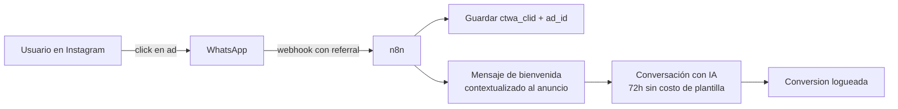

# Free Entry Points y CTWA

> **TL;DR:** Si un usuario inicia conversación cliqueando un anuncio Click-to-WhatsApp (CTWA) o el botón "Enviar mensaje" de una Facebook Page, se abre una **Free Entry Point Conversation**: una ventana de **72 horas** en la que el negocio puede enviar **mensajes free-form sin costo de plantilla**. Es la herramienta más subutilizada para bajar costos.

## Contexto

Meta incentiva que el usuario inicie la conversación. Cuando lo hace vía un anuncio o una superficie de Meta (no por número directo), el costo de la conversación se transforma de "Marketing tarifa-alta" en "Free Entry Point", y la ventana de respuesta se extiende a 72 horas.

Esto cambia drásticamente la economía de:

- Campañas de generación de leads.
- Atención al cliente como diferencial.
- Educación de productos antes de la compra.

## Qué cuenta como Free Entry Point

| Entrada | ¿Free Entry Point? | Comentario |
|---|---|---|
| Click-to-WhatsApp Ad (Facebook, Instagram) | Sí | El principal generador |
| Botón "Enviar mensaje" de Facebook Page | Sí | A veces llamado "Page CTA" |
| QR code en local físico | No (es Service normal) | Pero abre conversación con costo $0 igual |
| Link `wa.me/{{NUMERO}}` desde otro sitio | No (Service normal) | |
| Plantilla Marketing del negocio | No (Marketing) | |
| Llamada perdida del usuario al número de WA | Service normal | |

## Diferencias con Service normal

| Aspecto | Free Entry Point | Service (usuario inicia por otro lado) |
|---|---|---|
| Origen | Anuncio o Page CTA de Meta | Cualquier mensaje del usuario |
| Ventana | **72 horas** | 24 horas |
| Tarifa | **Sin costo de plantilla**, sin costo de conversación dentro de las 72h | $0 hasta cupo, luego tarifa Service |
| Reportes | Trackeable como conversion en Ads Manager | No es atribuible a campaña paga |

## Cómo se identifica en webhook

El primer mensaje entrante de una conversación CTWA trae un campo `referral`:

```json
{
  "from": "5491133334444",
  "id": "wamid.HBgL...",
  "timestamp": "1716200000",
  "type": "text",
  "text": { "body": "Hola, vi su anuncio" },
  "referral": {
    "source_url": "https://www.facebook.com/ads/?...",
    "source_type": "ad",
    "source_id": "120200123456789",
    "headline": "Comprá la zapatilla nueva",
    "body": "20% off esta semana",
    "media_type": "image",
    "image_url": "https://...",
    "ctwa_clid": "ARAH..."
  }
}
```

Campos útiles:

| Campo | Para qué |
|---|---|
| `source_type` | `ad` (CTWA) o `post` |
| `source_id` | ID del anuncio o post; correlacionar con Ads Manager |
| `ctwa_clid` | ID único del click; tracking conversion |
| `headline` / `body` | Copy del anuncio (útil para entender intención del usuario) |
| `image_url` | Creativo del anuncio (puede mostrarse al agente humano) |

## Patrón recomendado para aprovecharlo



Acciones específicas:

1. **Detectar `referral`** en el primer mensaje y trackear que esa conversación viene de un CTWA.
2. **Contextualizar la primera respuesta** mencionando el anuncio: "¡Hola! Vi que viste nuestro anuncio sobre {{HEADLINE}}. Contame qué te interesa."
3. **Aprovechar las 72h**: no apurarse a cerrar la venta; nutrir.
4. **Loguear conversion**: cuando el usuario completa una acción objetivo (compra, agenda), marcar la conversion vinculada al `ctwa_clid` y enviarla de vuelta a Meta vía Conversion API si querés optimizar la campaña.

## Cómo abrir un Free Entry Point: el lado de Ads

| Paso | Detalle |
|---|---|
| 1. Crear campaña en Ads Manager con objetivo `Messages` | |
| 2. Elegir destino "WhatsApp" | El número debe estar vinculado a la Page o WABA del Portfolio |
| 3. Diseñar creativo + copy de la ad | |
| 4. Definir audiencia | |
| 5. Pixel / Conversion API opcional para tracking de conversions | |

Detalle operacional fuera de scope de esta wiki (es de marketing puro), pero el integrador necesita saber que **el número** debe estar correctamente vinculado.

## Vinculación número ↔ Page

Para que las ads de Facebook puedan enrutar a un número de WA:

1. Page de Facebook del cliente debe pertenecer al Business Portfolio.
2. Page debe tener WhatsApp conectado: Settings de la Page → WhatsApp.
3. El número conectado a la Page debe ser uno de la WABA del Portfolio.

Sin esto, las ads CTWA no aparecen como opción al armar la campaña.

## Costos comparados (ejemplo ilustrativo, AR)

| Caso | Apertura | Costo aprox |
|---|---|---|
| 1.000 conversaciones vía Marketing template | Negocio | 1.000 × $0.07 = **$70** |
| 1.000 conversaciones vía CTWA | Usuario (CTWA) | **$0** (más costo de ad spend que es otra cosa) |
| 1.000 conversaciones reactivas Service | Usuario (otro canal) | $0 hasta cupo, luego $0.01-0.02 |

CTWA tiene costo de ad spend (CPM, CPC) que sí pagás a Meta como anunciante, pero el **conversation cost** queda en $0 dentro de las 72h. La economía depende del CPM vs el valor del lead.

## Errores comunes

| Error | Causa | Solución |
|---|---|---|
| `referral` no aparece en webhook | Suscripción de webhooks sin `messages` o el field no estaba habilitado | Verificar suscripción y volver a crear el ad |
| Tracking de conversion no llega a Ads Manager | Pixel o Conversion API no configurada | Implementar Conversion API con el `ctwa_clid` |
| Conversación se cobra como Marketing aunque vino de ad | El número no estaba bien vinculado a la Page | Revisar vinculación Page → WhatsApp |
| Ventana de 72h "expira" antes | Confusión con ventana de 24h | Confirmar que sea Free Entry Point real, no Service post-ad |
| Bot responde "como si fuera un usuario nuevo" | No mira `referral` | Agregar lógica de contextualización |

## Buenas prácticas

- Tener una **secuencia conversacional específica** para usuarios que vienen de ads, distinta del flujo orgánico.
- **Loguear `source_id`** y cruzar con ROI por campaña al final del mes.
- Pasar al CRM la atribución: el lead vino de la campaña X, anuncio Y, fecha Z.
- Aprovechar las 72h para nutrir, no para vender en el primer mensaje.
- Si el usuario no responde en las 72h, NO usar plantilla Marketing de inmediato: bajos engagement.

## Referencias

- [Conversation Types](https://developers.facebook.com/docs/whatsapp/cloud-api/guides/conversations/conversation-types) — Verificado 2026-05-20.
- [Click-to-WhatsApp Ads · Meta](https://www.facebook.com/business/ads/click-to-whatsapp-ads) — Verificado 2026-05-20.
- [Referral payload · Cloud API](https://developers.facebook.com/docs/whatsapp/cloud-api/webhooks/components#referral-object) — Verificado 2026-05-20.
- [`06-politicas-y-calidad/ventana-24h.md`](./ventana-24h.md)
- [`06-politicas-y-calidad/pricing.md`](./pricing.md)
