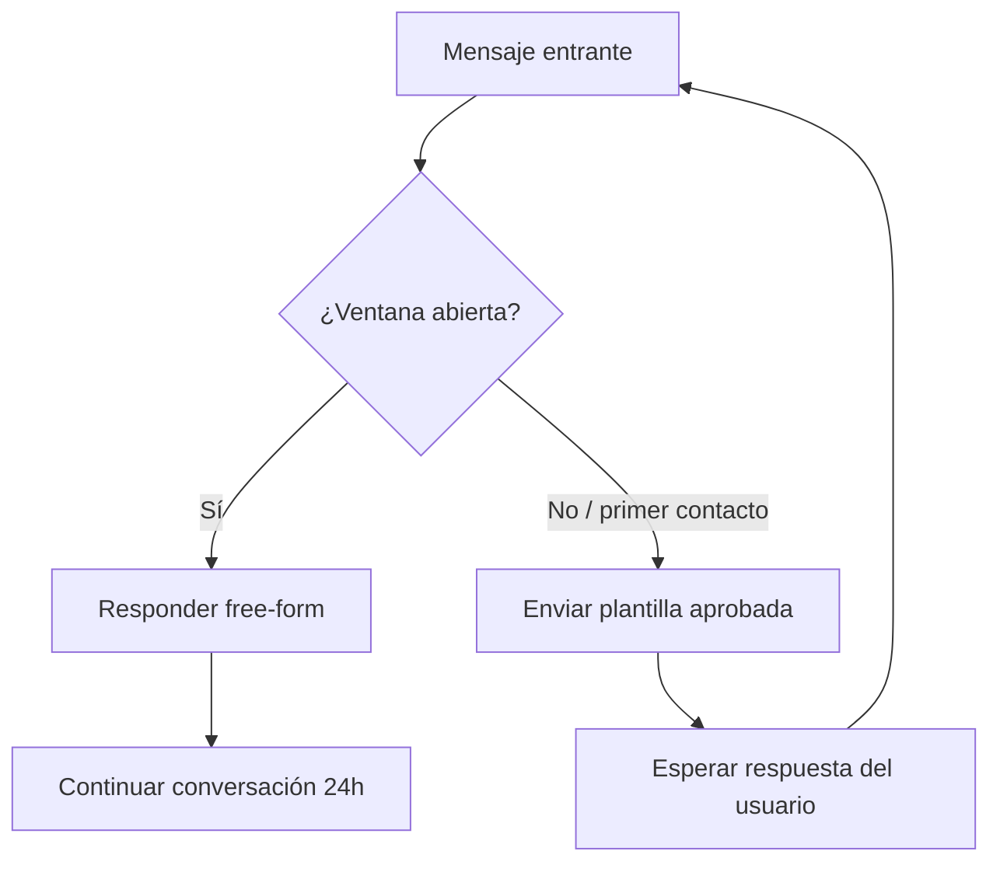

# Ventana de 24 horas de servicio al cliente

> **TL;DR:** Cada vez que un usuario te escribe se abre una ventana de 24h durante la cual podés responderle con **cualquier tipo de mensaje sin plantilla**. Fuera de esa ventana solo podés iniciar la conversación con una plantilla (HSM) aprobada y pagar la conversación correspondiente.

## Contexto

La ventana de 24h es el mecanismo central de Meta para diferenciar conversaciones reactivas (el usuario inició) de proactivas (el negocio inició). Entender cómo se abre, se reinicia y se cierra es clave para diseñar el flujo de cualquier integración y para no pagar de más.

## Cómo funciona

1. El usuario te envía cualquier mensaje (texto, audio, imagen, reacción, click en CTA de un anuncio que abre WA).
2. Se abre una **ventana de 24 horas** contadas desde ese mensaje.
3. Durante esas 24h, podés enviarle cualquier mensaje free-form (texto, media, interactivos, ubicación, etc.) sin necesidad de plantilla.
4. Cada nuevo mensaje del usuario **reinicia el contador**.
5. Pasadas 24h sin mensaje del usuario, la ventana se cierra: para reabrirla, el negocio debe enviar una plantilla aprobada (Marketing, Utility o Authentication según el caso).

## Estados posibles de una conversación

| Estado | ¿Quién inició? | ¿Cómo enviar? | Costo |
|---|---|---|---|
| Ventana abierta (reactiva) | Usuario | Free-form, sin HSM | Conversación de servicio (puede ser free según pricing actual) |
| Ventana cerrada | — | Solo HSM aprobada | Conversación business-initiated (paga según categoría) |
| Free Entry Point activo | Usuario vía CTWA / botón FB | Free-form 72h | Sin costo de plantilla |

Ver [`free-entry-points.md`](./free-entry-points.md) para el caso CTWA.

## Reglas operativas

| Regla | Detalle |
|---|---|
| El contador se basa en el **timestamp del último mensaje entrante** | No del último saliente, no del último visto |
| Aplica por número de teléfono del usuario, no por sesión | Mismo número = misma ventana |
| Aplica por número del negocio | Si tenés 2 números operando, cada uno tiene su ventana con el mismo usuario |
| Reacciones cuentan como mensaje | Si el usuario reacciona, reinicia ventana |
| Estados de "leído" del usuario NO cuentan | No reinician ventana |

## Diseño de flujo recomendado



En la práctica, cuando recibís el webhook entrante ya estás dentro de la ventana: respondé free-form. La decisión de "usar plantilla" aparece cuando el negocio quiere **iniciar** una conversación (recordatorio, promoción, follow-up).

## Cómo detectar si la ventana está abierta

No hay endpoint oficial para preguntar "¿tengo ventana abierta con este usuario?". Estrategias:

1. **Trackear el timestamp** del último mensaje entrante por número en una base propia.
2. Si pasaron < 24h desde ese timestamp → ventana abierta.
3. Si pasaron ≥ 24h o no hay registro → ventana cerrada, usar HSM.

Schema mínimo recomendado (Postgres / Redis):

| Campo | Tipo | Notas |
|---|---|---|
| `wa_user_id` | string | E.164 sin `+` |
| `wa_phone_number_id` | string | Para multi-número |
| `last_inbound_at` | timestamp | UTC |
| `window_expires_at` | timestamp | `last_inbound_at + 24h` |
| `last_template_used` | string | Para evitar enviar la misma 2 veces |

Actualizar `last_inbound_at` en cada webhook `messages` entrante.

## Cómo se "abre" desde el lado del negocio

Para iniciar conversación con ventana cerrada (o primer contacto) hay que enviar una plantilla aprobada. Endpoint:

```bash
curl -X POST \
  "https://graph.facebook.com/v21.0/{{PHONE_NUMBER_ID}}/messages" \
  -H "Authorization: Bearer {{ACCESS_TOKEN}}" \
  -H "Content-Type: application/json" \
  -d '{
    "messaging_product": "whatsapp",
    "to": "{{DESTINATION_E164}}",
    "type": "template",
    "template": {
      "name": "recordatorio_turno",
      "language": { "code": "es_AR" },
      "components": [
        {
          "type": "body",
          "parameters": [
            { "type": "text", "text": "Juan" },
            { "type": "text", "text": "15/06/2026 10:00" }
          ]
        }
      ]
    }
  }'
```

Si el usuario responde a esa plantilla, se abre la ventana de 24h y a partir de ahí podés responder free-form.

## Errores conceptuales frecuentes

| Mito | Realidad |
|---|---|
| "Si el usuario lee el mensaje, se reinicia la ventana" | No. Solo cuenta cuando **envía** un mensaje. |
| "La ventana es de 24h desde la última respuesta del negocio" | No. Es desde el último mensaje del usuario. |
| "Puedo enviar lo que quiera si pago la conversación" | Fuera de ventana solo se puede iniciar con plantilla. |
| "Las plantillas se pueden enviar dentro de la ventana también" | Sí, pero conviene usar free-form para no consumir plantillas. |
| "Cada plantilla cuesta lo mismo" | No, depende de la categoría. Ver [`pricing.md`](./pricing.md). |

## Errores comunes

| Error / Síntoma | Causa | Solución |
|---|---|---|
| Error 131047 / "Re-engagement message" | Intentaste enviar free-form con ventana cerrada | Cambiar a plantilla aprobada |
| Plantilla rechazada por la API en envío (no en aprobación) | Variables mal pasadas o plantilla pausada | Ver [`10-troubleshooting/plantillas-pausadas.md`](../10-troubleshooting/plantillas-pausadas.md) |
| Doble costo de conversación inesperado | Enviaste plantilla con ventana ya abierta + nuevo flujo cross-categoría | Revisar lógica de tracking de ventana |
| Usuario reportó que "le llegó publicidad sin permiso" | Plantilla Marketing enviada sin opt-in | Revisar [`opt-in.md`](./opt-in.md) |

## Referencias

- [Conversation Types · Meta](https://developers.facebook.com/docs/whatsapp/cloud-api/guides/conversations/conversation-types) — Verificado 2026-05-20.
- [WhatsApp Pricing](https://developers.facebook.com/docs/whatsapp/pricing) — Verificado 2026-05-20.
- [`06-politicas-y-calidad/free-entry-points.md`](./free-entry-points.md)
- [`06-politicas-y-calidad/pricing.md`](./pricing.md)
- [`05-plantillas-hsm/categorias.md`](../05-plantillas-hsm/categorias.md)
