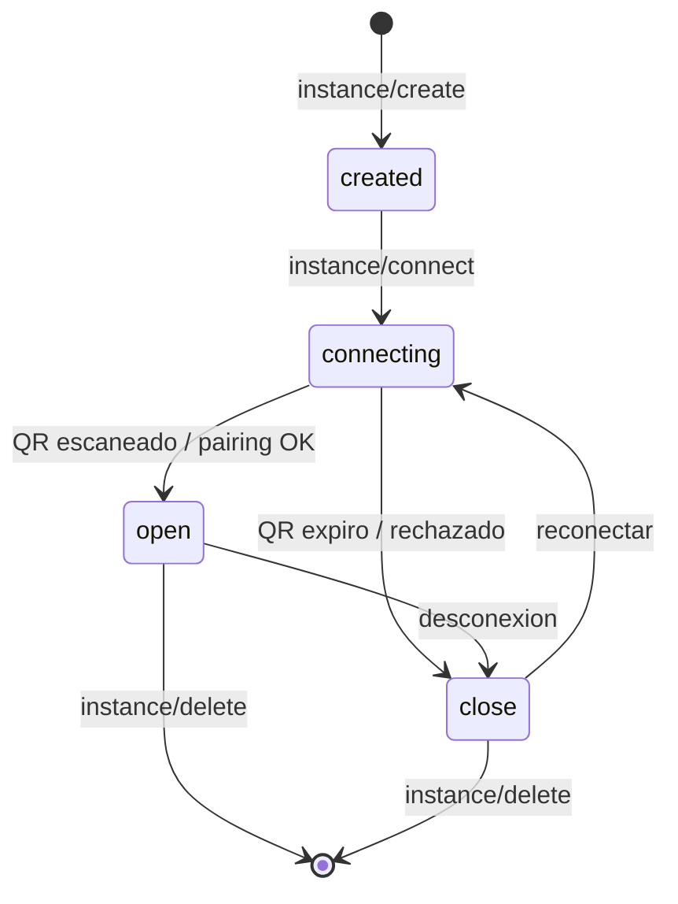

# Evolution API: instancias

> **TL;DR:** Una instancia = un número de WhatsApp conectado. Se crea con un nombre, se vincula escaneando un QR o con pairing code, y la sesión se persiste (Postgres). Un mismo servidor de Evolution maneja muchas instancias (multi-tenant). Estados: `open`, `connecting`, `close`.

## Contexto

La instancia es la unidad básica de Evolution API. Entender su ciclo de vida es clave para operar y para diagnosticar caídas.

## Qué es una instancia

| Aspecto | Detalle |
|---|---|
| Representa | Un número de WhatsApp conectado |
| Identificador | `instanceName` (lo elegís vos) |
| Sesión | Persistida en Postgres (con la config correcta) |
| Webhook | Configurable global o por instancia |
| Cantidad | Muchas por servidor (multi-tenant) |

## Nombrar instancias

| Patrón | Ejemplo |
|---|---|
| Por cliente | `acme`, `xyz-corp` |
| Por cliente + propósito | `acme-soporte`, `acme-ventas` |
| Genérico (un solo uso) | `main` |

Usar nombres descriptivos: el `instanceName` aparece en cada webhook y endpoint.

## Ciclo de vida



## Crear una instancia

```bash
curl -X POST "https://{{EVO_HOST}}/instance/create" \
  -H "apikey: {{API_KEY}}" \
  -H "Content-Type: application/json" \
  -d '{
    "instanceName": "acme-soporte",
    "qrcode": true,
    "integration": "WHATSAPP-BAILEYS"
  }'
```

| Campo | Detalle |
|---|---|
| `instanceName` | Único, descriptivo |
| `qrcode` | `true` para obtener QR al conectar |
| `integration` | `WHATSAPP-BAILEYS` (la conexión no oficial) |

## Conectar (vincular el número)

```bash
curl -X GET "https://{{EVO_HOST}}/instance/connect/acme-soporte" \
  -H "apikey: {{API_KEY}}"
```

Devuelve un QR (base64) o un `pairingCode`.

### QR vs pairing code

| Método | Detalle |
|---|---|
| QR | Escanear con la cámara desde WhatsApp → Dispositivos vinculados |
| Pairing code | Ingresar un código en WhatsApp → Dispositivos vinculados → Vincular con número |

**Preferir pairing code:** más estable, no requiere mostrar/escanear imagen. Para pairing code, pasar `?number={{NUMERO_E164}}`:

```bash
curl -X GET "https://{{EVO_HOST}}/instance/connect/acme-soporte?number={{NUMERO_E164}}" \
  -H "apikey: {{API_KEY}}"
```

## Consultar estado

```bash
curl -X GET "https://{{EVO_HOST}}/instance/connectionState/acme-soporte" \
  -H "apikey: {{API_KEY}}"
```

| Estado | Significado |
|---|---|
| `open` | Conectado, operativo |
| `connecting` | Intentando conectar |
| `close` | Desconectado |

## Listar instancias

```bash
curl -X GET "https://{{EVO_HOST}}/instance/fetchInstances" \
  -H "apikey: {{API_KEY}}"
```

Devuelve todas las instancias del servidor con su estado.

## Logout vs delete

| Operación | Efecto |
|---|---|
| `DELETE /instance/logout/{instance}` | Cierra la sesión, **mantiene** la instancia y su config |
| `DELETE /instance/delete/{instance}` | Borra la instancia completa |

Para re-vincular un número sin perder configuración: **logout**, luego **connect**. No delete.

## Persistencia de la sesión

Para que la sesión sobreviva a reinicios del container:

| Config | Valor |
|---|---|
| `DATABASE_PROVIDER` | `postgresql` |
| `DATABASE_CONNECTION_URI` | URI válida |
| `INSTANCE_EXPIRATION_TIME` | `false` |
| `DEL_INSTANCE` | `false` |

Con esto, al reiniciar el container las instancias reconectan **sin re-escanear**. Sin esto, cada reinicio pide QR de nuevo.

## Multi-tenancy

Un servidor de Evolution maneja muchas instancias. Patrón para integradores:

| Aspecto | Detalle |
|---|---|
| 1 instancia = 1 número = 1 cliente (o 1 canal) | |
| Webhook global apunta al mismo n8n | n8n distingue por el campo `instance` del payload |
| Aislamiento de datos | Por `instance` en tu base |

```javascript
// En el handler del webhook
const instance = body.instance;   // "acme-soporte"
const tenant = resolveTenant(instance);
```

## Webhook por instancia

Además del webhook global, cada instancia puede tener el suyo:

```bash
curl -X POST "https://{{EVO_HOST}}/webhook/set/acme-soporte" \
  -H "apikey: {{API_KEY}}" \
  -H "Content-Type: application/json" \
  -d '{
    "url": "https://n8n.../webhook/evolution-acme",
    "events": ["MESSAGES_UPSERT", "CONNECTION_UPDATE"],
    "webhook_by_events": false
  }'
```

Útil si distintos clientes necesitan endpoints distintos.

## Configuración de settings por instancia

Evolution permite ajustar comportamiento por instancia: rechazar llamadas, marcar como leído automáticamente, ignorar grupos, etc. Ver el endpoint `settings/set` en [`endpoints.md`](./endpoints.md).

## Errores comunes

| Error | Causa | Solución |
|---|---|---|
| `connecting` eterno | QR expiró o conflicto de sesión | Logout + connect con pairing code |
| Pide QR tras cada reinicio | Persistencia mal configurada | Postgres como provider |
| Instancia duplicada | `DEL_INSTANCE` mal o re-create | Setear a `false` |
| `apikey` rechazada | Header mal escrito | Es `apikey`, en minúsculas |
| Estado `open` pero no llegan mensajes | Webhook desconfigurado | Re-setear webhook |
| Se cae al usar el número en otro lado | Múltiples sesiones | Uso exclusivo del número |

Diagnóstico de caídas: [`10-troubleshooting/evolution-desconexion.md`](../../10-troubleshooting/evolution-desconexion.md).

## Referencias

- [Evolution API Docs](https://doc.evolution-api.com/) — Verificado 2026-05-20.
- [`07-integraciones/evolution-api/endpoints.md`](./endpoints.md)
- [`07-integraciones/evolution-api/eventos.md`](./eventos.md)
- [`03-formas-de-uso/evolution-api.md`](../../03-formas-de-uso/evolution-api.md)
