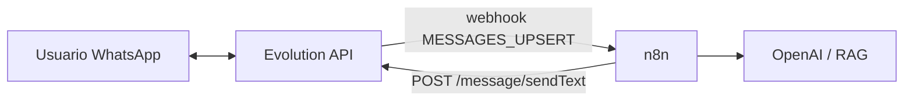
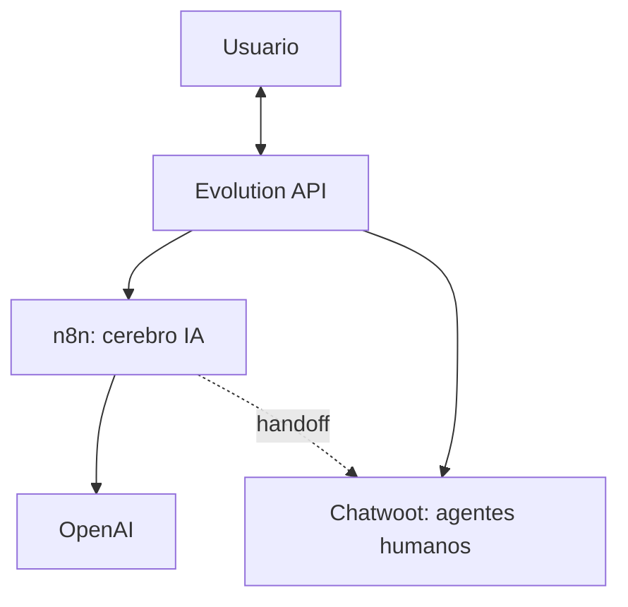

# Evolution API: integraciones

> **TL;DR:** Evolution se integra con n8n (orquestación, lo que cubre esta wiki), y trae integraciones nativas con **Chatwoot** (inbox de agentes) y **Typebot** (constructor de flujos conversacionales). Para stacks con IA, el patrón es Evolution como transporte + n8n como cerebro.

## Contexto

Evolution API es solo el transporte: enviar y recibir mensajes. La inteligencia, la UI de agentes o los flujos vienen de otras piezas. Este documento cubre las integraciones más usadas.

## Evolution + n8n (el foco de esta wiki)

El patrón principal: Evolution maneja el WhatsApp, n8n orquesta.



| Etapa | Cómo |
|---|---|
| Recibir | Webhook de Evolution → n8n (`MESSAGES_UPSERT`) |
| Procesar | n8n: contexto, OpenAI, lógica |
| Responder | n8n → `POST /message/sendText/{instance}` de Evolution |

Detalle:

- Parsear eventos: [`eventos.md`](./eventos.md)
- Endpoints de envío: [`endpoints.md`](./endpoints.md)
- Webhook en n8n (con el parser de Evolution): [`07-integraciones/n8n/webhook-entrante.md`](../n8n/webhook-entrante.md)
- Patrones de orquestación: [`07-integraciones/n8n/patrones.md`](../n8n/patrones.md)

Recetas que aplican (cambiando el transporte Cloud API → Evolution):

- [`09-recetas/bot-atencion-handoff.md`](../../09-recetas/bot-atencion-handoff.md)

### Configurar el webhook hacia n8n

Global (variables de entorno):

```
WEBHOOK_GLOBAL_URL=https://n8n.../webhook/evolution
WEBHOOK_GLOBAL_ENABLED=true
WEBHOOK_EVENTS_MESSAGES_UPSERT=true
WEBHOOK_EVENTS_CONNECTION_UPDATE=true
```

O por instancia con `POST /webhook/set/{instance}`.

Si Evolution y n8n están en el mismo proyecto de Railway / misma red Docker, usar el hostname interno (`http://n8n:5678/...` o `http://n8n.railway.internal:5678/...`) para no salir a Internet.

## Evolution + Chatwoot

[Chatwoot](https://www.chatwoot.com/) es una plataforma open source de atención al cliente (inbox para agentes humanos). Evolution trae integración nativa.

| Para qué sirve | Detalle |
|---|---|
| Inbox de agentes | Los humanos atienden WhatsApp desde Chatwoot |
| Open source | Self-hosteable |
| Alternativa a Kommo/Respond.io | Sin el componente CRM de ventas |

Cuándo usarlo:

| Caso | |
|---|---|
| Necesitás UI de agentes pero no CRM de ventas | Chatwoot |
| Querés todo self-hosted y open source | Chatwoot |
| Necesitás pipelines de venta | Mejor Kommo |

La integración se configura con variables de entorno de Evolution (`CHATWOOT_*`) apuntando a la instancia de Chatwoot.

## Evolution + Typebot

[Typebot](https://typebot.io/) es un constructor visual de flujos conversacionales (tipo formulario conversacional). Evolution trae integración nativa.

| Para qué sirve | Detalle |
|---|---|
| Flujos conversacionales sin código | Constructor visual |
| Bots de captura / calificación | Lineales |
| Alternativa al Salesbot de Kommo | Para casos sin CRM |

Cuándo usarlo:

| Caso | |
|---|---|
| Bot lineal simple sin IA | Typebot |
| Necesitás IA, RAG, function calling | n8n + OpenAI |
| Querés CRM | Kommo |

## Comparación de las opciones de "front"

| Opción | Rol | Cuándo |
|---|---|---|
| n8n | Orquestación + IA | Bots inteligentes, automatización |
| Chatwoot | Inbox de agentes humanos | Atención con equipo humano, open source |
| Typebot | Flujos conversacionales no-code | Bots lineales simples |
| Kommo | CRM + agentes | Ventas con pipeline |

No son excluyentes: un stack puede ser Evolution + n8n (cerebro) + Chatwoot (agentes humanos).

## Stack típico Evolution para producción mínima



- Evolution: transporte.
- n8n: bot con IA.
- Chatwoot: cuando se escala a humano.
- OpenAI: cerebro.

Todo self-hosted, sin costos de SaaS, asumiendo el riesgo de Evolution (no oficial).

## Despliegue

Las integraciones se despliegan juntas. Plantillas:

- [`08-despliegue/railway/plantilla-evolution-n8n-openai.md`](../../08-despliegue/railway/plantilla-evolution-n8n-openai.md)
- [`08-despliegue/docker-compose/README.md`](../../08-despliegue/docker-compose/README.md)

## Errores comunes

| Error | Causa | Solución |
|---|---|---|
| Webhook de Evolution no llega a n8n | URL mal o red | Usar hostname interno si están en la misma red |
| Chatwoot y n8n compiten por los mensajes | Ambos procesan el mismo evento | Definir quién maneja qué; usar modo bot/humano |
| Typebot y n8n duplican respuestas | Dos sistemas conectados a la misma instancia | Elegir uno como front |
| Integración Chatwoot no conecta | Variables `CHATWOOT_*` mal | Revisar URL y token de Chatwoot |

## Errores de diseño a evitar

| Anti-pattern | Por qué |
|---|---|
| Conectar n8n y Typebot a la misma instancia sin coordinación | Respuestas duplicadas |
| Usar Evolution para producción crítica | Riesgo de ban; ver [`03-formas-de-uso/evolution-api.md`](../../03-formas-de-uso/evolution-api.md) |
| No tener handoff a humano | El bot atrapa al usuario |

## Referencias

- [Evolution API Docs](https://doc.evolution-api.com/) — Verificado 2026-05-20.
- [Chatwoot](https://www.chatwoot.com/docs/) — Verificado 2026-05-20.
- [Typebot](https://docs.typebot.io/) — Verificado 2026-05-20.
- [`07-integraciones/n8n/patrones.md`](../n8n/patrones.md)
- [`08-despliegue/railway/plantilla-evolution-n8n-openai.md`](../../08-despliegue/railway/plantilla-evolution-n8n-openai.md)
