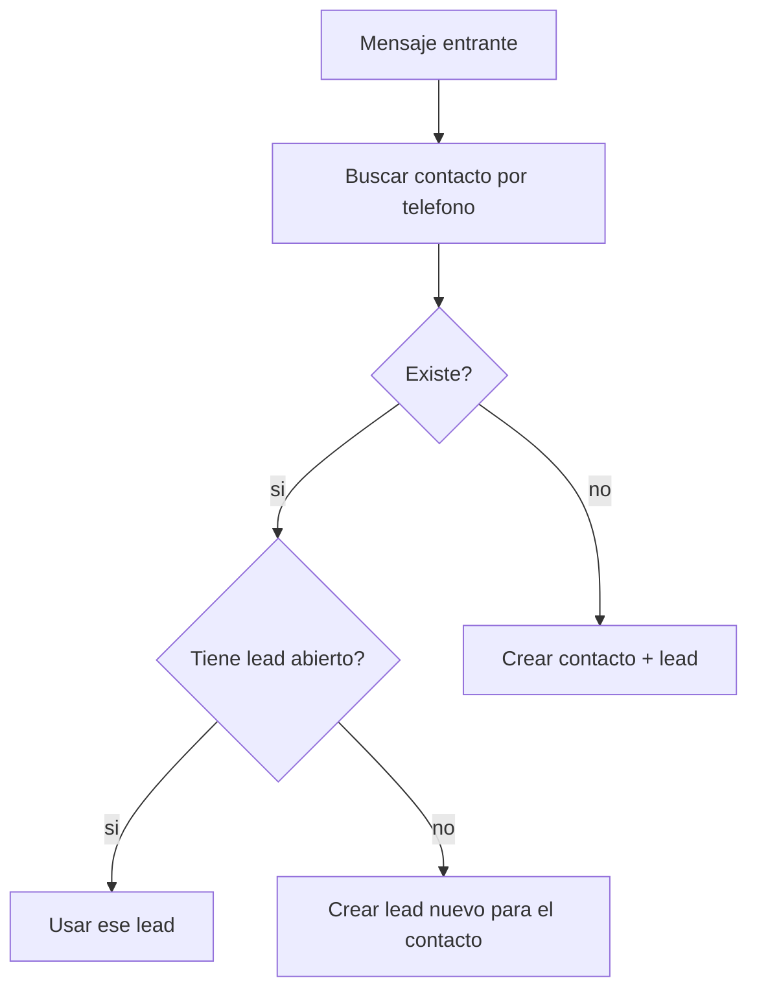

# Kommo: API REST

> **TL;DR:** API REST sobre `https://{{subdominio}}.kommo.com/api/v4/`. Autenticación: **OAuth 2.0** (marketplace, multi-cliente) o **long-lived token** (integración interna, más simple). Operaciones clave: leads, contacts, notes, tasks, pipelines. Rate limit ~7 req/s por cuenta.

## Contexto

n8n y sistemas externos operan Kommo vía esta API: crear leads, mover stages, enviar mensajes, leer pipelines. Este documento es la referencia técnica.

## Base URL

```
https://{{SUBDOMINIO}}.kommo.com/api/v4/
```

| Placeholder | Ejemplo |
|---|---|
| `SUBDOMINIO` | Si la cuenta es `acme.kommo.com` → `acme` |

## Autenticación

| Método | Cuándo |
|---|---|
| **Long-lived token** | Integración interna de un cliente. Más simple. |
| **OAuth 2.0** | Integración distribuida (marketplace, muchos clientes) |

### Long-lived token

Se genera en Kommo → Settings → Integrations → crear integración privada → obtener token de larga duración.

Header en cada request:

```
Authorization: Bearer {{LONG_LIVED_TOKEN}}
```

### OAuth 2.0

Flujo estándar: authorization code → access token + refresh token. El access token expira (típicamente 24h); se renueva con el refresh token. Para integraciones de marketplace.

Para la mayoría de los casos de un integrador con un cliente: **long-lived token**.

## Operaciones clave

### Leads

| Operación | Método + Path |
|---|---|
| Listar leads | `GET /api/v4/leads` |
| Obtener un lead | `GET /api/v4/leads/{{id}}` |
| Crear leads | `POST /api/v4/leads` |
| Actualizar lead | `PATCH /api/v4/leads/{{id}}` |
| Actualizar varios | `PATCH /api/v4/leads` |

Crear un lead:

```bash
curl -X POST \
  "https://{{SUBDOMINIO}}.kommo.com/api/v4/leads" \
  -H "Authorization: Bearer {{TOKEN}}" \
  -H "Content-Type: application/json" \
  -d '[{
    "name": "Consulta WhatsApp - Juan",
    "pipeline_id": {{PIPELINE_ID}},
    "status_id": {{STATUS_ID}},
    "_embedded": {
      "contacts": [{ "id": {{CONTACT_ID}} }]
    }
  }]'
```

Mover de stage (handoff):

```bash
curl -X PATCH \
  "https://{{SUBDOMINIO}}.kommo.com/api/v4/leads/{{LEAD_ID}}" \
  -H "Authorization: Bearer {{TOKEN}}" \
  -H "Content-Type: application/json" \
  -d '{
    "status_id": {{STATUS_ATENCION_HUMANA}},
    "pipeline_id": {{PIPELINE_ID}}
  }'
```

### Contacts

| Operación | Método + Path |
|---|---|
| Listar / buscar | `GET /api/v4/contacts?query={{telefono}}` |
| Crear | `POST /api/v4/contacts` |
| Actualizar | `PATCH /api/v4/contacts/{{id}}` |

Buscar contacto por teléfono (clave para no duplicar leads):

```bash
curl -X GET \
  "https://{{SUBDOMINIO}}.kommo.com/api/v4/contacts?query={{TELEFONO}}" \
  -H "Authorization: Bearer {{TOKEN}}"
```

### Notes

| Operación | Método + Path |
|---|---|
| Agregar nota a un lead | `POST /api/v4/leads/{{id}}/notes` |

```bash
curl -X POST \
  "https://{{SUBDOMINIO}}.kommo.com/api/v4/leads/{{LEAD_ID}}/notes" \
  -H "Authorization: Bearer {{TOKEN}}" \
  -H "Content-Type: application/json" \
  -d '[{
    "note_type": "common",
    "params": { "text": "Handoff: motivo X. Resumen: ..." }
  }]'
```

### Pipelines y stages

| Operación | Método + Path |
|---|---|
| Listar pipelines | `GET /api/v4/leads/pipelines` |
| Obtener un pipeline | `GET /api/v4/leads/pipelines/{{id}}` |

Llamar esto **una vez** al configurar la integración y guardar los `pipeline_id` / `status_id` como configuración. No consultarlos en cada request.

### Tasks

| Operación | Método + Path |
|---|---|
| Crear tarea | `POST /api/v4/tasks` |
| Listar | `GET /api/v4/tasks` |

### Enviar mensaje al cliente

El envío de mensajes de chat se hace vía el endpoint de chats/mensajería de Kommo (varía según la versión y el canal). Patrón general: POST a un endpoint de mensajería con `lead_id` o `chat_id` y el texto. Verificar en la doc oficial vigente la ruta exacta para el canal de WhatsApp.

## Estructura de respuestas

Kommo usa HAL/JSON con `_embedded` y `_links`:

```json
{
  "_page": 1,
  "_links": { "self": { "href": "..." } },
  "_embedded": {
    "leads": [
      { "id": 123, "name": "...", "status_id": 456, "_embedded": { "contacts": [...] } }
    ]
  }
}
```

Los objetos relacionados van anidados en `_embedded`.

## Custom fields

Leer/escribir campos custom requiere el `field_id`:

```json
"custom_fields_values": [
  {
    "field_id": {{FIELD_ID}},
    "values": [{ "value": "opt-in confirmado" }]
  }
]
```

Listar los field IDs: `GET /api/v4/leads/custom_fields`.

## Rate limits

| Límite | Valor referencial |
|---|---|
| Requests por segundo | ~7 por cuenta |

Implicaciones:

- Throttling client-side en n8n.
- Para operaciones masivas, batchear (`PATCH /leads` con array) en vez de una request por lead.
- Backoff ante `429`.

## Patrón: evitar leads duplicados

Cada mensaje entrante NO debe crear un lead nuevo. Patrón:



## Operaciones batch

Crear/actualizar varios objetos en una request (respeta el rate limit):

```bash
curl -X PATCH \
  "https://{{SUBDOMINIO}}.kommo.com/api/v4/leads" \
  -H "Authorization: Bearer {{TOKEN}}" \
  -H "Content-Type: application/json" \
  -d '[
    { "id": 1, "status_id": 100 },
    { "id": 2, "status_id": 100 }
  ]'
```

## Errores comunes

| Error | Causa | Solución |
|---|---|---|
| `401 Unauthorized` | Token revocado o cuenta cambió de plan | Regenerar long-lived token |
| `429 Too Many Requests` | Superaste ~7 req/s | Throttling + backoff |
| `400` al crear lead | `pipeline_id` / `status_id` inválidos | Verificar con `GET /pipelines` |
| Lead duplicado por mensaje | Sin búsqueda previa de contacto | Buscar antes de crear |
| Custom field no se escribe | `field_id` incorrecto | Listar `custom_fields` |
| `_embedded` vacío | No pediste el recurso anidado | Revisar el `with` param si aplica |

## Referencias

- [Kommo API v4](https://developers.kommo.com/) — Verificado 2026-05-20.
- [`07-integraciones/kommo/conceptos.md`](./conceptos.md)
- [`07-integraciones/kommo/webhooks.md`](./webhooks.md)
