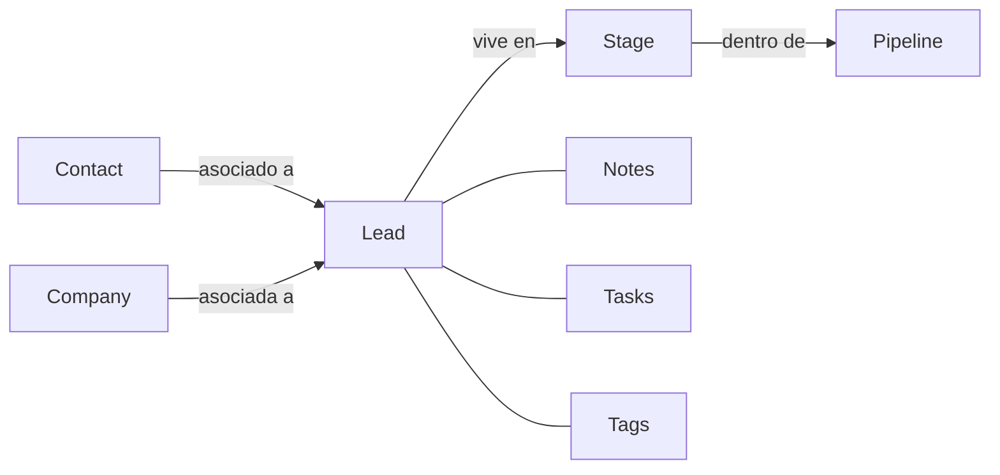

# Kommo: conceptos

> **TL;DR:** Kommo es un CRM conversacional: la unidad central es el **Lead** (una oportunidad/conversación) que avanza por **Stages** dentro de un **Pipeline** (Kanban). Otros objetos: Contact, Company, Task, Note. La automatización vive en el **Digital Pipeline** (por stage) y el **Salesbot** (bots visuales).

## Contexto

Antes de integrar Kommo con WhatsApp + n8n hay que tener su modelo de datos claro. Difiere de un CRM tradicional: en Kommo el lead **es** la conversación, no una ficha aparte.

## Objetos principales

| Objeto | Qué es |
|---|---|
| **Account** | La instancia de Kommo del cliente. Subdominio `{{cliente}}.kommo.com`. |
| **User** | Agente humano con permisos. |
| **Lead** | Oportunidad / conversación. El objeto central. |
| **Pipeline** | Conjunto ordenado de stages (un tablero Kanban). |
| **Stage** (status) | Columna del pipeline. El lead vive en una a la vez. |
| **Contact** | Persona. Un lead puede tener uno o varios. |
| **Company** | Empresa. Agrupa contactos. |
| **Task** | Tarea con vencimiento asignada a un user. |
| **Note** | Anotación en un lead/contacto (texto, llamada, mensaje, sistema). |
| **Tag** | Etiqueta para segmentar leads/contactos. |
| **Custom field** | Campo personalizado en cualquier objeto. |
| **Widget** | Integración instalada (WhatsApp, Salesbot, terceros). |

## El Lead como eje

Cuando llega un mensaje de WhatsApp de un número desconocido, Kommo típicamente crea un **Lead** nuevo (con su Contact). Toda la conversación queda atada a ese lead.

## Pipelines y stages

Un pipeline es un flujo de trabajo. Ejemplos:

| Pipeline | Stages típicos |
|---|---|
| Ventas | Nuevo · Contactado · Calificado · Propuesta · Ganado · Perdido |
| Soporte | Entrante · Bot activo · Atención humana · Resuelto |
| Onboarding | Registrado · En setup · Activo |

Una cuenta tiene varios pipelines. Un lead pertenece a uno; moverlo de stage es la operación más común.

| Stage especial | Detalle |
|---|---|
| Incoming leads | Bandeja de leads sin clasificar (opcional) |
| Won (Ganado) | Stage final de éxito |
| Lost (Perdido) | Stage final de fracaso, con motivo |

## Digital Pipeline

Automatización **por stage**. Cuando un lead entra a un stage, se dispara:

| Acción del Digital Pipeline | Ejemplo |
|---|---|
| Enviar mensaje | Plantilla de WhatsApp al entrar a "Contactado" |
| Ejecutar Salesbot | Lanzar un bot al entrar a "Bot activo" |
| Crear tarea | "Llamar al cliente" al entrar a "Calificado" |
| Llamar webhook | Avisar a n8n |
| Cambiar campo | Marcar una fecha |

Es la forma no-code de orquestar dentro de Kommo.

## Salesbot

Motor de bots visual de Kommo. Bloques arrastrables: enviar mensaje, condición, esperar respuesta, webhook, etc. Detalle en [`salesbot.md`](./salesbot.md).

Para integraciones serias con IA, el Salesbot se usa como **trigger** y la lógica vive en n8n. Ver [`integracion-n8n.md`](./integracion-n8n.md).

## Custom fields

Campos personalizados clave para WhatsApp:

| Campo sugerido | Objeto | Uso |
|---|---|---|
| `wa_opt_in` | Contact | Consentimiento de marketing |
| `wa_phone_number_id` | Lead | Para multi-número |
| `intent` | Lead | Clasificación de la consulta |
| `last_bot_interaction` | Lead | Timestamp |
| `handoff_reason` | Lead | Motivo de derivación a humano |

## IDs que vas a usar en la API

| ID | Para qué |
|---|---|
| `account` (subdominio) | URL base de la API |
| `lead_id` | Operar sobre un lead |
| `contact_id` | Operar sobre un contacto |
| `pipeline_id` | Identificar el pipeline |
| `status_id` | Identificar el stage (status) |
| `user_id` | Asignar a un agente |
| `custom_field_id` | Leer/escribir campos custom |

Los `pipeline_id` y `status_id` se obtienen una vez vía API y se guardan como configuración. Ver [`api-rest.md`](./api-rest.md).

## Modelo conversacional

Kommo unifica canales en el lead: WhatsApp, Instagram, Telegram, etc. aparecen como mensajes dentro del mismo lead/contacto. El agente humano responde desde la UI de Kommo sin importar el canal.

## Errores conceptuales comunes

| Error | Realidad |
|---|---|
| "El lead es una ficha de cliente" | El lead es una oportunidad/conversación; el cliente es el Contact |
| "Un contacto = un lead" | Un contacto puede tener varios leads (varias oportunidades) |
| "Las plantillas se configuran en Kommo" | Se aprueban en Meta; Kommo las sincroniza |
| "El Salesbot puede hacer todo" | Tiene techo; lo complejo va a n8n |
| "Mover de stage es cosmético" | Dispara automatizaciones del Digital Pipeline |

## Referencias

- [Kommo Developers](https://developers.kommo.com/) — Verificado 2026-05-20.
- [`03-formas-de-uso/kommo-crm.md`](../../03-formas-de-uso/kommo-crm.md)
- [`07-integraciones/kommo/salesbot.md`](./salesbot.md)
- [`07-integraciones/kommo/api-rest.md`](./api-rest.md)
