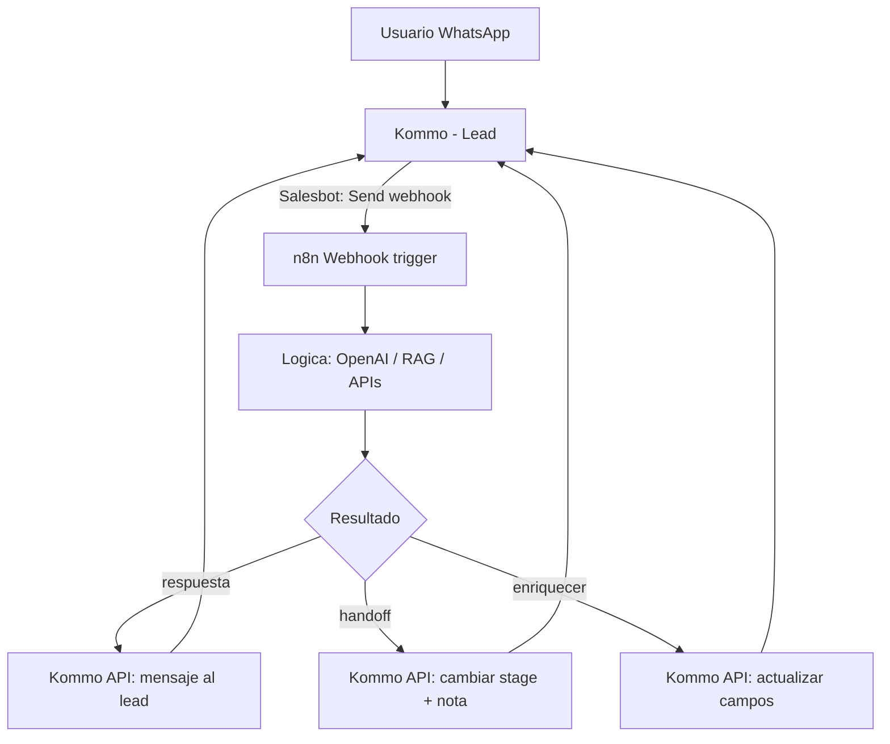
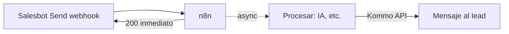

# Kommo: integración con n8n

> **TL;DR:** El patrón canónico: el **Salesbot de Kommo dispara un webhook a n8n**, n8n hace la lógica (IA, RAG, integraciones), y devuelve resultados a Kommo vía la **API REST** (mensaje al lead, cambio de stage, notas). El Salesbot queda mínimo; toda la inteligencia vive en n8n.

## Contexto

Kommo solo no alcanza para bots con IA. n8n solo no tiene UI de agentes. Juntos: Kommo es el front (CRM + inbox + agentes humanos), n8n es el cerebro (orquestación + IA). Este documento es el "cómo" del puente.

## Las dos direcciones

| Dirección | Mecanismo |
|---|---|
| Kommo → n8n | Webhook (de cuenta o Send webhook del Salesbot) |
| n8n → Kommo | API REST (leads, mensajes, notas, stages) |

## Patrón canónico



## Setup paso a paso

### 1. Credenciales de Kommo en n8n

Guardar como credential / variables:

| Variable | Valor |
|---|---|
| `KOMMO_SUBDOMAIN` | Subdominio de la cuenta |
| `KOMMO_LONG_LIVED_TOKEN` | Token de la integración privada |

### 2. Obtener los IDs de configuración

Una vez, llamar `GET /api/v4/leads/pipelines` y guardar:

| ID | Para qué |
|---|---|
| `KOMMO_PIPELINE_ID` | Pipeline principal |
| `KOMMO_STAGE_BOT_ID` | Stage "Bot activo" |
| `KOMMO_STAGE_HUMANO_ID` | Stage "Atención humana" |
| `KOMMO_STAGE_GANADO_ID` | Stage final de éxito |

### 3. Configurar el Salesbot trigger

En Kommo, un Salesbot mínimo:

1. Trigger: mensaje entrante con lead en stage `Bot activo`.
2. Bloque **Send webhook** → `https://n8n.../webhook/kommo`.
3. Datos enviados: `lead_id`, `contact_id`, teléfono, último mensaje.

### 4. Workflow de n8n

| Nodo | Función |
|---|---|
| Webhook trigger | Recibe el POST del Salesbot |
| Code | Parsea `lead_id`, `text`, etc. |
| Respond to Webhook | 200 inmediato (evitar timeout del Salesbot) |
| Postgres | Cargar/guardar contexto de la conversación |
| OpenAI | Generar respuesta / tool calls |
| Switch | Respuesta libre vs handoff vs otra acción |
| HTTP Request (Kommo API) | Enviar resultado a Kommo |

## Operaciones n8n → Kommo más usadas

### Enviar mensaje al lead

POST al endpoint de mensajería de Kommo con `lead_id` y texto. Ver [`api-rest.md`](./api-rest.md).

### Mover de stage (handoff)

```
PATCH /api/v4/leads/{{LEAD_ID}}
{ "status_id": {{KOMMO_STAGE_HUMANO_ID}}, "pipeline_id": {{KOMMO_PIPELINE_ID}} }
```

### Agregar nota de contexto

Cuando se hace handoff, dejar contexto para el agente:

```
POST /api/v4/leads/{{LEAD_ID}}/notes
[{ "note_type": "common", "params": { "text": "Handoff. Motivo: ... Resumen: ..." } }]
```

### Actualizar campos custom

Enriquecer el lead con datos detectados por la IA (intent, urgencia):

```
PATCH /api/v4/leads/{{LEAD_ID}}
{ "custom_fields_values": [{ "field_id": {{ID}}, "values": [{ "value": "..." }] }] }
```

## Manejo del timeout del Salesbot

El bloque Send webhook del Salesbot tiene timeout corto. Patrón correcto:



1. n8n responde **200 de inmediato** al Salesbot.
2. n8n sigue procesando async (queue mode).
3. La respuesta al usuario se envía vía **Kommo API**, no como respuesta del webhook.

Si esperás a que OpenAI responda dentro del webhook, el Salesbot puede cortar por timeout.

## Quién envía el mensaje

Decisión de diseño: ¿el Salesbot envía o n8n envía?

| Opción | Recomendación |
|---|---|
| Salesbot envía (usando la respuesta del webhook) | Solo para respuestas rápidas y simples |
| **n8n envía vía API** | Recomendado: desacopla, permite async |

Que **uno solo** envíe. Si ambos envían, el usuario recibe duplicados.

## Estado de la conversación

n8n mantiene el contexto en Postgres (ver [`07-integraciones/n8n/contexto.md`](../n8n/contexto.md)), mapeando `kommo_lead_id` ↔ conversación:

```sql
ALTER TABLE wa_conversations ADD COLUMN kommo_lead_id BIGINT;
ALTER TABLE wa_conversations ADD COLUMN kommo_contact_id BIGINT;
```

Kommo tiene el historial visible para los agentes; n8n tiene el contexto estructurado para el LLM. Conviven.

## Reaccionar a cambios de stage

Además del Salesbot, suscribir el webhook de cuenta `Lead status changed` para que n8n reaccione cuando un agente humano mueve un lead. Ejemplo: el agente cierra el lead → n8n archiva el contexto.

Cuidado con loops: filtrar los cambios que hace el propio n8n. Ver [`webhooks.md`](./webhooks.md).

## Receta completa

La integración Kommo + n8n + OpenAI con handoff está documentada end-to-end en:

- [`09-recetas/kommo-cloudapi-openai-handoff.md`](../../09-recetas/kommo-cloudapi-openai-handoff.md)
- [`09-recetas/kommo-n8n-rag.md`](../../09-recetas/kommo-n8n-rag.md) (con RAG)

## Errores comunes

| Error | Causa | Solución |
|---|---|---|
| Salesbot timeout | n8n procesa sync | 200 inmediato + async |
| Mensajes duplicados | Salesbot y n8n ambos envían | Que solo n8n envíe |
| Bot responde tras handoff | Lead sigue en stage Bot | Confirmar el PATCH de stage |
| Loop de webhooks | n8n actualiza → dispara webhook | Filtrar cambios propios |
| Lead no encontrado en n8n | Mapping `kommo_lead_id` ausente | Guardar el mapping al crear la conversación |
| Rate limit de Kommo | Muchas llamadas a la API | Throttling, batch |

## Referencias

- [`07-integraciones/kommo/salesbot.md`](./salesbot.md)
- [`07-integraciones/kommo/api-rest.md`](./api-rest.md)
- [`07-integraciones/kommo/webhooks.md`](./webhooks.md)
- [`09-recetas/kommo-cloudapi-openai-handoff.md`](../../09-recetas/kommo-cloudapi-openai-handoff.md)
