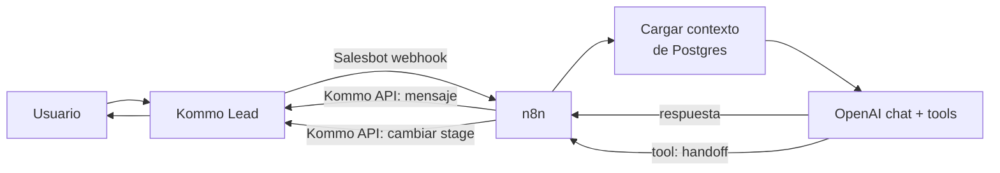

# Kommo: integración con OpenAI

> **TL;DR:** Kommo no llama a OpenAI directamente: el Salesbot no tiene LLM nativo. El patrón es **Kommo → n8n → OpenAI → Kommo**. El Salesbot dispara un webhook, n8n llama a OpenAI (con contexto y tools), y la respuesta vuelve al lead vía la API de Kommo. Para casos sin n8n, se puede llamar a un endpoint propio que envuelva OpenAI.

## Contexto

Sumar IA conversacional a Kommo es una de las integraciones más pedidas. Como el Salesbot no tiene LLM, hace falta una pieza intermedia. Este documento describe las opciones.

## Opciones de arquitectura

| Opción | Detalle | Recomendación |
|---|---|---|
| Kommo → n8n → OpenAI | n8n orquesta todo | **Recomendada** |
| Kommo → endpoint propio → OpenAI | Un microservicio en vez de n8n | Si ya tenés backend |
| Widget de IA de marketplace | Apps de terceros en Kommo | Cajas negras, menos control |

Esta wiki documenta la primera (con n8n), por flexibilidad y consistencia con el resto.

## Patrón Kommo → n8n → OpenAI



Es el patrón de [`integracion-n8n.md`](./integracion-n8n.md) con OpenAI como cerebro.

## Por qué OpenAi va detrás de n8n y no en el Salesbot

| Si lo metés en el Salesbot (vía webhook directo a OpenAI) | Problema |
|---|---|
| El Salesbot llamaría a OpenAI directo | No puede armar el array de mensajes con contexto |
| Sin manejo de historial | El bot "olvida" |
| Sin function calling orquestado | No puede ejecutar tools |
| Sin RAG | No puede buscar en la KB |

n8n resuelve todo eso: arma el contexto, llama a OpenAI, ejecuta las tools, persiste el estado.

## Componentes en n8n

| Etapa | Detalle |
|---|---|
| Recibir webhook del Salesbot | `lead_id`, `text` |
| Cargar contexto | Histórico desde Postgres mapeado por `kommo_lead_id` |
| Construir array de mensajes | system + facts + histórico + mensaje actual |
| Llamar OpenAI | Chat completion con tools |
| Procesar tool calls | `request_handoff`, `qualify_lead`, etc. |
| Responder al lead | Vía Kommo API |
| Persistir | Guardar el turno en Postgres |

Detalle de cada pieza:

- Contexto: [`07-integraciones/openai/contexto-conversacion.md`](../openai/contexto-conversacion.md)
- Function calling: [`07-integraciones/openai/function-calling.md`](../openai/function-calling.md)
- Prompts: [`07-integraciones/openai/prompts.md`](../openai/prompts.md)

## Tools típicas para Kommo

Las tools de OpenAI que actúan sobre Kommo:

| Tool | Acción en Kommo |
|---|---|
| `request_handoff(reason, department)` | `PATCH` lead a stage "Atención humana" + nota |
| `qualify_lead(intent, urgency, budget)` | `PATCH` campos custom del lead |
| `update_lead_stage(stage)` | `PATCH` lead a otro stage del pipeline |
| `create_task(description, due)` | `POST` task asignada a un agente |
| `search_knowledge_base(query)` | RAG (ver [`09-recetas/kommo-n8n-rag.md`](../../09-recetas/kommo-n8n-rag.md)) |

Cada tool, al ejecutarse en n8n, hace la llamada correspondiente a la API de Kommo.

## Ejemplo: tool de handoff

Definición (OpenAI):

```json
{
  "type": "function",
  "function": {
    "name": "request_handoff",
    "description": "Deriva la conversación a un agente humano moviendo el lead de stage en Kommo. Usar cuando el cliente lo pide o la consulta excede al bot.",
    "parameters": {
      "type": "object",
      "properties": {
        "reason": { "type": "string" },
        "department": { "type": "string", "enum": ["ventas", "soporte", "administracion"] }
      },
      "required": ["reason", "department"]
    }
  }
}
```

Ejecución (n8n, al recibir el tool call):

1. `PATCH /api/v4/leads/{{lead_id}}` → `status_id` del stage "Atención humana".
2. `POST /api/v4/leads/{{lead_id}}/notes` → nota con `reason`.
3. (Opcional) Asignar a un agente del `department`.
4. Responder al cliente: "Te conecto con el equipo de {{department}}."

## Enriquecer el lead con IA

Más allá de responder, la IA puede **enriquecer el CRM**. La tool `qualify_lead` permite que el modelo etiquete el lead:

```json
{ "intent": "compra", "urgency": "alta", "budget": "alto" }
```

n8n traduce eso a campos custom del lead en Kommo. El agente humano, al tomar el lead, ya lo ve clasificado. Esto es valor real del CRM: la IA no solo conversa, califica.

## Costos

| Componente | Detalle |
|---|---|
| OpenAI | Ver [`07-integraciones/openai/costos.md`](../openai/costos.md) — orden de centavos por conversación |
| Kommo | Suscripción del plan |
| n8n | Hosting |

OpenAI es la parte chica del costo total.

## Casos sin n8n

Si el integrador prefiere un microservicio propio en vez de n8n:

| Componente | Reemplazo |
|---|---|
| Webhook trigger | Endpoint HTTP del microservicio |
| Orquestación | Código propio |
| Llamadas a OpenAI / Kommo API | SDKs |

El patrón lógico es el mismo: Salesbot → tu endpoint → OpenAI → Kommo API. n8n solo baja la barrera de desarrollo.

## Errores comunes

| Error | Causa | Solución |
|---|---|---|
| El bot "olvida" el hilo | Sin contexto persistido | Cargar histórico desde Postgres |
| Salesbot timeout esperando a OpenAI | Llamada sync dentro del webhook | 200 inmediato + async + Kommo API |
| Tool de handoff no mueve el lead | `status_id` mal | Verificar IDs del pipeline |
| Respuestas largas y con markdown | Prompt no adaptado a WhatsApp | Ver [`07-integraciones/openai/prompts.md`](../openai/prompts.md) |
| Lead sin clasificar tras la charla | No se usa `qualify_lead` | Agregar la tool y la lógica |

## Referencias

- [`07-integraciones/kommo/integracion-n8n.md`](./integracion-n8n.md)
- [`07-integraciones/openai/function-calling.md`](../openai/function-calling.md)
- [`09-recetas/kommo-cloudapi-openai-handoff.md`](../../09-recetas/kommo-cloudapi-openai-handoff.md)
- [`09-recetas/kommo-n8n-rag.md`](../../09-recetas/kommo-n8n-rag.md)
