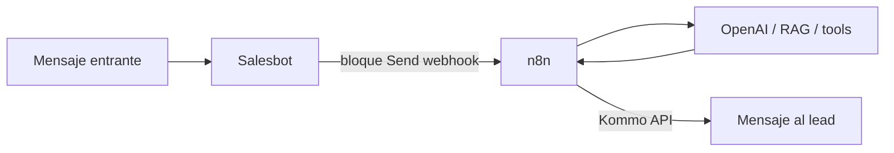

# Kommo: Salesbot

> **TL;DR:** El Salesbot es el motor de bots visual de Kommo: bloques arrastrables (enviar mensaje, condición, esperar, webhook, etc.). Cubre flujos lineales simples sin código. Para lógica compleja (IA, RAG, function calling), usar el Salesbot solo como **trigger** que llama a n8n vía un bloque webhook.

## Contexto

El Salesbot es lo que hace que Kommo sea "todo en uno" para casos simples. Conocer sus límites evita dos errores: subusarlo (armar en n8n lo que el Salesbot resuelve) o sobreusarlo (forzar lógica compleja en bloques visuales).

## Bloques del Salesbot

| Bloque | Función |
|---|---|
| Send message | Enviar texto/media al cliente |
| Condition | Branch según campo, tag, texto del cliente |
| Question / Wait for answer | Esperar respuesta del cliente |
| Set / edit field | Modificar un campo del lead/contacto |
| Add/remove tag | Etiquetar |
| Change stage | Mover el lead de stage |
| Assign user | Asignar a un agente |
| Create task | Crear una tarea |
| Send webhook | POST a una URL externa (la puerta a n8n) |
| Widget action | Acción de un widget instalado |
| Pause / Wait | Esperar un tiempo |
| Salesbot jump | Saltar a otro punto del bot |

## Cómo se dispara

| Trigger | Detalle |
|---|---|
| Digital Pipeline | Lead entra a un stage → ejecutar Salesbot |
| Mensaje entrante | Con condición de stage/pipeline |
| Manual | Un agente lo lanza |
| Bot anterior | Un Salesbot llama a otro |

## Qué resuelve bien

| Caso | Apto |
|---|---|
| Menú de bienvenida con opciones | Sí |
| Calificación con 3-5 preguntas fijas | Sí |
| Routing por palabra clave a un equipo | Sí |
| Branch simple (cliente nuevo vs existente) | Sí |
| Recordatorio / follow-up programado | Sí |
| Cambiar stage según la respuesta | Sí |

## Qué NO resuelve bien

| Caso | Por qué |
|---|---|
| Conversación natural con IA | No tiene LLM nativo |
| RAG / búsqueda semántica | Imposible |
| Function calling | No existe el concepto |
| Manejo de contexto multi-turno complejo | Memoria muy limitada |
| Lógica con muchas llamadas a APIs | Engorroso con bloques webhook |
| Cálculos / transformaciones de datos | Muy limitado |

Para todo eso: delegar a n8n.

## Patrón: Salesbot como trigger de n8n

El patrón recomendado para bots con IA:



El Salesbot se reduce a:

1. Trigger: mensaje entrante con lead en stage `Bot activo`.
2. Bloque **Send webhook** → POST a n8n con `lead_id`, `contact_id`, `last_message`, etc.
3. (Opcional) Bloque condición / espera.

Toda la inteligencia vive en n8n. El Salesbot es solo el disparador. Ver [`integracion-n8n.md`](./integracion-n8n.md).

### Por qué este patrón

| Ventaja | Detalle |
|---|---|
| Mantenibilidad | La lógica en un solo lugar (n8n), versionable |
| Capacidad | n8n hace lo que el Salesbot no puede |
| Testeable | Workflows de n8n testeables |
| El Salesbot queda mínimo | Menos cosas que romper |

## Bloque Send webhook: detalle

| Campo | Detalle |
|---|---|
| URL | Endpoint de n8n (`https://n8n.../webhook/kommo`) |
| Datos | Kommo envía datos del lead; se pueden agregar campos |
| Respuesta | El Salesbot puede usar la respuesta del webhook en bloques siguientes |
| Timeout | Limitado: n8n debe responder rápido |

**Importante:** el Salesbot tiene un timeout corto para el webhook. n8n debe responder rápido (un ack) y hacer el trabajo pesado async, enviando la respuesta al lead vía Kommo API. No esperar a que n8n termine todo dentro del webhook.

## Patrón: bot simple 100% Salesbot

Para un cliente sin IA, FAQ chica:

```
Trigger: mensaje entrante
→ Send message: "Hola, ¿en qué te ayudo? 1) Horarios 2) Ubicación 3) Hablar con alguien"
→ Wait for answer
→ Condition sobre la respuesta:
   - "1" → Send message con horarios
   - "2" → Send message con ubicación
   - "3" → Change stage a "Atención humana" + Assign user
   - otro → Send message "No entendí" + repetir
```

Esto no necesita n8n. Para FAQ estática alcanza.

## Límites técnicos

| Límite | Detalle |
|---|---|
| Granularidad de espera | Los bloques de pausa son de minutos, no segundos |
| Memoria | Limitada; depende de campos del lead |
| Condiciones complejas | Se vuelven inmanejables con muchos branches |
| Versionado | Cada cambio queda guardado, pero no hay diff tipo Git |
| Debugging | Limitado vs un workflow de n8n |

## Buenas prácticas

| Práctica | Razón |
|---|---|
| Salesbot mínimo si hay n8n | Una sola fuente de lógica |
| Documentar el bot fuera de Kommo | Los bloques visuales no se auto-documentan |
| Fallback para respuestas no esperadas | El usuario siempre escribe algo raro |
| Salida a humano siempre disponible | No atrapar al cliente en el bot |
| No anidar demasiados condicionales | Se vuelve ingobernable |

## Errores comunes

| Error | Causa | Solución |
|---|---|---|
| Salesbot no dispara | No vinculado al stage/pipeline correcto | Revisar Digital Pipeline |
| Webhook a n8n da timeout | n8n tarda mucho | Responder rápido, procesar async |
| Bot atrapa al cliente sin salida | Sin opción de humano | Agregar siempre una salida |
| Lógica compleja imposible de mantener | Todo en bloques visuales | Migrar a n8n |
| Bot responde duplicado | Salesbot envía + n8n también | Que solo uno envíe |

## Referencias

- [Kommo Help · Salesbot](https://www.kommo.com/help/) — Verificado 2026-05-20.
- [`07-integraciones/kommo/integracion-n8n.md`](./integracion-n8n.md)
- [`07-integraciones/kommo/conceptos.md`](./conceptos.md)
