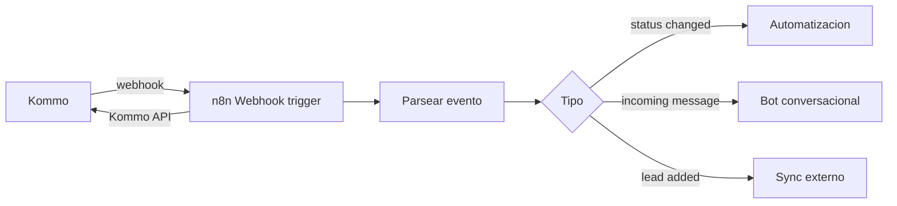

# Kommo: webhooks

> **TL;DR:** Kommo envía webhooks salientes a una URL del integrador cuando ocurren eventos (lead creado, stage cambiado, mensaje entrante, nota agregada, etc.). Se configuran en Settings → Integrations. Más el bloque **Send webhook** del Salesbot para disparos puntuales. Son la vía principal para conectar Kommo con n8n.

## Contexto

Hay dos formas de que Kommo "avise" a n8n: los **webhooks de cuenta** (eventos globales) y el **bloque Send webhook del Salesbot** (disparo dentro de un bot). Conocer ambos y cuándo usar cada uno.

## Webhooks de cuenta

Se configuran en Kommo → Settings → Integrations → Webhooks. Disparan ante eventos de toda la cuenta.

| Evento | Cuándo se dispara |
|---|---|
| Lead added | Se crea un lead |
| Lead status changed | Un lead cambia de stage |
| Lead updated | Cambia algún campo del lead |
| Lead deleted | Se borra un lead |
| Contact added / updated | Alta o cambio de contacto |
| Incoming chat message | Mensaje entrante de un canal |
| Task added / completed | Tareas |
| Note added | Se agrega una nota |
| Responsible user changed | Cambia el agente asignado |

### Configuración

| Campo | Detalle |
|---|---|
| URL | Endpoint del integrador (n8n: `https://n8n.../webhook/kommo`) |
| Eventos | Seleccionar los que interesan |
| Bloques (settings) | Kommo permite filtrar por pipeline/eventos según la versión |

### Payload

Kommo envía un POST `application/x-www-form-urlencoded` o JSON (según versión) con la estructura del evento:

```json
{
  "leads": {
    "status": [{
      "id": "123",
      "status_id": "456",
      "pipeline_id": "789",
      "old_status_id": "455",
      "old_pipeline_id": "789"
    }]
  },
  "account": { "id": "...", "subdomain": "acme" }
}
```

La forma exacta varía por evento. Parsear en n8n según el tipo.

## Bloque Send webhook del Salesbot

Dentro de un Salesbot, el bloque **Send webhook** hace un POST a una URL cuando el flujo llega a ese bloque.

| Diferencia con webhook de cuenta | |
|---|---|
| Webhook de cuenta | Global, ante cualquier evento del tipo |
| Send webhook (Salesbot) | Puntual, controlado, dentro de un flujo |

Para el patrón "Salesbot como trigger de n8n", se usa **Send webhook**: el bot recibe el mensaje, hace POST a n8n, n8n procesa. Ver [`salesbot.md`](./salesbot.md).

### Datos enviados

El bloque Send webhook permite enviar datos del lead/contacto: `lead_id`, `contact_id`, teléfono, último mensaje, campos custom. Configurables en el bloque.

### Respuesta

El Salesbot puede usar la respuesta del webhook en bloques siguientes. Pero por el timeout corto, conviene que n8n responda rápido (ack) y procese async.

## Cuál usar

| Necesidad | Webhook |
|---|---|
| Reaccionar a cambios de stage para automatizar | Webhook de cuenta `Lead status changed` |
| Bot conversacional disparado por mensaje | Send webhook del Salesbot |
| Sincronizar leads con un sistema externo | Webhook de cuenta `Lead added/updated` |
| Notificar a otro sistema cuando se cierra un lead | Webhook de cuenta `Lead status changed` (a stage Won) |

## Patrón: Kommo → n8n



### En n8n

1. **Webhook trigger** recibe el POST de Kommo.
2. **Code** parsea (Kommo manda formato distinto según evento).
3. **Switch** por tipo de evento.
4. Cada rama su lógica; las respuestas vuelven a Kommo vía API REST.

## Verificación / seguridad

Kommo no firma los webhooks con HMAC como Meta. Para asegurar el endpoint:

| Medida | Detalle |
|---|---|
| URL con token secreto en el path | `/webhook/kommo-{{secreto-largo}}` |
| Validar el `subdomain` del payload | Que coincida con el esperado |
| IP allowlist si Kommo publica rangos | Defensa adicional |

## Deduplicación

Kommo puede reenviar webhooks. Deduplicar:

| Estrategia | Detalle |
|---|---|
| Por evento + ID + timestamp | Hashear y guardar en Redis con TTL |
| Idempotencia en el handler | Que reprocesar no cause daño |

## Errores comunes

| Error | Causa | Solución |
|---|---|---|
| Webhook no llega | URL mal o evento no suscrito | Verificar config en Settings |
| Send webhook del Salesbot da timeout | n8n tarda | Responder rápido, procesar async |
| Payload no se parsea | Formato distinto por evento | Parser flexible según tipo |
| Eventos duplicados | Kommo reenvía | Dedup |
| n8n recibe pero no sabe de qué cuenta | Multi-tenant sin distinguir | Usar `account.subdomain` del payload |
| Loop de webhooks | n8n actualiza Kommo → dispara otro webhook | Filtrar / marcar cambios propios |

## Cuidado con los loops

Si n8n recibe `Lead updated`, actualiza el lead vía API, eso dispara otro `Lead updated`. Para evitar el loop:

- Suscribir solo los eventos necesarios.
- Marcar los cambios hechos por n8n (un campo `updated_by=bot`) y filtrarlos.
- O reaccionar solo a cambios específicos, no a "updated" genérico.

## Referencias

- [Kommo Developers · Webhooks](https://developers.kommo.com/) — Verificado 2026-05-20.
- [`07-integraciones/kommo/salesbot.md`](./salesbot.md)
- [`07-integraciones/kommo/integracion-n8n.md`](./integracion-n8n.md)
