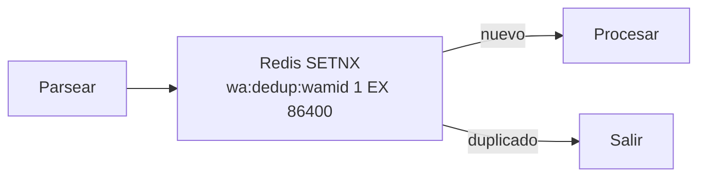
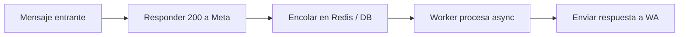
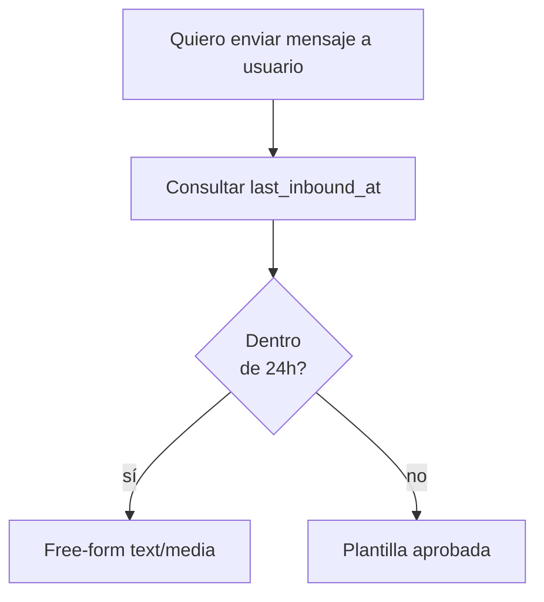

# Patrones de orquestación en n8n

> **TL;DR:** Cinco patrones que aparecen en casi todo workflow de WA: **router por tipo**, **dedup por wamid**, **sesión / contexto persistente**, **rate limiting outbound**, **handoff async**. Aplicarlos desde el inicio evita reescribir todo cuando crece el sistema.

## Contexto

n8n es flexible al punto de permitir mil maneras de hacer lo mismo. Cuando el workflow crece sin estructura, se vuelve ingobernable. Estos cinco patrones cubren el 80% de los casos.

## 1. Router por tipo de evento

Después de validar firma, dedup y parsear el payload, hacer un **Switch** con outputs explícitos:

| Output | Condición | Destino |
|---|---|---|
| `message_text` | `event === 'message' && type === 'text'` | Sub-workflow texto |
| `message_interactive` | `event === 'message' && type === 'interactive'` | Sub-workflow respuesta a botón |
| `message_media` | `event === 'message' && ['image','audio','video','document'].includes(type)` | Sub-workflow media (descargar + procesar) |
| `message_location` | `event === 'message' && type === 'location'` | Sub-workflow ubicación |
| `status` | `event === 'status'` | Sub-workflow tracking |
| `template_update` | `event === 'template_update'` | Alertar y actualizar DB de plantillas |
| `quality_update` | `event === 'quality_update'` | Alertar (Slack/email) |
| `unknown` | default | Loggear y descartar |

Ventajas:

- Cada rama testeable por separado.
- Visibilidad del flujo en el canvas.
- Cambios en una rama no rompen las demás.

Anti-pattern: un solo nodo IF gigante con expresiones complejas.

## 2. Dedup por wamid

**Siempre** deduplicar antes de procesar.



Implementación con nodo Redis:

| Operation | Detalle |
|---|---|
| `SET` con opciones `NX` y `EX 86400` | Si la key existe, no la pisa |

Si Redis devuelve `null` o `0`, ya existe → IF descarta.

Equivalente con Postgres si no tenés Redis:

```sql
INSERT INTO wa_dedup (wamid, created_at)
VALUES ('{{wamid}}', now())
ON CONFLICT (wamid) DO NOTHING
RETURNING wamid;
```

Si no devuelve fila → era duplicado.

## 3. Sesión y contexto persistente

Cada conversación necesita estado: histórico de mensajes, modo (bot/humano), datos del usuario, etapa del funnel.

Schema mínimo (ver receta completa en [`09-recetas/bot-atencion-handoff.md`](../../09-recetas/bot-atencion-handoff.md)):

```sql
CREATE TABLE wa_conversations (
  id UUID PRIMARY KEY DEFAULT gen_random_uuid(),
  wa_user_id TEXT NOT NULL,
  wa_phone_number_id TEXT NOT NULL,
  mode TEXT NOT NULL DEFAULT 'bot',
  last_inbound_at TIMESTAMPTZ NOT NULL,
  metadata JSONB DEFAULT '{}'::jsonb,
  UNIQUE(wa_user_id, wa_phone_number_id)
);
```

Pattern en cada workflow:

1. Upsert en `wa_conversations` por `(wa_user_id, wa_phone_number_id)`.
2. Insert en `wa_messages` con el mensaje entrante.
3. Cargar los últimos N mensajes para contexto del LLM.
4. Procesar.
5. Insert del mensaje saliente.

Para datos efímeros (timer, flags temporales), Redis con TTL.

## 4. Rate limiting outbound

Las APIs (Cloud API, OpenAI, Kommo) tienen rate limits. Sin throttling, en envíos masivos cae todo.

Estrategias:

| Estrategia | Implementación |
|---|---|
| Sleep entre nodos | `Wait` node con segundos calculados |
| Queue con concurrencia limitada | Activar `queue mode` de n8n; setear `concurrency` |
| Token bucket en Redis | `INCR` contador con expiración, IF supera límite → wait |
| Batches con espacio | Split In Batches + Wait entre batches |

Para WA Cloud API: ~80 mensajes/segundo por número en bursts cortos; sostenido depende del tier. Mantener < 50/s sostenido como regla práctica.

Para OpenAI: depende del tier. Implementar `Retry on fail` con backoff.

Para Kommo: ~7 req/s por cuenta.

## 5. Handoff async

Cuando una operación tarda más de 5-10s (llamadas a LLM, descarga de media grande, generación de docs), **no bloquear** el flujo principal.

Patrón:



Implementación:

| Componente | Cómo |
|---|---|
| Webhook trigger | Responde 200 rápido con `Respond to Webhook` |
| Continuación post-response | n8n permite "Continue After Response" |
| Encolado externo | Insertar en tabla `jobs` o lista de Redis (`LPUSH`) |
| Worker | Otro workflow con Cron + Redis BRPOP o polling SQL |

En **queue mode** de n8n, esto sucede semi-automático: el webhook responde rápido y los nodos pesados corren en workers.

## Patrón complementario: subflows reutilizables

Crear workflows separados invocables vía **Execute Workflow** o **HTTP Request**:

| Subflow | Responsabilidad |
|---|---|
| `wa-send-text` | Enviar texto con manejo de errores y plantilla fallback |
| `wa-send-template` | Enviar plantilla con verificación de estado |
| `wa-download-media` | Descargar media entrante con TTL del URL |
| `wa-mark-as-read` | Marcar leído |
| `openai-chat` | Llamar OpenAI con histórico estandarizado |
| `kommo-update-lead` | Actualizar lead con manejo de errores |
| `db-conversation-upsert` | Upsert estandarizado de conversación |

Cada uno con su input y output documentados. Cambios centralizados sin tocar 20 workflows.

## Patrón: respuesta condicional según ventana 24h



Subflow `wa-send-or-template`:

1. Input: `to`, `message`, `template_name` (fallback), `template_params`.
2. Mirar `last_inbound_at` del usuario.
3. Si < 24h, enviar free-form.
4. Si >= 24h, enviar plantilla.
5. Loggear cuál se usó (para métricas).

## Patrón: distribución multi-tenant

Si manejás varios clientes en un mismo n8n:

| Aspecto | Implementación |
|---|---|
| Distinguir cliente en el webhook | Leer `value.metadata.phone_number_id` y mapear a tenant |
| Credenciales por tenant | Múltiples credentials en n8n, una por cliente |
| Datos aislados | Schema o tabla con `tenant_id` |
| Logs separados | Tagear con `tenant_id` para filtrar después |

Tabla de mapping:

```sql
CREATE TABLE tenants (
  id UUID PRIMARY KEY,
  name TEXT,
  wa_phone_number_id TEXT UNIQUE,
  wa_access_token TEXT,  -- mejor referenciar a credential de n8n
  openai_api_key TEXT
);
```

## Patrón: a/b testing de respuestas

Para iterar sobre prompts u opciones de copy:

1. Cargar variantes en una tabla `experiments`.
2. Al recibir mensaje, asignar al usuario a una variante por hashing consistente (`wa_user_id % N`).
3. Trackear métrica objetivo (respuesta, click, conversion).
4. Reporting periódico.

## Patrón: queue de envíos masivos

Para campañas Marketing programadas:

| Paso | Detalle |
|---|---|
| 1. Cargar audiencia en `campaign_recipients` con `status='pending'` | |
| 2. Cron cada minuto: tomar N pendientes | Respetar tier |
| 3. Verificar opt-in y exclusion list | Compliance |
| 4. Verificar plantilla `APPROVED` | Evitar 132015 |
| 5. Enviar | |
| 6. Update `status` según resultado | `sent`, `failed`, `paused_template` |
| 7. Retry diferido para errores transitorios | Backoff |

Permite pausar la campaña sin perder progreso.

## Anti-patterns

| Anti-pattern | Por qué evitarlo |
|---|---|
| Lógica de negocio en expressions de un solo nodo de 200 líneas | Imposible mantener |
| Webhook que llama a OpenAI antes de responder 200 | Timeout de Meta, retries duplicados |
| Estado en variables de workflow (no persistente) | Se pierde al reiniciar |
| Hardcodear IDs (PHONE_NUMBER_ID, WABA_ID) | Atado a un tenant |
| No loggear `wamid` | Imposible debuggear |
| Single n8n instance sin queue mode | No escala |

## Recomendación de stack mínimo

| Componente | Para qué |
|---|---|
| n8n queue mode + worker | Orquestador |
| Postgres | Persistencia de conversaciones y plantillas |
| Redis | Dedup, cache, rate limiting |
| OpenAI key con tier acorde al volumen | Cerebro |
| Slack webhook | Alertas |

## Referencias

- [n8n Queue Mode](https://docs.n8n.io/hosting/scaling/queue-mode/) — Verificado 2026-05-20.
- [Sub-workflows](https://docs.n8n.io/flow-logic/subworkflows/) — Verificado 2026-05-20.
- [`07-integraciones/n8n/webhook-entrante.md`](./webhook-entrante.md)
- [`09-recetas/bot-atencion-handoff.md`](../../09-recetas/bot-atencion-handoff.md)
