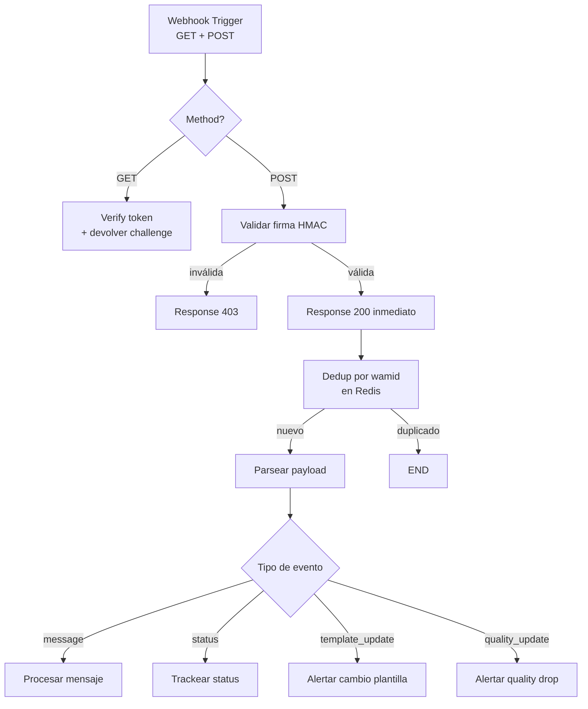

# Recibir mensajes de WhatsApp en n8n

> **TL;DR:** Un Webhook trigger en n8n que maneja **GET de verificación** y **POST de eventos**, valida la **firma HMAC-SHA256** con el App Secret, deduplica por `wamid` y enruta según `type`. Patrón válido para Cloud API y Evolution API (con ajustes en el payload).

## Contexto

El nodo Webhook es la puerta de entrada de todo el sistema. Si no anda bien o falla en la firma, el resto del workflow no se entera. Esta es la implementación de referencia.

## Setup del Webhook trigger

| Configuración | Valor |
|---|---|
| HTTP Method | `Both` (GET + POST) |
| Path | `wa-incoming` o similar |
| Response Mode | `Last Node` o `Respond to Webhook` (recomendado) |
| Response Code | 200 |
| Authentication | `None` (validamos firma manualmente) |

URL pública resultante: `https://n8n.midominio.com/webhook/wa-incoming`.

Usar esta URL en Meta Business Manager → App → WhatsApp → Configuration → Webhook URL.

## Estructura del workflow



## 1. Manejar el GET de verificación

Code node después del Webhook trigger:

```javascript
const method = $input.first().json.headers?.['x-forwarded-method']
            || $input.first().json.method
            || 'POST';

if (method === 'GET') {
  const query = $input.first().json.query || {};
  const mode = query['hub.mode'];
  const token = query['hub.verify_token'];
  const challenge = query['hub.challenge'];

  if (mode === 'subscribe' && token === $env.WA_VERIFY_TOKEN) {
    return [{ json: { response: challenge, statusCode: 200 } }];
  }
  return [{ json: { response: 'forbidden', statusCode: 403 } }];
}

// POST: pasar al siguiente nodo
return $input.all();
```

| Detalle clave | Valor |
|---|---|
| `WA_VERIFY_TOKEN` | Variable de entorno que coincide con la configurada en Meta |
| Respuesta | El `challenge` como **texto plano** (configurar Content-Type en Respond to Webhook) |

## 2. Validar firma HMAC

Code node siguiente. Crítico: usar **raw body**, no el JSON parseado.

```javascript
const crypto = require('crypto');

const rawBody = $input.first().json.body
              || JSON.stringify($input.first().json);
const signatureHeader = $input.first().json.headers['x-hub-signature-256'];

if (!signatureHeader?.startsWith('sha256=')) {
  return [{ json: { valid: false, error: 'missing_signature' } }];
}

const expected = crypto
  .createHmac('sha256', $env.WA_APP_SECRET)
  .update(rawBody, 'utf8')
  .digest('hex');

const received = signatureHeader.slice('sha256='.length);

const valid = crypto.timingSafeEqual(
  Buffer.from(expected, 'hex'),
  Buffer.from(received, 'hex')
);

return [{ json: { ...$input.first().json, _signatureValid: valid } }];
```

**Importante:** n8n por defecto parsea el body. Para conservar el raw, activar en el Webhook trigger la opción "Raw Body" o usar binary mode. En n8n recientes hay un toggle directo.

Después de validar, un IF node corta si `_signatureValid === false`.

## 3. Responder 200 inmediato

Usar `Respond to Webhook` antes de procesar pesado. Esto evita reintentos por timeout de Meta (que es de ~20s).

| Nodo | Acción |
|---|---|
| Respond to Webhook | Status 200, body `OK` |
| Resto del flujo | Continúa en background |

n8n permite **continuar el workflow después** de haber respondido, lo que es ideal acá.

## 4. Deduplicar por wamid

Redis node:

```
Operation: SET
Key: wa:dedup:{{ $json.entry[0].changes[0].value.messages[0].id }}
Value: 1
Options: NX (only if not exists), EX 86400 (TTL 24h)
```

Si Redis devuelve `null` o `0`, ya existía → salir. Si devuelve `OK` o `1`, es nuevo → continuar.

Equivalente vía Code node:

```javascript
const messageId = $input.first().json.entry?.[0]?.changes?.[0]?.value?.messages?.[0]?.id;
if (!messageId) {
  return [{ json: { skip: true, reason: 'no_message_id' } }];
}
const setResult = await $redis.set(`wa:dedup:${messageId}`, '1', 'NX', 'EX', 86400);
if (setResult !== 'OK') {
  return [{ json: { skip: true, reason: 'duplicate' } }];
}
return $input.all();
```

## 5. Parsear el payload

Code node que extrae los campos relevantes y normaliza:

```javascript
const body = $input.first().json;
const change = body.entry?.[0]?.changes?.[0];

if (!change) {
  return [{ json: { skip: true, reason: 'no_change' } }];
}

const field = change.field;
const value = change.value;

// Caso 1: mensaje entrante
if (field === 'messages' && value.messages) {
  const msg = value.messages[0];
  return [{
    json: {
      event: 'message',
      waba_id: body.entry[0].id,
      phone_number_id: value.metadata.phone_number_id,
      from: msg.from,
      contact_name: value.contacts?.[0]?.profile?.name,
      wa_message_id: msg.id,
      timestamp: parseInt(msg.timestamp) * 1000,
      type: msg.type,
      text: msg.text?.body,
      interactive_id: msg.interactive?.button_reply?.id
                  || msg.interactive?.list_reply?.id,
      media_id: msg.image?.id || msg.audio?.id || msg.video?.id || msg.document?.id,
      referral: msg.referral,
      raw: msg
    }
  }];
}

// Caso 2: status de mensaje saliente
if (field === 'messages' && value.statuses) {
  const status = value.statuses[0];
  return [{
    json: {
      event: 'status',
      wa_message_id: status.id,
      status: status.status,
      recipient_id: status.recipient_id,
      timestamp: parseInt(status.timestamp) * 1000,
      conversation: status.conversation,
      pricing: status.pricing,
      errors: status.errors
    }
  }];
}

// Caso 3: plantilla
if (field === 'message_template_status_update') {
  return [{ json: { event: 'template_update', ...value } }];
}

// Caso 4: quality
if (field === 'phone_number_quality_update') {
  return [{ json: { event: 'quality_update', ...value } }];
}

return [{ json: { event: 'unknown', field, raw: value } }];
```

## 6. Switch para enrutar

| Output | Condición |
|---|---|
| `message_text` | `event === 'message' && type === 'text'` |
| `message_interactive` | `event === 'message' && type === 'interactive'` |
| `message_media` | `event === 'message' && ['image','audio','video','document'].includes(type)` |
| `status` | `event === 'status'` |
| `template_update` | `event === 'template_update'` |
| `quality_update` | `event === 'quality_update'` |

Cada output va a su sub-workflow específico.

## Adaptación para Evolution API

Evolution API envía un payload distinto. Cambia el parseo:

```javascript
const body = $input.first().json;

if (body.event === 'messages.upsert') {
  const msg = body.data;
  return [{
    json: {
      event: 'message',
      instance: body.instance,
      from: msg.key?.remoteJid?.split('@')[0],
      wa_message_id: msg.key?.id,
      timestamp: msg.messageTimestamp * 1000,
      type: msg.messageType,
      text: msg.message?.conversation
         || msg.message?.extendedTextMessage?.text,
      raw: msg
    }
  }];
}
```

Sin firma HMAC (Evolution no la implementa por defecto). Validar al menos:

- Header con API key custom (Evolution permite configurarlo).
- IP whitelist en el reverse proxy.

## Variables de entorno

| Variable | Descripción |
|---|---|
| `WA_VERIFY_TOKEN` | String arbitrario que pusiste en Meta |
| `WA_APP_SECRET` | App Secret de la App de Meta |
| `WA_PHONE_NUMBER_ID` | ID del número (para multi-número, usar el del payload) |
| `WA_ACCESS_TOKEN` | Para descargar media |
| `REDIS_URL` | Para dedup |

## Testing local

Antes de configurar en Meta, probar el webhook con `webhook.site` o `ngrok`:

```bash
# Test del GET de verificación
curl "https://n8n.midominio.com/webhook/wa-incoming?hub.mode=subscribe&hub.verify_token=MI_TOKEN&hub.challenge=12345"

# Esperado: "12345"
```

```bash
# Test del POST con un payload fake (sin firma válida, solo para probar parseo)
curl -X POST "https://n8n.midominio.com/webhook/wa-incoming" \
  -H "Content-Type: application/json" \
  -d '{
    "entry": [{
      "id": "WABA_ID",
      "changes": [{
        "field": "messages",
        "value": {
          "metadata": { "phone_number_id": "PHONE_NUMBER_ID" },
          "messages": [{
            "from": "5491133334444",
            "id": "wamid.TEST",
            "timestamp": "1716200000",
            "type": "text",
            "text": { "body": "Hola" }
          }],
          "contacts": [{ "profile": { "name": "Test User" }, "wa_id": "5491133334444" }]
        }
      }]
    }]
  }'
```

(En testing, comentar temporalmente la validación de firma.)

## Errores comunes

| Error | Causa | Solución |
|---|---|---|
| `403` en GET de verificación | `verify_token` mal o variable no resuelve | Verificar valor en Meta y env |
| Firma siempre inválida | Body parseado en vez de raw | Activar Raw Body en el Webhook trigger |
| n8n recibe pero ignora segundos eventos | No respondés 200 a tiempo, Meta reintenta | Usar `Respond to Webhook` antes del procesamiento |
| Dedup que falla | Redis no conectado o key mal armada | Loggear y testear con `SET ... NX EX` manual |
| Mensajes interactivos llegan como `interactive` pero `text` undefined | Estás leyendo `text.body` para todo tipo | Switch por `type` |
| Media `id` viene pero no podés descargar | TTL de 5min expirado | Descargar en cuanto llega, no later |

## Patrón completo recomendado

1. Webhook trigger en `Both` mode.
2. Switch por `method` (GET vs POST).
3. GET: validate verify_token, devolver challenge.
4. POST: validate firma HMAC.
5. Respond to Webhook 200.
6. Continúa: dedup → parse → switch por tipo de evento → handlers.

Guardar el workflow exportado en [`examples/n8n/wa-webhook-entrante.json`](../../examples/) (pendiente).

## Referencias

- [n8n Webhook node](https://docs.n8n.io/integrations/builtin/core-nodes/n8n-nodes-base.webhook/) — Verificado 2026-05-20.
- [Webhooks · Cloud API](https://developers.facebook.com/docs/whatsapp/cloud-api/webhooks) — Verificado 2026-05-20.
- [`02-numeros-y-conexion/webhooks.md`](../../02-numeros-y-conexion/webhooks.md)
