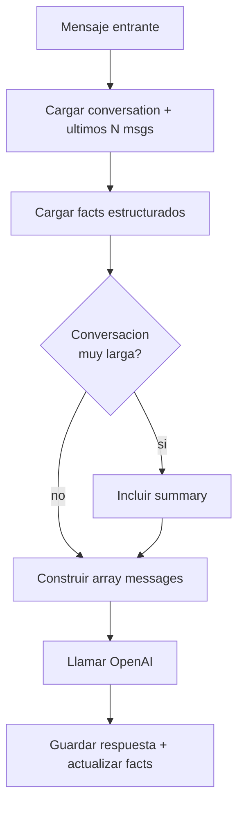

# Contexto de conversación con OpenAI

> **TL;DR:** OpenAI no tiene memoria entre llamadas: en cada request enviás todo el contexto. Para un bot de WhatsApp eso significa mantener un historial por usuario en tu base, recortarlo a los últimos N mensajes (o resumirlo), y reconstruir el array `messages` en cada turno. Sin esto, el bot "olvida" lo que se dijo dos mensajes atrás.

## Contexto

El error de principiante más común al hacer bots con LLM: asumir que el modelo "recuerda" la conversación. No la recuerda. Cada llamada a la API es stateless. La memoria la implementás vos.

## Cómo funciona el contexto

Cada request a Chat Completions lleva un array `messages`:

```json
{
  "model": "gpt-4o-mini",
  "messages": [
    { "role": "system", "content": "Sos el asistente de..." },
    { "role": "user", "content": "Hola, quería consultar por un producto" },
    { "role": "assistant", "content": "¡Hola! Claro, ¿qué producto te interesa?" },
    { "role": "user", "content": "El que vi en su anuncio" }
  ]
}
```

El modelo ve **todo** ese array y responde el siguiente turno. Si no incluís los mensajes previos, no los conoce.

| Role | Para qué |
|---|---|
| `system` | Instrucciones, personalidad, contexto del negocio. Siempre primero. |
| `user` | Mensajes del usuario |
| `assistant` | Respuestas previas del bot |
| `tool` | Resultados de function calls |

## El problema del crecimiento

Una conversación larga crece sin límite. Cada turno suma tokens. Esto trae:

| Problema | Efecto |
|---|---|
| Costo | Pagás por todos los tokens de entrada en cada llamada |
| Latencia | Más tokens = más lento |
| Límite de contexto | Cada modelo tiene un máximo (decenas/cientos de miles de tokens) |
| Ruido | Demasiado historial dispersa la atención del modelo |

## Estrategias de manejo de contexto

### 1. Ventana deslizante (sliding window)

La más simple y la que sirve para el 90% de los casos: mantener solo los últimos N mensajes.

```sql
SELECT role, content FROM wa_messages
WHERE conversation_id = '{{ID}}'
ORDER BY created_at DESC
LIMIT 10;
```

Luego invertir el orden (cronológico) y anteponer el `system`.

| Parámetro | Recomendación |
|---|---|
| N (cantidad de mensajes) | 8-15 para soporte; 20+ para casos complejos |
| Siempre incluir el `system` | Sí, no cuenta en la ventana |
| Incluir pares completos | No cortar a la mitad de un tool call |

### 2. Resumen progresivo (summarization)

Para conversaciones muy largas: resumir los mensajes viejos en un bloque y mantener los recientes textuales.

```
[system]
[resumen de los primeros 30 mensajes: "El usuario consultó por X,
se le ofreció Y, quedó pendiente Z..."]
[últimos 10 mensajes textuales]
```

Implementación:

1. Cuando el historial supera N mensajes, llamar al modelo para resumir los más viejos.
2. Guardar ese resumen en `wa_conversations.metadata.summary`.
3. En cada request: `system` + `summary` + últimos N textuales.

Trade-off: una llamada extra de vez en cuando, pero contexto acotado.

### 3. Memoria estructurada (facts)

Extraer datos clave a campos estructurados en lugar de depender del texto:

```json
{
  "customer_name": "María",
  "interested_product": "zapatillas running",
  "budget": "hasta 80000",
  "stage": "comparando_modelos"
}
```

Esto se inyecta en el `system` prompt como contexto:

```
Datos conocidos del cliente:
- Nombre: María
- Interés: zapatillas running
- Presupuesto: hasta 80000
- Etapa: comparando modelos
```

Más robusto que confiar en que el modelo "se acuerde". Combinable con la ventana deslizante.

## Patrón recomendado para WhatsApp

Combinar las tres:

```
[system: instrucciones + contexto del negocio]
[system o user: facts estructurados del cliente]
[summary: resumen si la conversación es larga]
[últimos 8-12 mensajes textuales]
[nuevo mensaje del usuario]
```



## Construcción del array en n8n

Code node típico:

```javascript
const systemPrompt = $env.SYSTEM_PROMPT || buildSystemPrompt();
const facts = $json.conversation.metadata?.facts || {};
const summary = $json.conversation.metadata?.summary;
const recentMessages = $json.recentMessages; // últimos N desde Postgres, cronológico

const messages = [
  { role: 'system', content: systemPrompt }
];

if (Object.keys(facts).length > 0) {
  messages.push({
    role: 'system',
    content: 'Datos conocidos del cliente:\n' +
      Object.entries(facts).map(([k, v]) => `- ${k}: ${v}`).join('\n')
  });
}

if (summary) {
  messages.push({
    role: 'system',
    content: 'Resumen de la conversación previa:\n' + summary
  });
}

for (const m of recentMessages) {
  messages.push({ role: m.role, content: m.content });
}

return [{ json: { messages } }];
```

## Tokens: estimación rápida

| Regla práctica | Valor |
|---|---|
| 1 token | ~4 caracteres en español |
| 1 mensaje típico de usuario | ~20-60 tokens |
| System prompt mediano | ~300-800 tokens |
| Ventana de 10 mensajes | ~500-1.500 tokens |
| Respuesta del bot | ~100-300 tokens |

Para `gpt-4o-mini` con ventana de 10 mensajes: ~$0.0002 por turno. Despreciable hasta volúmenes altos.

## Cuándo NO recortar agresivamente

| Caso | Recomendación |
|---|---|
| Flujo de calificación con muchos datos | Ventana más amplia o facts estructurados |
| Soporte técnico paso a paso | Mantener el hilo completo del troubleshooting |
| Conversación corta (< 15 mensajes) | No hace falta recortar, mandar todo |
| FAQ de un turno | Ni siquiera necesitás historial |

## Multi-turno con function calling

Cuando hay tool calls, el contexto incluye también los mensajes `assistant` con `tool_calls` y los `tool` con resultados. **No los recortes a la mitad**: un `assistant` con `tool_calls` debe ir siempre seguido de su `tool` correspondiente, o la API falla.

Ver [`function-calling.md`](./function-calling.md).

## Caché de prompts

Si el `system` prompt es grande y estable, algunos proveedores permiten **prompt caching**: el prefijo estable se cachea y se cobra menos. Estructurar el array con lo estable primero (system, contexto del negocio) y lo variable después (historial) maximiza el cache hit.

## Reset de contexto

Conviene resetear / archivar el contexto cuando:

| Disparo | Acción |
|---|---|
| Pasaron > 24-72h sin actividad | Archivar la conversación, empezar fresca |
| El usuario dice "empezar de nuevo" / "otra consulta" | Reset |
| Cambió el tema radicalmente | Opcional: resumir y empezar sub-contexto |
| Tras un handoff completado | Nueva conversación al volver el bot |

## Errores comunes

| Error | Causa | Solución |
|---|---|---|
| El bot "olvida" lo dicho 2 mensajes atrás | No estás pasando el historial | Cargar y enviar últimos N mensajes |
| Respuestas lentas y caras | Historial sin límite | Aplicar ventana deslizante |
| Error de límite de contexto | Conversación enorme | Summarization |
| `tool` message huérfano | Recortaste mal el array | No cortar pares tool_call/tool |
| El bot mezcla conversaciones de distintos usuarios | `conversation_id` mal resuelto | Verificar unicidad por (user, phone_number_id) |
| Facts desactualizados | No se actualizan tras cada turno | Extraer y guardar facts en cada respuesta |

## Referencias

- [Text generation · OpenAI](https://platform.openai.com/docs/guides/text-generation) — Verificado 2026-05-20.
- [Prompt caching · OpenAI](https://platform.openai.com/docs/guides/prompt-caching) — Verificado 2026-05-20.
- [`07-integraciones/openai/function-calling.md`](./function-calling.md)
- [`07-integraciones/n8n/contexto.md`](../n8n/contexto.md)
