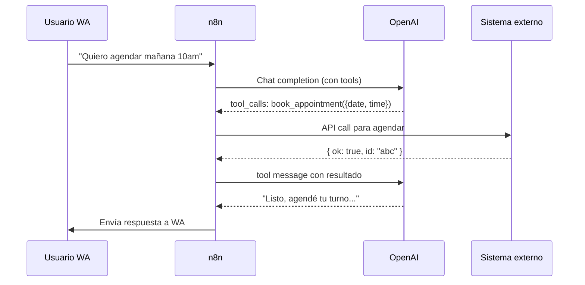

# Function calling con OpenAI sobre WhatsApp

> **TL;DR:** Function calling permite que el modelo "decida" llamar a una función externa (handoff, agendar turno, consultar inventario, etc.) en lugar de responder texto libre. Definís las tools con JSON Schema, el modelo elige cuál llamar con qué args, vos ejecutás la acción y opcionalmente devolvés el resultado al modelo para que arme la respuesta final.

## Contexto

Sin function calling, un asistente sobre WA solo puede responder texto. Con function calling, se convierte en un agente que puede **actuar**: cambiar estado en un CRM, agendar, consultar APIs, derivar a humano, ejecutar workflows. Es el patrón fundamental para bots útiles.

## Conceptos

| Concepto | Detalle |
|---|---|
| Tool / function | Acción que el modelo puede invocar |
| JSON Schema | Define nombre, descripción y parámetros |
| `tool_calls` | Respuesta del modelo cuando elige usar una tool |
| `tool` message | Mensaje que devolvés con el resultado de ejecutar la tool |
| `tool_choice` | Forzar al modelo a usar (o no) una tool específica |

## Flujo típico



## Definir tools

```json
{
  "tools": [
    {
      "type": "function",
      "function": {
        "name": "request_handoff",
        "description": "Escala la conversación a un agente humano. Usar cuando el usuario lo pide explícitamente o cuando la consulta excede tu alcance.",
        "parameters": {
          "type": "object",
          "properties": {
            "reason": {
              "type": "string",
              "description": "Motivo breve del handoff para contexto del agente"
            },
            "priority": {
              "type": "string",
              "enum": ["low", "normal", "high"]
            }
          },
          "required": ["reason"]
        }
      }
    },
    {
      "type": "function",
      "function": {
        "name": "book_appointment",
        "description": "Agenda un turno en el sistema de turnos.",
        "parameters": {
          "type": "object",
          "properties": {
            "date": { "type": "string", "format": "date" },
            "time": { "type": "string", "pattern": "^[0-2][0-9]:[0-5][0-9]$" },
            "service": { "type": "string" }
          },
          "required": ["date", "time", "service"]
        }
      }
    }
  ]
}
```

| Detalle | Importancia |
|---|---|
| `name` | Snake_case, descriptivo |
| `description` | Crítica: el modelo decide por esto |
| `parameters` | JSON Schema válido |
| `required` | Lista de params obligatorios |
| `enum` | Cuando hay opciones cerradas |

## Llamar la API

```bash
curl -X POST "https://api.openai.com/v1/chat/completions" \
  -H "Authorization: Bearer {{OPENAI_API_KEY}}" \
  -H "Content-Type: application/json" \
  -d '{
    "model": "gpt-4o-mini",
    "messages": [
      { "role": "system", "content": "..." },
      { "role": "user", "content": "Quiero agendar mañana 10am" }
    ],
    "tools": [ ... ],
    "tool_choice": "auto"
  }'
```

Respuesta cuando el modelo elige una tool:

```json
{
  "choices": [{
    "message": {
      "role": "assistant",
      "content": null,
      "tool_calls": [{
        "id": "call_abc123",
        "type": "function",
        "function": {
          "name": "book_appointment",
          "arguments": "{\"date\":\"2026-05-21\",\"time\":\"10:00\",\"service\":\"consulta_general\"}"
        }
      }]
    },
    "finish_reason": "tool_calls"
  }]
}
```

Importante:

- `arguments` es **string JSON**, hay que parsearlo.
- Puede haber múltiples `tool_calls` simultáneos.
- Si `tool_calls` está presente, `content` suele ser `null`.

## Ejecutar la tool y devolver resultado

Tras ejecutar la acción, opcional pero recomendado: enviar el resultado de vuelta al modelo para que arme la respuesta natural.

```json
{
  "model": "gpt-4o-mini",
  "messages": [
    { "role": "system", "content": "..." },
    { "role": "user", "content": "Quiero agendar mañana 10am" },
    {
      "role": "assistant",
      "tool_calls": [{
        "id": "call_abc123",
        "type": "function",
        "function": {
          "name": "book_appointment",
          "arguments": "{\"date\":\"2026-05-21\",\"time\":\"10:00\",\"service\":\"consulta_general\"}"
        }
      }]
    },
    {
      "role": "tool",
      "tool_call_id": "call_abc123",
      "content": "{\"ok\": true, \"appointment_id\": \"abc\", \"confirmation\": \"21/05 10:00, Dra. Pérez\"}"
    }
  ],
  "tools": [ ... ]
}
```

Respuesta esperada:

```json
{
  "choices": [{
    "message": {
      "role": "assistant",
      "content": "Listo, tu turno quedó confirmado para mañana 21/05 a las 10:00 con la Dra. Pérez. Te enviamos recordatorio el día previo."
    }
  }]
}
```

## tool_choice

| Valor | Significado |
|---|---|
| `"auto"` | Default; el modelo decide |
| `"none"` | Forzar a no usar tools (responder texto) |
| `"required"` | Forzar a usar alguna tool |
| `{ "type": "function", "function": { "name": "X" } }` | Forzar tool específica |

Usos:

- `"auto"`: conversación general.
- `"required"`: cuando entrás en un flujo guiado y querés que invoque sí o sí.
- Específica: en pasos determinísticos.

## Buenas prácticas de tool design

### Tools claras y atómicas

| Bien | Mal |
|---|---|
| `request_handoff(reason, priority)` | `manage_conversation(action, ...)` |
| `book_appointment(date, time, service)` | `do_anything(intent, payload)` |
| `qualify_lead(intent, urgency)` | `process_message(text)` |

Cada tool con un propósito claro. Mejor 5 tools precisas que 1 tool genérica.

### Descriptions ricas

La `description` es lo único que ve el modelo para decidir cuándo usarla. Incluir:

- Qué hace.
- Cuándo usarla.
- Qué NO es (si confunde con otra).

Ejemplo:

```json
"description": "Escala la conversación a un agente humano. Usar SOLAMENTE cuando el usuario pide explícitamente hablar con una persona, o cuando la consulta es sobre temas médicos (síntomas, diagnóstico, dosis). NO usar para consultas administrativas básicas (horarios, ubicación, precios) que vos podés responder."
```

### Validar args devueltos

El modelo a veces inventa formatos:

```javascript
const args = JSON.parse(toolCall.function.arguments);

// Validar con un schema (zod, ajv, joi)
const validated = bookAppointmentSchema.safeParse(args);
if (!validated.success) {
  // Devolver tool result con error para que el modelo reintente
  return { ok: false, error: 'Invalid args', details: validated.error };
}
```

Devolver error al modelo permite que pida más info al usuario o reintente.

## Patrón en n8n

| Nodo | Función |
|---|---|
| HTTP Request a OpenAI (o nodo OpenAI nativo) | Llamada con tools |
| Code | Parsear `tool_calls` |
| Switch | Una salida por tool name |
| HTTP Request (por rama) | Ejecutar la acción |
| Code | Armar tool message |
| HTTP Request a OpenAI (segunda llamada) | Generar respuesta final |
| HTTP Request a Cloud API | Enviar a WA |

Para evitar la segunda llamada en casos simples, podés generar la respuesta a partir del resultado:

```javascript
// Sin segunda llamada al modelo
const result = JSON.parse(toolResult);
const reply = result.ok
  ? `Listo, agendé tu turno para ${result.confirmation}.`
  : `No pude agendar: ${result.error}. ¿Querés intentar otra fecha?`;
```

Trade-off: respuestas más rígidas, pero más rápido y barato.

## Modelos recomendados

| Modelo | Cuándo |
|---|---|
| `gpt-4o-mini` | Default para bots conversacionales. Cheap + bueno. |
| `gpt-4o` | Conversaciones complejas, function calling con muchas tools |
| `gpt-4.1` o superior | Si el caso lo justifica y hay presupuesto |

Function calling es robusto desde `gpt-4o-mini` para arriba.

## Costos

| Componente | Ejemplo |
|---|---|
| System prompt + histórico (~500 tokens) | $0.00007 con `gpt-4o-mini` |
| Respuesta (~200 tokens) | $0.00006 |
| 2 llamadas (tool + final) | ~$0.0002 por turno |
| 1.000 turnos | ~$0.20 |

Costo por conversación típica (~10 turnos): ~$0.002. Es el orden de magnitud que hace viable bots a escala.

## Errores comunes

| Error | Causa | Solución |
|---|---|---|
| Modelo inventa tools que no definiste | `description` mala o ausente | Mejorar descriptions, listar tools en system prompt |
| Args con campos inventados | Schema no estricto | Strict mode (OpenAI lo soporta con `strict: true`) |
| Modelo no invoca nunca aunque debería | `tool_choice: "none"` o descriptions débiles | Cambiar a `"auto"` y mejorar |
| Loop infinito de tool calls | Bug en el handler | Limitar a N tool calls por turn |
| Respuesta final pierde contexto | Faltó el `tool` message en messages | Verificar que estás pasando todo el hilo |
| `tool_call_id` mismatch | Estás usando otro id | Copiar exacto del response |

## Strict mode (OpenAI)

Para JSON Schema estricto:

```json
{
  "type": "function",
  "function": {
    "name": "book_appointment",
    "strict": true,
    "parameters": {
      "type": "object",
      "properties": { ... },
      "required": [...],
      "additionalProperties": false
    }
  }
}
```

Garantía: args salen 100% válidos contra el schema. Reduce código defensivo.

## Referencias

- [Function Calling Guide · OpenAI](https://platform.openai.com/docs/guides/function-calling) — Verificado 2026-05-20.
- [Structured Outputs · OpenAI](https://platform.openai.com/docs/guides/structured-outputs) — Verificado 2026-05-20.
- [`07-integraciones/openai/contexto-conversacion.md`](./contexto-conversacion.md)
- [`09-recetas/bot-atencion-handoff.md`](../../09-recetas/bot-atencion-handoff.md)
