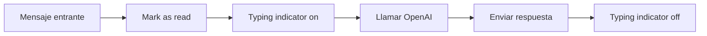

# OpenAI: streaming en WhatsApp

> **TL;DR:** WhatsApp **no soporta streaming nativo**: los mensajes se reciben enteros, no tokens en vivo como ChatGPT. Para mejorar la UX percibida: 1) marcar el mensaje como leído inmediatamente, 2) enviar un indicador de "estoy escribiendo", 3) responder cuando el modelo termina. Si la respuesta es muy larga, dividirla en mensajes.

## Contexto

Una pregunta frecuente: "¿puedo hacer que el bot escriba como ChatGPT, palabra por palabra?". En WhatsApp no: el medio no lo soporta. Pero hay patrones para que la conversación se sienta rápida y atenta.

## Qué es streaming en OpenAI

Con `stream: true`, OpenAI envía los tokens de la respuesta a medida que se generan, sobre una conexión SSE. Útil en web/desktop para mostrar la respuesta progresivamente. En WhatsApp **no aplica** porque WhatsApp no muestra mensajes "a medias".

## Lo que sí podés hacer en WhatsApp

### 1. Marcar el mensaje del usuario como leído de inmediato

Apenas llega el webhook, marcar leído. Doble check azul = "te leyó".

```bash
curl -X POST \
  "https://graph.facebook.com/v21.0/{{PHONE_NUMBER_ID}}/messages" \
  -H "Authorization: Bearer {{ACCESS_TOKEN}}" \
  -H "Content-Type: application/json" \
  -d '{
    "messaging_product": "whatsapp",
    "status": "read",
    "message_id": "{{WAMID}}"
  }'
```

Ver [`04-mensajeria/marcar-leido-typing.md`](../../04-mensajeria/marcar-leido-typing.md).

### 2. Typing indicator

Cloud API soporta typing indicator. Activarlo mientras OpenAI genera:

| Estado | Cuándo |
|---|---|
| Typing on | Apenas marcaste leído |
| Typing off | Cuando enviás la respuesta |

El usuario ve "escribiendo..." durante el tiempo que tarda OpenAI. Mucho mejor que silencio.

### 3. Respuesta consolidada

Una vez que OpenAI terminó, enviar la respuesta. Si es muy larga (> 3 párrafos), considerar dividirla en 2-3 mensajes secuenciales con pausas cortas. **Cuidado:** no mandar 10 mensajes seguidos = pair rate limit.

## Cuándo usar `stream: true` del lado de OpenAI

Aun sin streaming en WA, hay razones para usarlo:

| Razón | Detalle |
|---|---|
| Detectar respuesta larga antes de que termine | Si el modelo se descontroló, cortar |
| Mostrar progreso en otra UI (panel del agente) | Sí útil |
| Reducir time-to-first-byte | Marginal en uso server-side |

Para la mayoría de bots de WA: `stream: false` es más simple.

## Patrón completo de respuesta



En la práctica, `typing off` ocurre automáticamente cuando enviás el mensaje. No hay que enviar un "stop" explícito.

## Respuestas muy largas

OpenAI puede devolver respuestas largas si el system prompt no las acota. Patrón recomendado:

| Acción | Detalle |
|---|---|
| `max_tokens` razonable | Limitar a ~300-500 |
| System prompt fuerza brevedad | "Respondé en máximo 3 párrafos cortos" |
| Si igual sale larga, dividir | En 2-3 mensajes con `\n\n` como separador natural |

## División de mensajes

Si necesitás partir la respuesta:

```javascript
function splitMessage(text, maxLen = 1000) {
  const parts = [];
  const paragraphs = text.split('\n\n');
  let current = '';
  for (const p of paragraphs) {
    if ((current + p).length > maxLen) {
      if (current) parts.push(current.trim());
      current = p + '\n\n';
    } else {
      current += p + '\n\n';
    }
  }
  if (current.trim()) parts.push(current.trim());
  return parts;
}
```

Enviar las partes con pausa de 500ms-1s entre cada una para evitar pair rate limit y dar tiempo de lectura.

## Manejo de latencia

| Etapa | Tiempo típico |
|---|---|
| Webhook → mark as read | < 1s |
| Typing on | < 1s |
| OpenAI `gpt-4o-mini` | 1-3s |
| OpenAI con RAG | 2-5s |
| OpenAI con function calling + segunda llamada | 3-7s |
| Enviar respuesta | < 1s |
| **Total percibido** | **2-8s** |

Con typing indicator, 5-8s se tolera bien. Sin él, se siente eterno.

## Anti-patterns

| Anti-pattern | Por qué evitarlo |
|---|---|
| Mandar respuestas en chunks de 1-2 oraciones cada una | Spam visual, rate limit |
| Streaming "fake" mandando un mensaje y editándolo | WhatsApp no permite editar así desde la API |
| Silencio durante 10 segundos | El usuario cree que se rompió todo |
| Mensaje gigante de 3000 chars | Ilegible en móvil |

## Errores comunes

| Error | Causa | Solución |
|---|---|---|
| Usuario reenvía el mensaje creyendo que no llegó | Sin mark as read + typing | Implementar ambos |
| Mensajes salen en orden invertido | Race condition entre partes | Send sync con espera entre cada uno |
| Pair rate limit (`131056`) | Muchas partes seguidas | Espaciar 500ms-1s |
| Typing indicator no aparece | Versión de la API o cliente del usuario | Verificar versión, probar con usuario distinto |

## Referencias

- [Streaming · OpenAI](https://platform.openai.com/docs/api-reference/streaming) — Verificado 2026-05-20.
- [`07-integraciones/openai/contexto-conversacion.md`](./contexto-conversacion.md)
- [`04-mensajeria/marcar-leido-typing.md`](../../04-mensajeria/marcar-leido-typing.md)
