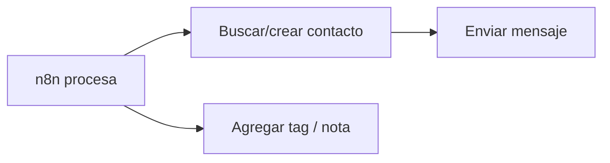

# Respond.io: API REST

> **TL;DR:** API REST en `https://api.respond.io/v2/`. Autenticación con **API token** (Bearer). Operaciones clave: enviar mensajes, gestionar contactos, disparar workflows, agregar tags/notas. Útil para que n8n o sistemas externos operen Respond.io desde fuera.

## Base URL

```
https://api.respond.io/v2/
```

## Autenticación

```
Authorization: Bearer {{RESPOND_IO_API_TOKEN}}
```

El token se genera en Settings → Integrations → API Access.

## Operaciones clave

### Enviar mensaje a un contacto

```bash
curl -X POST "https://api.respond.io/v2/contact/{{CONTACT_ID}}/message" \
  -H "Authorization: Bearer {{TOKEN}}" \
  -H "Content-Type: application/json" \
  -d '{
    "channelId": {{CHANNEL_ID}},
    "message": {
      "type": "text",
      "text": "Hola desde la API"
    }
  }'
```

Tipos de mensaje soportados: text, image, video, audio, document, etc.

### Enviar plantilla (WhatsApp)

```bash
curl -X POST "https://api.respond.io/v2/contact/{{CONTACT_ID}}/message" \
  -H "Authorization: Bearer {{TOKEN}}" \
  -H "Content-Type: application/json" \
  -d '{
    "channelId": {{CHANNEL_ID}},
    "message": {
      "type": "whatsapp_template",
      "template": {
        "name": "recordatorio_turno",
        "language": "es_AR",
        "components": [ ... ]
      }
    }
  }'
```

### Identificar contacto

Buscar/crear por `phone`:

```bash
curl -X POST "https://api.respond.io/v2/contact" \
  -H "Authorization: Bearer {{TOKEN}}" \
  -H "Content-Type: application/json" \
  -d '{
    "identifier": "5491133334444",
    "identifierType": "phone",
    "firstName": "Juan",
    "lastName": "Pérez"
  }'
```

### Actualizar contacto

```bash
curl -X PATCH "https://api.respond.io/v2/contact/{{CONTACT_ID}}" \
  -H "Authorization: Bearer {{TOKEN}}" \
  -H "Content-Type: application/json" \
  -d '{
    "customFields": [
      { "name": "wa_opt_in", "value": "true" }
    ]
  }'
```

### Agregar tag

```bash
curl -X POST "https://api.respond.io/v2/contact/{{CONTACT_ID}}/tag" \
  -H "Authorization: Bearer {{TOKEN}}" \
  -H "Content-Type: application/json" \
  -d '{ "tags": ["interesado", "argentina"] }'
```

### Disparar un workflow

```bash
curl -X POST "https://api.respond.io/v2/contact/{{CONTACT_ID}}/workflow/{{WORKFLOW_ID}}" \
  -H "Authorization: Bearer {{TOKEN}}"
```

Útil para que un sistema externo (n8n) inicie un workflow de Respond.io.

### Notas

```bash
curl -X POST "https://api.respond.io/v2/contact/{{CONTACT_ID}}/note" \
  -H "Authorization: Bearer {{TOKEN}}" \
  -H "Content-Type: application/json" \
  -d '{ "text": "Cliente interesado en producto X" }'
```

## IDs que vas a usar

| ID | Cómo obtenerlo |
|---|---|
| `CONTACT_ID` | De búsqueda/creación o del webhook |
| `CHANNEL_ID` | Settings → Channels → cada canal tiene su ID |
| `WORKFLOW_ID` | Workflows → seleccionar → ID en URL |
| `TEAM_ID` | Settings → Teams |
| `USER_ID` (agent) | Settings → Users |

Guardar como configuración, no consultar en cada request.

## Patrón: n8n → Respond.io



Combinado con webhooks salientes de Respond.io (ver [`webhooks.md`](./webhooks.md)), el patrón Kommo-like también aplica:

- Workflow Respond.io → HTTP Request a n8n.
- n8n procesa con OpenAI.
- n8n responde vía API.

## Rate limits

Respond.io tiene rate limits según el plan. Implementar throttling y backoff.

## Errores comunes

| Error | Causa | Solución |
|---|---|---|
| `401` | Token inválido o revocado | Regenerar |
| `404` contacto no existe | Buscar antes o usar `identifier` para upsert |
| Plantilla rechazada | Componentes mal formados | Verificar estructura |
| Doble envío | Webhook + API ambos enviando | Decidir quién envía |
| Rate limit | Demasiadas requests | Throttle |

## Referencias

- [Respond.io Developers](https://developers.respond.io/) — Verificado 2026-05-20.
- [`07-integraciones/respond-io/webhooks.md`](./webhooks.md)
- [`07-integraciones/respond-io/workflows.md`](./workflows.md)
