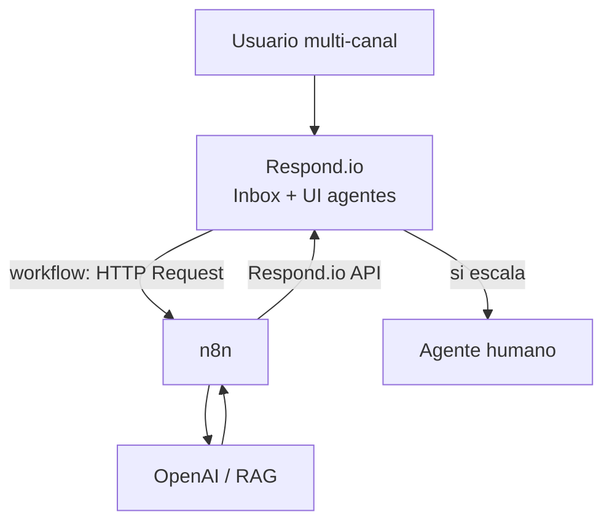

# Respond.io vs n8n: cuándo cada uno

> **TL;DR:** **Respond.io** brilla en inbox de agentes humanos, omnicanalidad y workflows simples sin código. **n8n** brilla en lógica compleja (IA, RAG, function calling), integraciones múltiples y control fino. Suelen combinarse: Respond.io para el frente (agentes), n8n para el cerebro. Decisión: si solo necesitás workflows medianos sin IA compleja, Respond.io alcanza; si necesitás IA seria, n8n es obligatorio.

## Comparación dimensional

| Dimensión | Respond.io | n8n |
|---|---|---|
| Foco | Inbox + workflows | Orquestación general |
| UI de agentes | Sí, incluida | No (requiere otra herramienta) |
| Omnicanal | Sí, fuerte | Manual |
| Workflows visuales | Sí | Sí |
| Capacidad de lógica | Media | Alta |
| IA / function calling | AI Agent built-in (limitado) | OpenAI directo, ilimitado |
| RAG | No nativo | Vía pgvector / Qdrant |
| Integraciones | Limitadas + HTTP Request | Cientos de nodos |
| Control de payloads | Medio | Total |
| Costo | Suscripción + MAU | Solo hosting |
| Curva | Baja | Media |
| Versionado | Limitado | Git si exportás JSON |

## Cuándo Respond.io alcanza

| Caso | Por qué |
|---|---|
| Soporte multicanal con equipo humano | Inbox + asignación |
| FAQ con AI Agent y plantillas estándar | AI nativo cubre casos básicos |
| Routing por palabras clave | Workflows simples |
| Broadcasts con segmentación básica | Built-in |
| Necesitás algo operativo en días sin código | Setup rápido |

## Cuándo necesitás n8n

| Caso | Por qué |
|---|---|
| Function calling con muchas tools | n8n permite ramificar fino |
| RAG con tu base de conocimiento | Requiere embeddings + vector DB |
| Integración con 5+ APIs externas | n8n nativo |
| Lógica de negocio compleja | n8n es general purpose |
| Multi-tenant con tokens dinámicos | Respond.io es por workspace |
| Optimizar costos de IA / control fino | n8n da control |
| Versionar workflows en Git | n8n permite export |

## El patrón híbrido: ambos

Respond.io maneja:

- Recepción multi-canal.
- UI para agentes humanos.
- Workflows simples (auto-respuestas, routing, asignación).

n8n maneja:

- Bot conversacional con IA.
- RAG.
- Integraciones complejas.

Es probablemente el stack más completo para producto de soporte + ventas + IA.

## Comparación con Kommo

Para completar el cuadro:

| Caso | Respond.io | Kommo | n8n directo |
|---|---|---|---|
| CRM con pipeline de ventas | Limitado | Excelente | Manual |
| Inbox multicanal | Excelente | Bueno | Manual |
| Workflows no-code | Buenos | Salesbot (más limitado) | n/a |
| Costo | Suscripción + MAU | Suscripción + conv | Solo hosting |
| Adopción LATAM | Media | Muy alta | Alta |

## Cómo elegir

| Cliente | Recomendación |
|---|---|
| Soporte con multicanal, equipo medio | Respond.io (+ n8n si hay IA) |
| Ventas con pipeline LATAM PyME | Kommo (+ n8n) |
| Operación 100% automatizada con IA | n8n + Cloud API directa (sin UI de agentes) |
| Equipo grande con foco corporativo | HubSpot / Salesforce |

## Migrar entre ambos

Si arrancás con Respond.io y la lógica crece más allá de lo que sus workflows aguantan:

1. Mantener Respond.io como inbox de agentes.
2. Mover la lógica nueva a n8n (workflows HTTP Request al cerebro).
3. Eventualmente, los workflows viejos de Respond.io se reducen a triggers.

Si arrancás con n8n y luego querés sumar UI de agentes:

1. Agregar Respond.io o Chatwoot.
2. n8n maneja el bot; Respond.io/Chatwoot, los agentes humanos.
3. Sincronizar contactos via API.

## Errores comunes

| Error | Causa | Solución |
|---|---|---|
| "Respond.io no puede hacer X" | Lógica fuera de su scope | Delegar a n8n |
| Duplicar trabajo en ambos | No definir responsabilidades | Documentar quién hace qué |
| AI Agent de Respond.io alucina | Sin RAG ni umbral | Migrar a n8n + OpenAI con prompt fuerte |
| Costo MAU alto | Base grande con poca actividad | Limpiar contactos inactivos |

## Referencias

- [`03-formas-de-uso/respond-io.md`](../../03-formas-de-uso/respond-io.md)
- [`07-integraciones/respond-io/workflows.md`](./workflows.md)
- [`07-integraciones/n8n/patrones.md`](../n8n/patrones.md)
