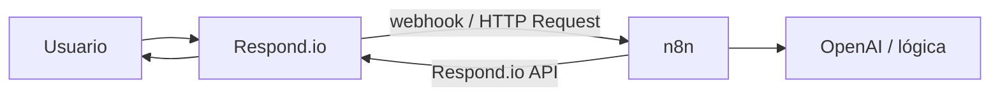

# Respond.io: webhooks

> **TL;DR:** Respond.io envía eventos salientes (incoming message, conversation status changed, new contact, workflow completed) a una URL del integrador. Más el step **HTTP Request** dentro de un workflow para disparos puntuales. Junto con la API REST, es la vía estándar para conectar con n8n y CRMs externos.

## Tipos de webhook

| Tipo | Cuándo |
|---|---|
| Webhook de cuenta | Eventos globales suscriptos (incoming message, etc.) |
| HTTP Request en workflow | Disparo puntual dentro de un workflow |

## Eventos globales

Configurables en Settings → Integrations → Webhooks. Eventos típicos:

| Evento | Cuándo |
|---|---|
| New incoming message | Mensaje entrante de cualquier canal |
| Conversation opened | Inicio de conversación |
| Conversation closed | Cierre |
| Conversation assigned | Asignación a agente |
| Contact created | Contacto nuevo |
| Contact updated | Cambio en contacto |
| Workflow completed | Workflow terminó |

## Payload típico

```json
{
  "event_type": "message.created",
  "event_id": "...",
  "contact": {
    "id": "...",
    "phone": "5491133334444",
    "name": "Juan",
    "custom_fields": { ... }
  },
  "message": {
    "channelMessageId": "wamid....",
    "channel": "whatsapp",
    "messageType": "text",
    "content": { "text": "Hola" },
    "timestamp": "..."
  },
  "channel": "whatsapp"
}
```

La estructura exacta varía por evento. Parser flexible en n8n.

## Configuración

| Campo | Detalle |
|---|---|
| URL | Endpoint público del integrador (n8n: `https://n8n.../webhook/respond-io`) |
| Eventos | Seleccionar los suscriptos |
| Secret (si está disponible) | Para validar |

## Seguridad

Respond.io provee validación según la versión:

| Mecanismo | Detalle |
|---|---|
| Secret en header | Validar que coincide |
| URL con token | Token en el path |
| HTTPS obligatorio | Sí |

Implementar al menos uno de estos antes de procesar.

## HTTP Request dentro de un workflow

Step disponible en workflows. Diferencia con el webhook de cuenta:

| Webhook de cuenta | HTTP Request en workflow |
|---|---|
| Global, eventos suscriptos | Puntual, dentro de un flujo |
| Side effect (avisás a otro sistema) | Espera respuesta y la usa |

Casos:

| Caso | Cuál |
|---|---|
| Sincronizar contacto con CRM | Webhook de cuenta o HTTP Request |
| Llamar a n8n y usar la respuesta para el siguiente step | HTTP Request en workflow |
| Notificar a Slack cuando se cierra conversación | Webhook de cuenta `conversation.closed` |

## Patrón Respond.io → n8n → Respond.io



En n8n:

1. Webhook trigger recibe el POST de Respond.io.
2. Parsea evento.
3. Procesa.
4. Envía resultado vía API de Respond.io (o responde el HTTP Request si fue desde workflow).

## Dedup

Respond.io puede reenviar. Deduplicar por `event_id` o `channelMessageId`:

```
SET rio:dedup:{{event_id}} 1 NX EX 86400
```

## Loops

Si n8n actualiza el contacto vía API, eso puede disparar otro webhook `contact.updated`. Filtrar:

| Estrategia | Detalle |
|---|---|
| Suscribir solo eventos necesarios | Menos riesgo |
| Marcar cambios propios | `updated_by=bot` y filtrar |

## Errores comunes

| Error | Causa | Solución |
|---|---|---|
| Webhook no llega | URL mal o evento no suscripto | Revisar config |
| Workflow HTTP Request timeout | n8n tarda | Responder rápido + async |
| Eventos duplicados | Reenvíos | Dedup |
| n8n no sabe de qué workspace | Multi-tenant | Identificar por workspace en el payload |
| Loop de webhooks | Updates propios disparan eventos | Filtrar |

## Referencias

- [Respond.io Developers](https://developers.respond.io/) — Verificado 2026-05-20.
- [`07-integraciones/respond-io/workflows.md`](./workflows.md)
- [`07-integraciones/respond-io/api-rest.md`](./api-rest.md)
