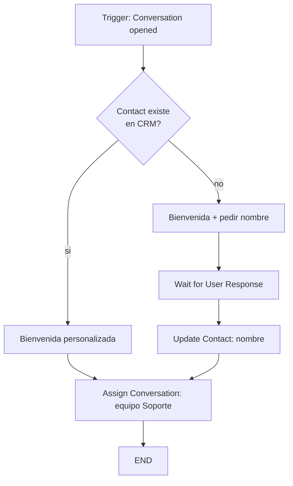
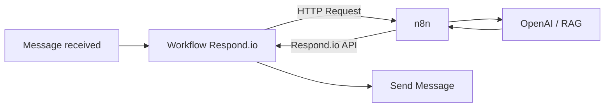

# Respond.io: workflows

> **TL;DR:** Workflows visuales de Respond.io. Cubren bien automatizaciones de soporte/ventas (routing, asignación, auto-respuestas, bots simples). Para lógica compleja (IA, RAG, function calling, integraciones múltiples), usar el workflow como **trigger** que llama a n8n vía HTTP Request.

## Anatomía de un workflow

| Elemento | Detalle |
|---|---|
| **Trigger** | Qué dispara el workflow |
| **Steps** | Bloques que ejecuta |
| **Branches** | Ramas condicionales |
| **End** | Cierre del flujo |

## Triggers disponibles

| Trigger | Cuándo |
|---|---|
| Conversation opened | Primer mensaje del contacto en una sesión |
| Conversation closed | Cierre de conversación |
| Contact created | Contacto nuevo |
| Contact updated | Cambio en campos |
| Message received | Cualquier mensaje entrante |
| Webhook | POST externo a un endpoint del workflow |
| Manual | Lanzado por agente o broadcast |
| Schedule | Programado |

## Steps (bloques) más usados

| Step | Función |
|---|---|
| Send Message | Texto/media al contacto |
| Send Template | Plantilla aprobada |
| Wait for User Response | Pausa esperando respuesta |
| Wait | Pausa temporal |
| Branch | Condicional |
| Update Contact | Modificar campos del contacto |
| Assign Conversation | Asignar a user/team |
| Close Conversation | Cerrar |
| Add/Remove Tag | Tagging |
| HTTP Request | Llamar API externa (la puerta a n8n) |
| AI Agent | Step nativo de IA (si está en el plan) |

## Patrón: workflow básico de bienvenida

Cubre el caso sin tocar n8n.

## Patrón: workflow como trigger de n8n

Cuando hace falta IA o lógica compleja:

El workflow:

1. Trigger: message received.
2. **HTTP Request** a n8n con el contenido y el `contact_id`.
3. n8n procesa, devuelve respuesta.
4. **Send Message** con la respuesta.

O alternativamente, n8n responde vía la API REST de Respond.io y el workflow termina ahí.

## AI Agent nativo

Respond.io ofrece un AI Agent step en sus planes superiores:

| Capacidad | Detalle |
|---|---|
| Knowledge base | Subir docs / FAQs |
| Tono configurable | Sí |
| Handoff | Built-in |
| Limitaciones | Function calling más limitado que OpenAI directo |

Cuándo conviene: casos estándar de soporte que el AI Agent resuelve sin tener que armar n8n.

Cuándo no: function calling complejo, integraciones profundas, RAG custom → mejor n8n + OpenAI.

## Dynamic Variables

Variables que el workflow setea y usa en steps posteriores:

| Origen | Ejemplo |
|---|---|
| Respuesta del usuario | `{{ user_response.text }}` |
| Campo del contacto | `{{ contact.first_name }}` |
| Respuesta de HTTP Request | `{{ http_response.body.X }}` |

Útiles para parametrizar mensajes y branches.

## Workflows + plantillas

| Caso | Cómo |
|---|---|
| Iniciar conversación (ventana cerrada) | Send Template step |
| Responder dentro de ventana | Send Message normal |
| Verificar ventana antes de enviar | Step de Branch + check |

Respond.io no siempre verifica automáticamente la ventana de 24h: testear el flujo para no caer en errores 131047.

## Versionado / mantenimiento

Los workflows quedan guardados pero el versionado tipo Git no es nativo. Buenas prácticas:

| Práctica | Razón |
|---|---|
| Workflows pocos y enfocados | Más fácil mantener que uno gigante |
| Naming consistente (`onboarding:welcome`, `routing:support`) | Encontrabilidad |
| Documentar fuera de la UI | Los bloques visuales no se auto-documentan |
| Probar antes de activar en producción | Sandbox / canal de prueba |

## Errores comunes

| Error | Causa | Solución |
|---|---|---|
| Workflow no dispara | Trigger mal configurado | Revisar condiciones |
| HTTP Request a n8n timeout | n8n lento | Responder rápido, async |
| Send Template falla con error 131047 | No estás en ventana ni usás template | Detectar antes y elegir bien |
| Loop infinito | Workflow dispara otro que dispara al primero | Diseñar dependencias |
| Variables con `undefined` | Path de la variable mal escrito | Verificar nombres |

## Cuándo migrar lógica a n8n

| Señal | |
|---|---|
| El workflow tiene 30+ bloques | |
| Necesitás function calling | |
| Necesitás RAG | |
| Integrás 3+ APIs externas | |
| Querés versionar en Git | |

Ver [`vs-n8n.md`](./vs-n8n.md).

## Referencias

- [Respond.io Docs · Workflows](https://docs.respond.io/) — Verificado 2026-05-20.
- [`07-integraciones/respond-io/setup.md`](./setup.md)
- [`07-integraciones/respond-io/vs-n8n.md`](./vs-n8n.md)
