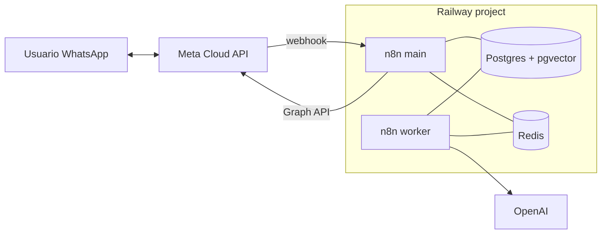

# Railway · Plantilla: Cloud API oficial + n8n + OpenAI

> **TL;DR:** Stack productivo con **Cloud API oficial** (Meta, sin Evolution) + n8n queue mode + Postgres (incluido pgvector si vas a sumar RAG) + Redis. n8n recibe los webhooks de Meta y orquesta con OpenAI. ~25-35 USD/mes. Es la plantilla recomendada para producción seria con IA.

## Contexto

Esta plantilla es lo que usa la mayoría de los proyectos serios de esta wiki. La diferencia con `plantilla-evolution-n8n-openai.md`: acá no hay Evolution. WhatsApp se conecta vía Cloud API directa de Meta (oficial, sin riesgo de ban). Toda la infra es solo orquestación + IA.

## Cuándo elegir esta plantilla

| Caso | Razón |
|---|---|
| Cliente productivo con marketing / industria regulada | Cloud API oficial |
| Necesitás HSM reales y quality rating | Cloud API |
| Querés zero lock-in (sin BSP/SaaS) | Stack propio |
| Sumarás RAG / function calling complejo | n8n + OpenAI |
| Volumen medio-alto | El stack lo soporta |

## Cuándo elegir otra

| Caso | Plantilla |
|---|---|
| Prototipo con WA no oficial | `plantilla-evolution-n8n-openai.md` |
| Solo n8n, sin OpenAI | `plantilla-n8n.md` |
| Solo Evolution sin n8n local | `plantilla-evolution-api.md` |

## Arquitectura



## Servicios

| Servicio | Imagen / plugin | Rol |
|---|---|---|
| `n8n-main` | `n8nio/n8n:1.x.x` | Webhooks, UI, scheduler |
| `n8n-worker` | mismo tag, comando `n8n worker` | Ejecuciones |
| `postgres` | Plugin Postgres con extensión `vector` | n8n + datos de negocio + RAG (opcional) |
| `redis` | Plugin Redis | Cola + cache + dedup |

## Variables de entorno

Idénticas a [`plantilla-n8n.md`](./plantilla-n8n.md) más las credenciales WhatsApp/OpenAI que se cargan **dentro de n8n** como credentials, no como env vars (encriptadas por `N8N_ENCRYPTION_KEY`).

Variables clave del stack:

| Variable | Valor | Secreto |
|---|---|---|
| `DB_TYPE` | `postgresdb` | No |
| `DB_POSTGRESDB_HOST` | `${{Postgres.PGHOST}}` | No |
| `DB_POSTGRESDB_DATABASE` | `${{Postgres.PGDATABASE}}` | No |
| `DB_POSTGRESDB_USER` | `${{Postgres.PGUSER}}` | **Sí** |
| `DB_POSTGRESDB_PASSWORD` | `${{Postgres.PGPASSWORD}}` | **Sí** |
| `EXECUTIONS_MODE` | `queue` | No |
| `QUEUE_BULL_REDIS_HOST` | `${{Redis.REDISHOST}}` | No |
| `QUEUE_BULL_REDIS_PORT` | `${{Redis.REDISPORT}}` | No |
| `QUEUE_BULL_REDIS_PASSWORD` | `${{Redis.REDISPASSWORD}}` | **Sí** |
| `N8N_ENCRYPTION_KEY` | `{{32_CHARS_RANDOM}}` | **Sí**, nunca rotar |
| `N8N_HOST` | `n8n.{{TU_DOMINIO}}` | No |
| `N8N_PROTOCOL` | `https` | No |
| `WEBHOOK_URL` | `https://n8n.{{TU_DOMINIO}}/` | No |
| `N8N_BASIC_AUTH_ACTIVE` | `true` | No |
| `N8N_BASIC_AUTH_USER` / `_PASSWORD` | Credenciales UI | **Sí** |
| `GENERIC_TIMEZONE` | `America/Argentina/Buenos_Aires` | No |

## Credentials dentro de n8n

Una vez levantado, en n8n → Credentials, crear:

| Credential | Para |
|---|---|
| WhatsApp Business Cloud (o HTTP Auth genérico) | Cloud API. Bearer con System User token. |
| OpenAI | Chat + embeddings |
| Postgres | DB del proyecto |
| Redis | Para nodos Redis |

## Habilitar pgvector (si vas a usar RAG)

En el Postgres:

```sql
CREATE EXTENSION IF NOT EXISTS vector;
```

Crear las tablas de embeddings (ver [`09-recetas/rag-kb.md`](../../09-recetas/rag-kb.md)).

## Pasos de despliegue

1. Crear project Railway.
2. Agregar Postgres + Redis (plugins).
3. Conectar a Postgres y `CREATE EXTENSION vector;` (si usás RAG).
4. Generar `N8N_ENCRYPTION_KEY` (`openssl rand -hex 16`).
5. Crear servicio `n8n-main` con la imagen y variables.
6. Crear servicio `n8n-worker` con comando `n8n worker` y las mismas variables comunes.
7. Generar dominio público para `n8n-main` (o apuntar CNAME propio).
8. Acceder a la UI, completar setup inicial.
9. Crear credentials de WhatsApp y OpenAI en n8n.
10. Importar/crear workflows (webhook entrante, bot, etc.).
11. Configurar webhook en Meta apuntando a `https://n8n.{{TU_DOMINIO}}/webhook/wa-incoming`.
12. Suscribir la WABA a la App.

Detalle de cada paso en [`01-onboarding-meta/`](../../01-onboarding-meta/) y [`02-numeros-y-conexion/webhooks.md`](../../02-numeros-y-conexion/webhooks.md).

## Costos estimados

| Servicio | Plan | USD/mes |
|---|---|---|
| n8n-main | 1 vCPU / 1 GB | ~10 |
| n8n-worker | 0.5 vCPU / 512 MB | ~6 |
| Postgres (con pgvector) | Plugin base | ~5-8 |
| Redis | Plugin base | ~3 |
| **Total** | | **~25-30 USD/mes** |

Más OpenAI según uso y conversaciones de Meta. Ver [`07-integraciones/openai/costos.md`](../../07-integraciones/openai/costos.md) y [`06-politicas-y-calidad/pricing.md`](../../06-politicas-y-calidad/pricing.md).

## Hardening

| Acción | Razón |
|---|---|
| Basic Auth en n8n | UI segura |
| `N8N_ENCRYPTION_KEY` fija | Credentials persistentes |
| Pinear versión de n8n | Sin breaking |
| Postgres con backups activos | Recuperación |
| HTTPS válido | Webhook de Meta |
| Verify token largo y secreto | Seguridad del webhook |
| Validación de firma HMAC en el workflow | Anti-spoofing |

## Multi-tenant

Si manejás varios clientes en este mismo proyecto:

| Aspecto | Detalle |
|---|---|
| Una credential por cliente | Token de cada uno |
| Tabla `tenants` mapeando `phone_number_id` → cliente | Para routing |
| Datos aislados por `tenant_id` | En todas las tablas |
| Workflows pueden ser compartidos | Si la lógica es la misma |

Para muchos clientes (decenas+), considerar Embedded Signup (ver [`01-onboarding-meta/embedded-signup.md`](../../01-onboarding-meta/embedded-signup.md)) y eventualmente projects separados por cliente grande.

## Errores comunes

| Error | Causa | Solución |
|---|---|---|
| Webhook no llega | WABA no suscrita | `POST /{{WABA_ID}}/subscribed_apps` |
| Firma siempre inválida | Body parseado | Raw body en el webhook trigger |
| Workflows pierden credentials | `N8N_ENCRYPTION_KEY` cambió | Fijarla |
| Lentitud / timeout | Sin queue mode | Activar |
| pgvector no funciona | Extensión no creada | `CREATE EXTENSION vector;` |
| Token expira | User token en vez de System User | Usar System User token |

## Cuándo migrar (escalar)

| Señal | Cambio |
|---|---|
| Conversaciones > 10K/día | Considerar workers extra, plan más alto |
| Mucha data en RAG | Postgres más grande o vector DB dedicado (Qdrant) |
| Multi-cliente con onboarding masivo | Embedded Signup |
| Necesitás multi-región | Fly.io u otro PaaS global |

## Referencias

- [Railway Docs](https://docs.railway.com/) — Verificado 2026-05-20.
- [Cloud API Get Started](https://developers.facebook.com/docs/whatsapp/cloud-api/get-started) — Verificado 2026-05-20.
- [`03-formas-de-uso/cloud-api-oficial.md`](../../03-formas-de-uso/cloud-api-oficial.md)
- [`08-despliegue/railway/conceptos.md`](./conceptos.md)
- [`08-despliegue/railway/plantilla-n8n.md`](./plantilla-n8n.md)
