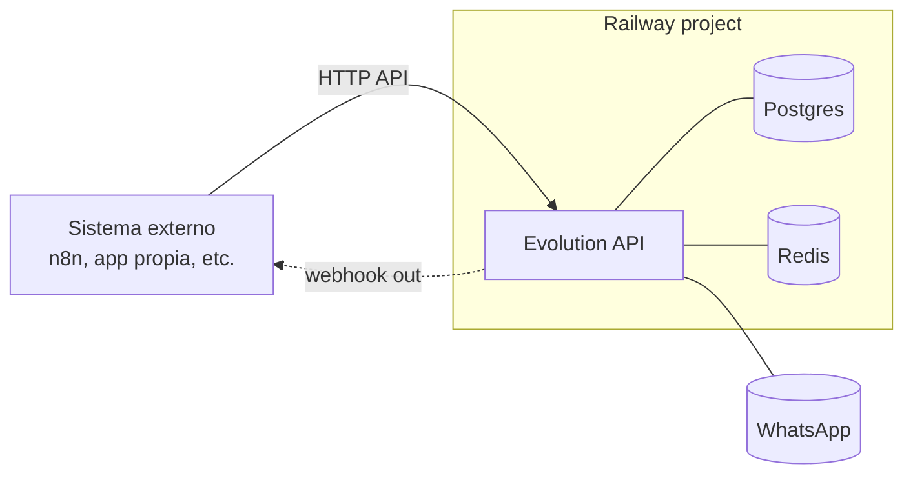

# Railway · Plantilla: Evolution API standalone

> **TL;DR:** Despliegue mínimo de Evolution API en Railway: container Evolution + Postgres + Redis. Útil para integrar con un n8n o sistema externo ya existente. ~10 USD/mes. Para stack completo en un solo proyecto, ver [`plantilla-evolution-n8n-openai.md`](./plantilla-evolution-n8n-openai.md).

## Contexto

Hay dos escenarios típicos:

1. **Solo necesito el transporte WhatsApp**: ya tengo n8n / sistema propio corriendo en otro lado y quiero un endpoint Evolution para enviar/recibir.
2. **Stack completo en un solo lugar**: Evolution + n8n + DB → usar la otra plantilla.

Este documento cubre el primer caso.

## Arquitectura



## Servicios

| Servicio | Imagen / template | Notas |
|---|---|---|
| `evolution-api` | `atendai/evolution-api:v2` (pinear versión) | Único contenedor expuesto |
| `postgres` | Plugin oficial de Railway | Persistencia de instancias y sesiones |
| `redis` | Plugin oficial de Railway | Cache de Baileys, sesiones |

## Variables de entorno

| Variable | Ejemplo | Secreto | Descripción |
|---|---|---|---|
| `SERVER_URL` | `https://evo.{{TU_DOMINIO}}` | No | URL pública con HTTPS |
| `AUTHENTICATION_API_KEY` | `{{API_KEY_LARGA}}` | **Sí** | Token de admin (header `apikey`) |
| `DATABASE_PROVIDER` | `postgresql` | No | |
| `DATABASE_CONNECTION_URI` | `${{Postgres.DATABASE_URL}}?schema=evolution` | **Sí** | Schema dedicado |
| `DATABASE_CONNECTION_CLIENT_NAME` | `evolution_exchange` | No | |
| `CACHE_REDIS_ENABLED` | `true` | No | |
| `CACHE_REDIS_URI` | `${{Redis.REDIS_URL}}/1` | **Sí** | DB 1 separa del resto |
| `CACHE_REDIS_PREFIX_KEY` | `evolution` | No | |
| `CACHE_LOCAL_ENABLED` | `false` | No | Forzar Redis, no fs |
| `WEBHOOK_GLOBAL_URL` | `https://n8n.{{TU_DOMINIO}}/webhook/evolution` | No | URL de tu n8n |
| `WEBHOOK_GLOBAL_ENABLED` | `true` | No | |
| `WEBHOOK_GLOBAL_WEBHOOK_BY_EVENTS` | `false` | No | Un solo endpoint |
| `WEBHOOK_EVENTS_MESSAGES_UPSERT` | `true` | No | Mensajes entrantes |
| `WEBHOOK_EVENTS_CONNECTION_UPDATE` | `true` | No | Alertas de conexión |
| `WEBHOOK_EVENTS_QRCODE_UPDATED` | `true` | No | Notificar QR nuevo |
| `LANGUAGE` | `es` | No | Mensajes del API |
| `LOG_LEVEL` | `ERROR,WARN,INFO` | No | Sin DEBUG en prod |
| `INSTANCE_EXPIRATION_TIME` | `false` | No | No expirar instancias |
| `DEL_INSTANCE` | `false` | No | No borrar tras desconexión |

Generar API key:

```bash
openssl rand -hex 32
```

## Volumen y persistencia

| Recurso | Persistencia | Tamaño sugerido |
|---|---|---|
| Postgres | Plugin Railway con backups | 5 GB inicial |
| Redis | Ephemeral OK (la session real está en Postgres) | 512 MB |
| Evolution container | Sin volumen propio (estado en Postgres) | — |

## Pasos de despliegue

1. **Crear proyecto Railway** vacío.
2. **Agregar plugin Postgres**: panel → New → Database → Postgres.
3. **Agregar plugin Redis**: idem con Redis.
4. **Agregar servicio Evolution**: New → Docker Image → `atendai/evolution-api:v2`.
5. **Cargar variables de entorno** según tabla.
6. **Generar dominio público** en el servicio Evolution: Settings → Networking → Generate Domain.
7. **(Opcional) Apuntar dominio propio**: CNAME `evo.{{TU_DOMINIO}}` → dominio público de Railway.
8. **Verificar healthcheck**: `GET https://evo.{{TU_DOMINIO}}/` debe devolver 200.
9. **Crear primera instancia**:

```bash
curl -X POST "https://evo.{{TU_DOMINIO}}/instance/create" \
  -H "apikey: {{API_KEY_LARGA}}" \
  -H "Content-Type: application/json" \
  -d '{
    "instanceName": "main",
    "qrcode": true,
    "integration": "WHATSAPP-BAILEYS"
  }'
```

10. **Conectar el número**:

```bash
curl -X GET "https://evo.{{TU_DOMINIO}}/instance/connect/main" \
  -H "apikey: {{API_KEY_LARGA}}"
```

Devuelve un QR base64 o `pairingCode`. Escanear desde la app de WA del teléfono.

11. **Verificar estado**:

```bash
curl -X GET "https://evo.{{TU_DOMINIO}}/instance/connectionState/main" \
  -H "apikey: {{API_KEY_LARGA}}"
```

Esperado: `{ "instance": { "state": "open" } }`.

12. **(Opcional) Configurar webhook por instancia** si querés override del global:

```bash
curl -X POST "https://evo.{{TU_DOMINIO}}/webhook/set/main" \
  -H "apikey: {{API_KEY_LARGA}}" \
  -H "Content-Type: application/json" \
  -d '{
    "url": "https://n8n.{{TU_DOMINIO}}/webhook/evolution-main",
    "events": ["MESSAGES_UPSERT", "CONNECTION_UPDATE"],
    "webhook_by_events": false
  }'
```

## Costos estimados

| Servicio | Plan típico | USD/mes |
|---|---|---|
| Evolution API | 0.5 vCPU / 512 MB | ~5 |
| Postgres | Plugin base | ~5 |
| Redis | Plugin base | ~3 |
| **Total** | | **~13 USD/mes** |

Más egress según volumen.

## Hardening recomendado

| Acción | Razón |
|---|---|
| API key larga (≥32 chars random) | Evitar brute force |
| Pinear versión del container (`:v2.0.x`) | Evitar breaking changes automáticos |
| Rotar API key tras cambios de equipo | Higiene |
| Backup automático de Postgres | El plugin lo soporta, activarlo |
| Suscribir solo eventos necesarios | Menos tráfico, menos exposición |
| Si exponés a Internet, filtrar IPs del webhook receptor | Defensa en profundidad |

## Multi-tenancy

Evolution soporta múltiples instancias en el mismo container. Patrón típico:

- 1 instancia = 1 número.
- Nombrar por cliente: `acme-soporte`, `acme-ventas`, `xyz-main`.
- Webhook global apunta al mismo n8n; n8n decide qué cliente atender según el campo `instance` del payload.

Para alto volumen (decenas de instancias), considerar escalar el container y separar Redis DBs.

## Backup y restore

### Backup

```bash
# Desde Railway CLI o panel
railway run pg_dump $DATABASE_URL > evolution-backup.sql
```

Incluye sesiones de WhatsApp; con esto, en otro Railway / VPS recuperás todo.

### Restore

```bash
railway run psql $DATABASE_URL < evolution-backup.sql
```

Reiniciar el container Evolution para que tome las sesiones existentes.

## Errores comunes

| Error | Causa | Solución |
|---|---|---|
| Container reinicia en loop | Connection URI mal armada o DB no lista | Esperar a que Postgres esté `ready`, revisar URI |
| QR no aparece | `qrcode: true` no seteado al crear instancia | Re-crear con `qrcode: true` |
| Webhook no llega a n8n | Hostname / URL mal | Probar con `webhook.site` primero |
| Sesión se cae cada noche | Logs muestran reconexión | Versionar el container y revisar issues del repo de Evolution |
| Instancia se duplica al reiniciar | `DEL_INSTANCE` o `INSTANCE_EXPIRATION_TIME` mal configurado | Setearlos a `false` |
| `apikey` rechazada | Header mal escrito (case sensitive) | Usar exactamente `apikey` |
| Mensajes salen pero status no llega | Evento no suscrito | Activar `MESSAGES_UPDATE` |

## Cuándo migrar al stack completo

Si en algún momento necesitás:

- n8n dedicado en el mismo proyecto (privacidad de red).
- Workflows complejos con muchos nodos.
- OpenAI integrado y sin cambios de contexto.

Migrar a [`plantilla-evolution-n8n-openai.md`](./plantilla-evolution-n8n-openai.md). El Postgres y Redis se pueden reutilizar.

## Referencias

- [Railway docs](https://docs.railway.com/) — Verificado 2026-05-20.
- [Evolution API docs](https://doc.evolution-api.com/) — Verificado 2026-05-20.
- [`03-formas-de-uso/evolution-api.md`](../../03-formas-de-uso/evolution-api.md)
- [`08-despliegue/railway/plantilla-evolution-n8n-openai.md`](./plantilla-evolution-n8n-openai.md)
