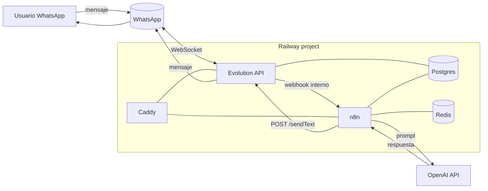

# Railway · Stack completo: Evolution API + n8n + OpenAI

> **TL;DR:** Plantilla self-hosted en Railway con Evolution API (WhatsApp no oficial), n8n (orquestación), Postgres (persistencia compartida), Redis (queue de n8n y cache) y Caddy (TLS y router de subdominios). Pensada para prototipos y operaciones internas. Coste estimado: 15-40 USD/mes según uso.

## Contexto

Cuando el cliente necesita un MVP funcional rápido con WhatsApp + IA, este stack te lo deja parado en menos de una hora. No usa Cloud API oficial, por lo tanto **no es apto para producción seria con HSM ni industrias reguladas**. Para esos casos ver [`plantilla-cloudapi-n8n-openai.md`](./plantilla-cloudapi-n8n-openai.md).

Razones para elegirlo:

- Cero fricción regulatoria de Meta para arrancar.
- Todo bajo un mismo proyecto de Railway, con red privada interna.
- Webhooks de Evolution → n8n por hostname interno, sin exponer puertos.
- OpenAI accesible desde n8n como nodo nativo.

Razones para NO elegirlo:

- Riesgo de ban del número (Evolution se conecta como WhatsApp Web).
- Sin HSM reales, sin quality rating, sin tiers.
- Si el cliente factura conversaciones, el modelo de Meta no aplica.

## Arquitectura



## Servicios a crear

| Servicio | Imagen / template | Notas |
|---|---|---|
| `evolution-api` | `atendai/evolution-api:latest` o tag pineado | Expone `:8080`. Persistencia en Postgres. |
| `n8n` | `n8nio/n8n:latest` (queue mode) | Worker separado opcional para escalar. |
| `postgres` | Plugin oficial de Railway | Compartido entre Evolution y n8n (DBs separadas). |
| `redis` | Plugin oficial de Railway | Queue y cache de n8n. |
| `caddy` | `caddy:2-alpine` con Caddyfile | TLS y subdominios `evo.*` / `n8n.*`. |

## Variables de entorno

### `evolution-api`

| Variable | Ejemplo | Secreto | Descripción |
|---|---|---|---|
| `SERVER_URL` | `https://evo.{{TU_DOMINIO}}` | No | URL pública. |
| `AUTHENTICATION_API_KEY` | `{{API_KEY_LARGA}}` | **Sí** | Token global de admin. |
| `DATABASE_PROVIDER` | `postgresql` | No | |
| `DATABASE_CONNECTION_URI` | `${{Postgres.DATABASE_URL}}?schema=evolution` | **Sí** | Schema dedicado. |
| `CACHE_REDIS_ENABLED` | `true` | No | |
| `CACHE_REDIS_URI` | `${{Redis.REDIS_URL}}/1` | **Sí** | DB 1 de Redis. |
| `WEBHOOK_GLOBAL_URL` | `http://n8n.railway.internal:5678/webhook/evolution` | No | Hostname interno de Railway. |
| `WEBHOOK_GLOBAL_ENABLED` | `true` | No | |
| `WEBHOOK_EVENTS_MESSAGES_UPSERT` | `true` | No | Evento principal. |

### `n8n`

| Variable | Ejemplo | Secreto | Descripción |
|---|---|---|---|
| `N8N_HOST` | `n8n.{{TU_DOMINIO}}` | No | |
| `N8N_PROTOCOL` | `https` | No | |
| `WEBHOOK_URL` | `https://n8n.{{TU_DOMINIO}}/` | No | |
| `N8N_PORT` | `5678` | No | |
| `DB_TYPE` | `postgresdb` | No | |
| `DB_POSTGRESDB_HOST` | `${{Postgres.PGHOST}}` | No | |
| `DB_POSTGRESDB_DATABASE` | `n8n` | No | DB separada de Evolution. |
| `DB_POSTGRESDB_USER` | `${{Postgres.PGUSER}}` | **Sí** | |
| `DB_POSTGRESDB_PASSWORD` | `${{Postgres.PGPASSWORD}}` | **Sí** | |
| `EXECUTIONS_MODE` | `queue` | No | |
| `QUEUE_BULL_REDIS_HOST` | `${{Redis.REDISHOST}}` | No | |
| `QUEUE_BULL_REDIS_PORT` | `${{Redis.REDISPORT}}` | No | |
| `QUEUE_BULL_REDIS_PASSWORD` | `${{Redis.REDISPASSWORD}}` | **Sí** | |
| `N8N_ENCRYPTION_KEY` | `{{32_CHARS_RANDOM}}` | **Sí** | **No rotar**, encripta credenciales. |
| `GENERIC_TIMEZONE` | `America/Argentina/Buenos_Aires` | No | |
| `OPENAI_API_KEY` | `{{TU_OPENAI_KEY}}` | **Sí** | Opcional, también puede ir como credential dentro de n8n. |

### `caddy`

Montar un `Caddyfile`:

```caddyfile
evo.{{TU_DOMINIO}} {
    reverse_proxy evolution-api.railway.internal:8080
}

n8n.{{TU_DOMINIO}} {
    reverse_proxy n8n.railway.internal:5678
}
```

| Placeholder | Descripción |
|---|---|
| `TU_DOMINIO` | Dominio propio apuntado por CNAME a Railway. |
| `API_KEY_LARGA` | String aleatorio ≥ 32 chars. Generar con `openssl rand -hex 32`. |
| `TU_OPENAI_KEY` | Key de https://platform.openai.com/api-keys |

## Volúmenes y persistencia

| Servicio | ¿Necesita volumen? | Tamaño sugerido |
|---|---|---|
| `evolution-api` | Solo si se desactiva Postgres como provider | 1 GB |
| `n8n` | Sí, para `/home/node/.n8n` (workflow binaries y logs) | 2-5 GB |
| `postgres` | Sí, plugin lo maneja | 5-10 GB |
| `redis` | Opcional (puede ser ephemeral) | 1 GB |
| `caddy` | Sí, para certificados | 100 MB |

## Pasos de despliegue

1. **Crear proyecto en Railway** y agregar los plugins de Postgres y Redis.
2. **Generar `AUTHENTICATION_API_KEY`** y `N8N_ENCRYPTION_KEY` localmente:
   ```bash
   openssl rand -hex 32
   openssl rand -base64 32
   ```
3. **Deployar Evolution API** con las variables de la tabla. Esperar healthcheck en `:8080`.
4. **Deployar n8n** apuntando a la misma instancia de Postgres con `DB_POSTGRESDB_DATABASE=n8n`. Confirmar que crea las tablas.
5. **Deployar Caddy** con el Caddyfile y volumen para certificados.
6. **Apuntar DNS**: CNAME `evo` y `n8n` al dominio público de Railway del servicio Caddy.
7. **Conectar el número en Evolution**:
   ```bash
   curl -X POST "https://evo.{{TU_DOMINIO}}/instance/create" \
     -H "apikey: {{API_KEY_LARGA}}" \
     -H "Content-Type: application/json" \
     -d '{ "instanceName": "main", "qrcode": true, "integration": "WHATSAPP-BAILEYS" }'
   ```
   Escanear el QR desde el endpoint `/instance/connect/main`.
8. **Configurar webhook por instancia** (además del global):
   ```bash
   curl -X POST "https://evo.{{TU_DOMINIO}}/webhook/set/main" \
     -H "apikey: {{API_KEY_LARGA}}" \
     -H "Content-Type: application/json" \
     -d '{
       "url": "http://n8n.railway.internal:5678/webhook/evolution",
       "events": ["MESSAGES_UPSERT"],
       "webhook_by_events": false
     }'
   ```
9. **Crear workflow en n8n** con un Webhook trigger en `/webhook/evolution`, parsear `data.message`, llamar a OpenAI Chat node, y devolver vía HTTP Request a `https://evo.{{TU_DOMINIO}}/message/sendText/main`.

## Estimación de costos

| Servicio | Plan típico | USD/mes |
|---|---|---|
| Evolution API | 0.5 vCPU / 512 MB | ~5 |
| n8n | 1 vCPU / 1 GB | ~10 |
| Postgres | Plugin base | ~5 |
| Redis | Plugin base | ~3 |
| Caddy | 0.25 vCPU / 256 MB | ~2 |
| **Total estimado** | | **~25 USD/mes** |

Volumen y egress varían según uso. **Verificado: 2026-05-20** contra pricing de Railway.

## Healthchecks recomendados

| Servicio | Endpoint | Método |
|---|---|---|
| `evolution-api` | `/` | GET → 200 |
| `n8n` | `/healthz` | GET → 200 |
| `caddy` | `/` | GET → 200 vía cualquier hostname configurado |

Configurar restart policy `on-failure` con `maxRetries: 5`.

## Errores comunes

| Error | Causa | Solución |
|---|---|---|
| n8n no recibe el webhook de Evolution | Hostname interno mal escrito o instancia no creada | Verificar `{servicio}.railway.internal` y que la instancia tenga `state: open`. |
| Evolution pierde la sesión cada pocos días | Múltiples sesiones del mismo número, throttling de WA | Usar siempre pairing code, no abrir WA Web en paralelo. |
| n8n no persiste credentials tras redeploy | `N8N_ENCRYPTION_KEY` no fijo | Setear como variable permanente y nunca rotar. |
| Postgres `too many connections` | n8n abre demasiadas con queue mode | Ajustar `DB_POSTGRESDB_POOL_SIZE` y `pgbouncer` si es necesario. |
| Caddy no obtiene cert | DNS no propagado o puerto 80 bloqueado | Esperar propagación y verificar que Railway exponga 80/443. |

## Hardening mínimo para "producción"

- Cambiar `AUTHENTICATION_API_KEY` por una key larga y guardarla en gestor de secretos.
- Habilitar Basic Auth en n8n (`N8N_BASIC_AUTH_ACTIVE=true`).
- Backup automático de Postgres (plugin lo soporta).
- Pinear versiones de imágenes (no usar `latest`).
- Limitar IPs de webhook de Evolution si se expone públicamente.

## Referencias

- [Railway docs · Networking](https://docs.railway.com/reference/private-networking) — Verificado 2026-05-20.
- [Evolution API · Webhooks](https://doc.evolution-api.com/) — Verificado 2026-05-20.
- [n8n · Queue mode](https://docs.n8n.io/hosting/scaling/queue-mode/) — Verificado 2026-05-20.
- [`03-formas-de-uso/evolution-api.md`](../../03-formas-de-uso/evolution-api.md) — análisis de riesgos.
- [`09-recetas/bot-atencion-handoff.md`](../../09-recetas/bot-atencion-handoff.md) — receta de uso sobre este stack.
