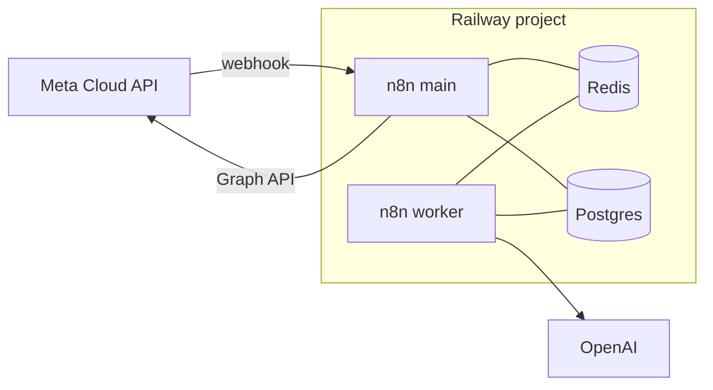

# Railway · Plantilla: n8n + Postgres + Redis

> **TL;DR:** Despliegue de n8n en queue mode en Railway: servicio main + worker + Postgres + Redis. Es el orquestador para integrar con Cloud API oficial (sin Evolution). ~20-30 USD/mes. Para el stack con Evolution incluido, ver [`plantilla-evolution-n8n-openai.md`](./plantilla-evolution-n8n-openai.md).

## Contexto

Cuando trabajás con **Cloud API oficial directa**, no necesitás Evolution: solo el orquestador. Esta plantilla deja n8n en producción, listo para recibir webhooks de Meta y orquestar con OpenAI, Postgres, etc.

## Arquitectura



## Servicios

| Servicio | Imagen | Rol |
|---|---|---|
| `n8n-main` | `n8nio/n8n` (pinear versión) | Webhooks, UI, scheduler |
| `n8n-worker` | `n8nio/n8n` mismo tag | Ejecuta los workflows (queue mode) |
| `postgres` | Plugin Railway | Datos de n8n + datos de negocio |
| `redis` | Plugin Railway | Cola de ejecuciones + cache |

El worker es opcional para volumen bajo (n8n puede correr todo en el main), pero recomendado para producción.

## Variables de entorno

### Comunes a `n8n-main` y `n8n-worker`

| Variable | Valor | Secreto |
|---|---|---|
| `DB_TYPE` | `postgresdb` | No |
| `DB_POSTGRESDB_HOST` | `${{Postgres.PGHOST}}` | No |
| `DB_POSTGRESDB_PORT` | `${{Postgres.PGPORT}}` | No |
| `DB_POSTGRESDB_DATABASE` | `${{Postgres.PGDATABASE}}` | No |
| `DB_POSTGRESDB_USER` | `${{Postgres.PGUSER}}` | **Sí** |
| `DB_POSTGRESDB_PASSWORD` | `${{Postgres.PGPASSWORD}}` | **Sí** |
| `EXECUTIONS_MODE` | `queue` | No |
| `QUEUE_BULL_REDIS_HOST` | `${{Redis.REDISHOST}}` | No |
| `QUEUE_BULL_REDIS_PORT` | `${{Redis.REDISPORT}}` | No |
| `QUEUE_BULL_REDIS_PASSWORD` | `${{Redis.REDISPASSWORD}}` | **Sí** |
| `N8N_ENCRYPTION_KEY` | `{{32_CHARS_RANDOM}}` | **Sí** |
| `GENERIC_TIMEZONE` | `America/Argentina/Buenos_Aires` | No |
| `N8N_LOG_LEVEL` | `info` | No |

### Solo `n8n-main`

| Variable | Valor | Secreto |
|---|---|---|
| `N8N_HOST` | `n8n.{{TU_DOMINIO}}` | No |
| `N8N_PROTOCOL` | `https` | No |
| `N8N_PORT` | `5678` | No |
| `WEBHOOK_URL` | `https://n8n.{{TU_DOMINIO}}/` | No |
| `N8N_BASIC_AUTH_ACTIVE` | `true` | No |
| `N8N_BASIC_AUTH_USER` | `{{USUARIO}}` | **Sí** |
| `N8N_BASIC_AUTH_PASSWORD` | `{{PASSWORD}}` | **Sí** |

### Solo `n8n-worker`

| Variable | Valor |
|---|---|
| Comando de inicio | `n8n worker` |

El worker se levanta con el comando `worker`; el main con el default.

Generar la encryption key:

```bash
openssl rand -hex 16
```

| Placeholder | Descripción |
|---|---|
| `TU_DOMINIO` | Dominio propio o el generado por Railway |
| `32_CHARS_RANDOM` | `N8N_ENCRYPTION_KEY`, **nunca rotar** |
| `USUARIO` / `PASSWORD` | Credenciales de acceso a la UI de n8n |

## Volúmenes

| Servicio | Volumen | Tamaño |
|---|---|---|
| `n8n-main` | `/home/node/.n8n` | 2-5 GB |
| `n8n-worker` | `/home/node/.n8n` (puede compartir config) | 1-2 GB |
| `postgres` | Gestionado por el plugin | 5-10 GB |
| `redis` | Ephemeral OK | 512 MB |

## Pasos de despliegue

1. **Crear project** en Railway.
2. **Agregar Postgres y Redis** (plugins).
3. **Generar `N8N_ENCRYPTION_KEY`** localmente.
4. **Crear servicio `n8n-main`** con la imagen `n8nio/n8n:1.x.x`:
   - Cargar variables comunes + las de main.
   - Agregar volumen en `/home/node/.n8n`.
   - Generar dominio público.
5. **Crear servicio `n8n-worker`** con la misma imagen:
   - Mismas variables comunes.
   - Start command: `n8n worker`.
6. **Apuntar DNS** (opcional): CNAME `n8n` → dominio del servicio main.
7. **Verificar healthcheck**: `GET https://n8n.{{TU_DOMINIO}}/healthz` → 200.
8. **Acceder a la UI**, completar el setup inicial.
9. **Configurar credentials** de WhatsApp y OpenAI dentro de n8n.
10. **Importar/crear workflows** (ver [`07-integraciones/n8n/webhook-entrante.md`](../../07-integraciones/n8n/webhook-entrante.md)).
11. **Configurar el webhook en Meta** apuntando a `https://n8n.{{TU_DOMINIO}}/webhook/wa-incoming`.

## Costos estimados

| Servicio | Plan típico | USD/mes |
|---|---|---|
| n8n-main | 1 vCPU / 1 GB | ~10 |
| n8n-worker | 0.5 vCPU / 512 MB | ~6 |
| Postgres | Plugin base | ~5 |
| Redis | Plugin base | ~3 |
| **Total** | | **~24 USD/mes** |

Para volumen bajo, omitir el worker baja a ~$18/mes.

## Queue mode: por qué

| Sin queue mode | Con queue mode |
|---|---|
| El webhook procesa sincrónico | El webhook encola y responde rápido |
| Riesgo de timeout de Meta (20s) | El main responde 200 al instante |
| No escala horizontalmente | Agregás workers para más throughput |
| Una ejecución pesada bloquea | Las ejecuciones se distribuyen |

Para WhatsApp, queue mode es prácticamente obligatorio: Meta reintenta si no respondés a tiempo.

## Hardening

| Acción | Razón |
|---|---|
| Basic Auth activo en la UI | Evitar acceso no autorizado |
| `N8N_ENCRYPTION_KEY` fija y guardada | Sin ella se pierden las credentials |
| Pinear versión de imagen | Evitar breaking changes |
| Backups de Postgres | Recuperación |
| No exponer el worker públicamente | Solo el main necesita dominio |
| Variables sensibles marcadas como secretas | No leakear en logs |

## Escalado

| Situación | Acción |
|---|---|
| Workflows lentos / cola crece | Agregar más workers |
| Webhook con picos | El main aguanta; los workers absorben |
| Mucha data en Postgres | Subir el plan del plugin |
| Muchos clientes (multi-tenant) | Considerar un n8n por cliente grande |

## Errores comunes

| Error | Causa | Solución |
|---|---|---|
| Credentials se pierden tras redeploy | `N8N_ENCRYPTION_KEY` cambió o no fija | Fijarla y nunca rotar |
| Webhooks no se ejecutan | Worker caído o Redis no conectado | Verificar worker y `QUEUE_BULL_REDIS_*` |
| `too many connections` en Postgres | Muchas conexiones de main+workers | Ajustar pool, considerar pgbouncer |
| UI no carga | `N8N_HOST` / `WEBHOOK_URL` mal | Verificar dominio y protocolo |
| Webhook responde lento | No está en queue mode | `EXECUTIONS_MODE=queue` en ambos |
| Worker no toma ejecuciones | Start command no es `n8n worker` | Corregir el comando |

## Combinaciones

| Stack | Plantilla |
|---|---|
| Solo n8n (Cloud API directa) | **Este documento** |
| Evolution + n8n + OpenAI | [`plantilla-evolution-n8n-openai.md`](./plantilla-evolution-n8n-openai.md) |
| Solo Evolution (n8n externo) | [`plantilla-evolution-api.md`](./plantilla-evolution-api.md) |

## Referencias

- [n8n Hosting](https://docs.n8n.io/hosting/) — Verificado 2026-05-20.
- [n8n Queue Mode](https://docs.n8n.io/hosting/scaling/queue-mode/) — Verificado 2026-05-20.
- [Railway Docs](https://docs.railway.com/) — Verificado 2026-05-20.
- [`08-despliegue/railway/conceptos.md`](./conceptos.md)
