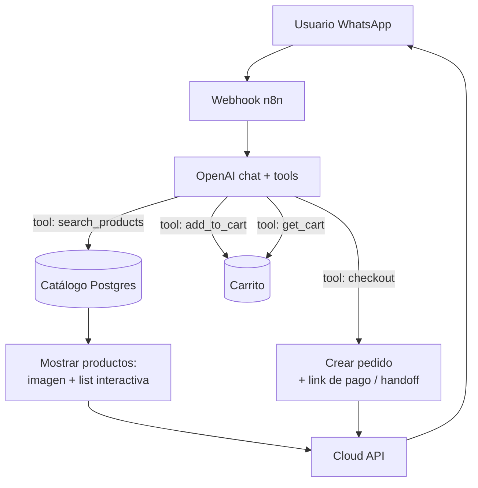
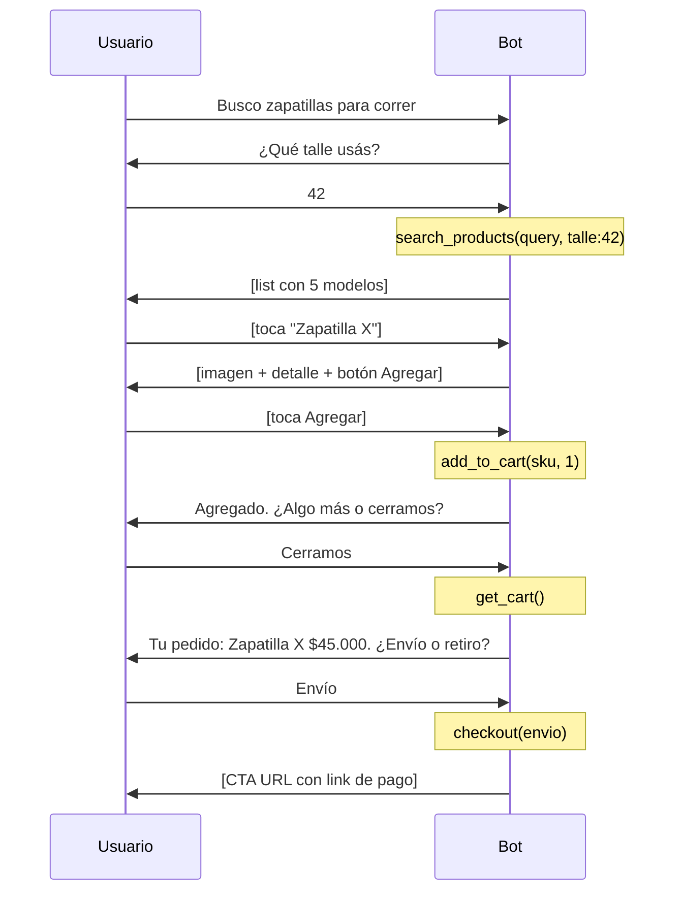

# Receta: Agente de ventas con catálogo

> **TL;DR:** Bot de WhatsApp que asesora en la compra: entiende lo que el usuario busca, consulta el catálogo del cliente vía function calling, muestra productos con imágenes y listas interactivas, arma un pedido y lo deriva a un humano o checkout para cerrar. Stack: WA + n8n + OpenAI + Postgres. No reemplaza al pago, lo prepara.

## Caso de uso

Un e-commerce / comercio quiere un asesor de ventas conversacional que:

- Entienda consultas en lenguaje natural ("busco zapatillas para correr, talle 42").
- Consulte stock y precios reales del catálogo.
- Muestre productos con foto, precio, descripción.
- Arme un carrito / pedido tentativo.
- Derive a un humano o a checkout para cerrar.

## Por qué este stack

- **OpenAI con function calling**: entiende la intención y consulta el catálogo como tool.
- **Interactivos** (list, buttons, CTA): mostrar productos sin que el usuario tipee.
- **Postgres**: catálogo + carrito + conversación.
- **Cloud API**: imágenes de producto, mensajes interactivos.

## Arquitectura



## Schema

```sql
CREATE TABLE products (
  id UUID PRIMARY KEY DEFAULT gen_random_uuid(),
  tenant_id TEXT NOT NULL,
  sku TEXT NOT NULL,
  name TEXT NOT NULL,
  description TEXT,
  category TEXT,
  attributes JSONB DEFAULT '{}'::jsonb,  -- {color, talle, marca, ...}
  price NUMERIC(12,2) NOT NULL,
  currency TEXT DEFAULT 'ARS',
  stock INT DEFAULT 0,
  image_url TEXT,
  active BOOLEAN DEFAULT true,
  UNIQUE(tenant_id, sku)
);

CREATE TABLE carts (
  id UUID PRIMARY KEY DEFAULT gen_random_uuid(),
  conversation_id UUID NOT NULL,
  status TEXT DEFAULT 'open',             -- open | submitted | abandoned
  created_at TIMESTAMPTZ DEFAULT now()
);

CREATE TABLE cart_items (
  id UUID PRIMARY KEY DEFAULT gen_random_uuid(),
  cart_id UUID REFERENCES carts(id) ON DELETE CASCADE,
  product_id UUID REFERENCES products(id),
  quantity INT NOT NULL DEFAULT 1,
  unit_price NUMERIC(12,2) NOT NULL
);

CREATE INDEX idx_products_search ON products(tenant_id, category, active);
```

## Tools (function calling)

```json
[
  {
    "type": "function",
    "function": {
      "name": "search_products",
      "description": "Busca productos en el catálogo según criterios. Usar cuando el usuario describe lo que busca.",
      "parameters": {
        "type": "object",
        "properties": {
          "query": { "type": "string", "description": "Términos de búsqueda" },
          "category": { "type": "string" },
          "max_price": { "type": "number" },
          "attributes": { "type": "object", "description": "Filtros como talle, color" }
        },
        "required": ["query"]
      }
    }
  },
  {
    "type": "function",
    "function": {
      "name": "add_to_cart",
      "description": "Agrega un producto al carrito del usuario.",
      "parameters": {
        "type": "object",
        "properties": {
          "sku": { "type": "string" },
          "quantity": { "type": "integer", "minimum": 1 }
        },
        "required": ["sku", "quantity"]
      }
    }
  },
  {
    "type": "function",
    "function": {
      "name": "get_cart",
      "description": "Devuelve el contenido actual del carrito con el total.",
      "parameters": { "type": "object", "properties": {} }
    }
  },
  {
    "type": "function",
    "function": {
      "name": "checkout",
      "description": "Cierra el pedido. Genera link de pago o deriva a un vendedor humano.",
      "parameters": {
        "type": "object",
        "properties": {
          "delivery_method": { "type": "string", "enum": ["envio", "retiro"] }
        },
        "required": ["delivery_method"]
      }
    }
  }
]
```

## Implementación de las tools

### search_products

```sql
SELECT sku, name, description, price, currency, stock, image_url, attributes
FROM products
WHERE tenant_id = '{{T}}'
  AND active = true
  AND stock > 0
  AND (
    name ILIKE '%{{query}}%'
    OR description ILIKE '%{{query}}%'
    OR category ILIKE '%{{query}}%'
  )
  {{filtro category si viene}}
  {{filtro max_price si viene}}
ORDER BY stock DESC
LIMIT 8;
```

Para búsqueda más inteligente, combinar con embeddings (ver [`rag-kb.md`](./rag-kb.md)) sobre nombre+descripción.

Devolver el resultado al LLM **y** disparar el render de los productos.

### add_to_cart / get_cart

Operaciones directas sobre `carts` / `cart_items`. `get_cart` calcula:

```sql
SELECT p.name, ci.quantity, ci.unit_price,
       (ci.quantity * ci.unit_price) AS subtotal
FROM cart_items ci
JOIN products p ON p.id = ci.product_id
WHERE ci.cart_id = '{{CART_ID}}';
```

### checkout

| delivery_method | Acción |
|---|---|
| Generar link de pago | Integrar con Mercado Pago / Stripe / etc., enviar CTA URL |
| Handoff a vendedor | Notificar a un agente humano con el carrito armado |

El bot **prepara** la venta; el cierre puede ser un link de pago o un humano. Decisión del cliente.

## Mostrar productos: render

Cuando `search_products` devuelve resultados, mostrarlos. Patrón:

### Pocos resultados (1-3): imagen + texto por producto

Para cada producto, un mensaje con imagen de header:

```json
{
  "type": "interactive",
  "interactive": {
    "type": "button",
    "header": { "type": "image", "image": { "link": "{{image_url}}" } },
    "body": { "text": "*{{name}}*\n{{description}}\nPrecio: ${{price}}" },
    "action": {
      "buttons": [
        { "type": "reply", "reply": { "id": "add_{{sku}}", "title": "Agregar" } },
        { "type": "reply", "reply": { "id": "more_{{sku}}", "title": "Ver más" } }
      ]
    }
  }
}
```

### Varios resultados (4-8): list interactiva

```json
{
  "type": "interactive",
  "interactive": {
    "type": "list",
    "body": { "text": "Encontré estas opciones para vos:" },
    "action": {
      "button": "Ver productos",
      "sections": [{
        "title": "Resultados",
        "rows": [
          { "id": "prod_SKU1", "title": "Zapatilla X", "description": "$45.000 · Talle 42" }
        ]
      }]
    }
  }
}
```

Cuando el usuario toca una row, el `id` (`prod_SKU1`) vuelve por webhook y el bot muestra ese producto en detalle.

## System prompt

```
Sos un asesor de ventas de {{NEGOCIO}} que atiende por WhatsApp.

Tu objetivo: ayudar al cliente a encontrar lo que busca y cerrar la venta.

Reglas:
- Preguntá lo necesario para entender qué busca (uso, talle, presupuesto)
  pero no interrogues: 1-2 preguntas máximo antes de buscar.
- Usá search_products apenas tengas idea de lo que quiere.
- Mostrá precios y stock REALES, nunca inventes.
- Si no hay stock de algo, ofrecé alternativas.
- Cuando el usuario quiera comprar, usá add_to_cart y confirmá.
- Antes de checkout, mostrá el carrito con get_cart y confirmá el total.
- Sé cordial y directo. Español. Mensajes breves.
- Si el usuario quiere hablar con una persona, derivá.

No inventes productos, precios ni promociones.
```

## Flujo conversacional típico



## Variables de entorno

| Variable | Descripción | Secreto |
|---|---|---|
| `WA_ACCESS_TOKEN` | Token System User | Sí |
| `WA_PHONE_NUMBER_ID` | ID del número | No |
| `WA_APP_SECRET` | Validación firma | Sí |
| `OPENAI_API_KEY` | API key | Sí |
| `OPENAI_MODEL` | `gpt-4o-mini` o `gpt-4o` | No |
| `POSTGRES_URL` | Catálogo + carrito | Sí |
| `PAYMENT_PROVIDER_KEY` | Mercado Pago / Stripe | Sí |
| `SALES_NOTIFY_WEBHOOK` | Notificar vendedores | Sí |
| `TENANT_ID` | Identificador del cliente | No |

## Sincronización del catálogo

El catálogo vive en `products`. Mantenerlo al día:

| Fuente | Cómo |
|---|---|
| E-commerce (Tienda Nube, Shopify, WooCommerce) | Webhook de cambios → upsert en `products` |
| Planilla / ERP | Job de sync periódico (Cron en n8n) |
| Carga manual | Panel propio o directo en DB |

El stock debe estar razonablemente fresco para no vender lo que no hay.

## Cómo probar

1. Cargar 10-15 productos de prueba en `products`.
2. "Busco algo para regalar" → verificar que el bot pregunta para acotar.
3. "Zapatillas talle 42" → verificar `search_products` y render con list.
4. Tocar un producto → verificar detalle con imagen.
5. Agregar al carrito → verificar `cart_items`.
6. "Cerrar" → verificar `get_cart` con total correcto.
7. Elegir envío → verificar `checkout` y link de pago / handoff.
8. Buscar algo sin stock → verificar que ofrece alternativas, no vende.

## Métricas

| Métrica | Cálculo |
|---|---|
| Tasa de conversión | Carritos `submitted` / conversaciones |
| Valor medio de carrito | Promedio de totales |
| Abandono de carrito | `abandoned` / `open + submitted` |
| Productos más consultados | Agrupar búsquedas |
| Costo OpenAI por venta | Tokens × pricing / ventas |

## Costos

| Concepto | Estimación |
|---|---|
| OpenAI por conversación de venta (~15 turnos, con tools) | ~$0.005-0.02 |
| Imágenes de producto | Subir vía `media_id` y reusar |
| Conversaciones de WA | Mayormente service (el usuario inicia) |
| Hosting | ~$20-30/mes |

## Errores comunes

| Error | Causa | Solución |
|---|---|---|
| Bot inventa productos | `search_products` no usado o prompt débil | Forzar tool, prompt estricto |
| Muestra productos sin stock | Query sin filtro de stock | `WHERE stock > 0` |
| List con > 10 filas falla | Demasiados resultados | `LIMIT 8`, paginar |
| Precio desactualizado | Catálogo no sincronizado | Sync más frecuente |
| Carrito se pierde entre mensajes | `cart` no asociado a la conversación | Vincular `cart.conversation_id` |
| Imágenes lentas | URL externa lenta | Subir a `media_id` y reusar |

## Variantes

| Variante | Cambio |
|---|---|
| Con WhatsApp Catalog nativo | Usar el catálogo de Commerce de Meta en vez de render manual |
| Con búsqueda semántica | Embeddings sobre productos (ver [`rag-kb.md`](./rag-kb.md)) |
| Con Kommo | El carrito como lead; checkout = avanzar pipeline |
| Con pago integrado | Link de Mercado Pago / Stripe en el CTA |
| Recuperación de carrito | Plantilla Marketing para carritos abandonados |

## Referencias

- [`04-mensajeria/interactivos.md`](../04-mensajeria/interactivos.md)
- [`07-integraciones/openai/function-calling.md`](../07-integraciones/openai/function-calling.md)
- [`09-recetas/bot-atencion-handoff.md`](./bot-atencion-handoff.md)
- [`09-recetas/rag-kb.md`](./rag-kb.md)
