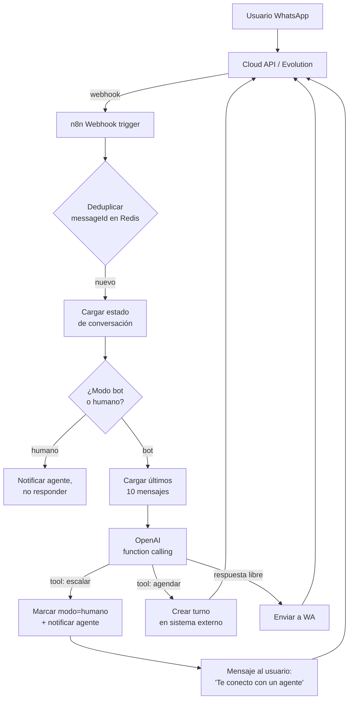

# Receta: Bot de atención con handoff a humano

> **TL;DR:** Bot conversacional sobre WhatsApp que responde con OpenAI usando contexto persistido en Postgres, escala a un humano cuando detecta intención de hablar con persona (o cuando la confianza es baja), y vuelve al bot cuando el agente cierra el ticket. Stack: WA + n8n + OpenAI + Postgres + Redis.

## Caso de uso

Una PyME de servicios recibe ~200 mensajes/día. Quiere que el bot resuelva el 70% (consultas frecuentes, agendar, derivar a sectores) y escale a un agente humano cuando hace falta. Requisitos:

- Respuesta < 5 segundos en horario comercial.
- Contexto de los últimos 10 mensajes por usuario.
- Pausar el bot cuando un humano toma el caso.
- Reanudar el bot cuando el humano cierra la conversación.
- Métricas básicas: conversaciones, tasa de resolución, tiempo de espera.

## Arquitectura



## Componentes

| Componente | Tecnología | Responsabilidad |
|---|---|---|
| Transporte | Cloud API (recomendado) o Evolution API | Enviar/recibir mensajes |
| Orquestador | n8n (queue mode) | Webhook, routing, llamadas a APIs |
| Cerebro | OpenAI Chat Completions con function calling | Generar respuestas, decidir tools |
| Estado | Postgres | Conversación, modo (bot/humano), histórico |
| Dedup / cache | Redis | Evitar reprocesar webhooks duplicados |
| Notificación a agentes | Slack / email / panel propio | Alertar handoff |

## Schema mínimo en Postgres

```sql
CREATE TABLE wa_conversations (
  id UUID PRIMARY KEY DEFAULT gen_random_uuid(),
  wa_user_id TEXT NOT NULL,
  wa_phone_number_id TEXT NOT NULL,
  mode TEXT NOT NULL DEFAULT 'bot',        -- 'bot' | 'human'
  last_inbound_at TIMESTAMPTZ NOT NULL,
  last_outbound_at TIMESTAMPTZ,
  assigned_agent_id TEXT,
  metadata JSONB DEFAULT '{}'::jsonb,
  created_at TIMESTAMPTZ DEFAULT now(),
  updated_at TIMESTAMPTZ DEFAULT now(),
  UNIQUE(wa_user_id, wa_phone_number_id)
);

CREATE TABLE wa_messages (
  id UUID PRIMARY KEY DEFAULT gen_random_uuid(),
  conversation_id UUID REFERENCES wa_conversations(id) ON DELETE CASCADE,
  direction TEXT NOT NULL,                 -- 'in' | 'out'
  wa_message_id TEXT UNIQUE,
  role TEXT NOT NULL,                      -- 'user' | 'assistant' | 'system'
  content TEXT NOT NULL,
  tool_call JSONB,
  created_at TIMESTAMPTZ DEFAULT now()
);

CREATE INDEX idx_wa_messages_conv ON wa_messages(conversation_id, created_at DESC);
```

## Flujo del workflow de n8n

### Nodos principales

1. **Webhook trigger** (`POST /webhook/wa-incoming`)
2. **Function (Code)**: parsear payload de Cloud API o Evolution.
3. **Redis**: `SETNX dedup:{{messageId}} 1 EX 86400`. Si ya existía → salir.
4. **Postgres**: upsert en `wa_conversations` (`last_inbound_at = now()`).
5. **Postgres**: insertar en `wa_messages` (direction=`in`).
6. **IF** `mode = 'human'`:
   - Postgres: notificar al agente asignado.
   - Salir sin responder al usuario.
7. **Postgres**: `SELECT * FROM wa_messages WHERE conversation_id = {{id}} ORDER BY created_at DESC LIMIT 10`.
8. **OpenAI Chat node**: enviar histórico + system prompt + tools.
9. **Switch** sobre la respuesta:
   - Tool `request_handoff` → marcar `mode='human'`, notificar agente, responder ack.
   - Tool `book_appointment` → llamar API de agenda, responder confirmación.
   - Respuesta libre → enviar a WA.
10. **HTTP Request** a Cloud API: `POST /{{PHONE_NUMBER_ID}}/messages`.
11. **Postgres**: insertar en `wa_messages` (direction=`out`).

### System prompt sugerido

```
Sos el asistente de atención al cliente de {{NEGOCIO}}. Atendés por WhatsApp.

Reglas:
- Respondé siempre en español, en tono cordial y breve (máx. 3 párrafos cortos).
- Si la consulta es sobre {{TEMAS_PERMITIDOS}}, respondé directamente.
- Si el usuario pide hablar con un humano, o si la pregunta está fuera de tu alcance,
  o si detectás molestia/frustración, llamá a la tool `request_handoff`.
- Si el usuario quiere agendar, recolectá fecha y hora preferidas y llamá a `book_appointment`.
- Nunca inventes precios, horarios ni políticas. Si no sabés, escalá.
- No menciones que sos una IA salvo que pregunten directamente.

Información sobre el negocio:
{{CONTEXTO_DEL_NEGOCIO}}
```

### Tools (function calling)

```json
[
  {
    "type": "function",
    "function": {
      "name": "request_handoff",
      "description": "Escala la conversación a un agente humano. Usar cuando el usuario lo pide o cuando la consulta excede lo que podés responder.",
      "parameters": {
        "type": "object",
        "properties": {
          "reason": {
            "type": "string",
            "description": "Motivo breve del handoff para que el agente humano entre en contexto."
          },
          "priority": {
            "type": "string",
            "enum": ["low", "normal", "high"],
            "description": "Prioridad del caso."
          }
        },
        "required": ["reason"]
      }
    }
  },
  {
    "type": "function",
    "function": {
      "name": "book_appointment",
      "description": "Agenda un turno en el sistema de turnos.",
      "parameters": {
        "type": "object",
        "properties": {
          "preferred_date": { "type": "string", "format": "date" },
          "preferred_time": { "type": "string" },
          "service": { "type": "string" }
        },
        "required": ["preferred_date", "preferred_time", "service"]
      }
    }
  }
]
```

## Handoff: cómo notificar al agente

Cuando se dispara `request_handoff`:

1. Actualizar `wa_conversations.mode = 'human'`.
2. Enviar al usuario un acknowledgement: `"En un momento te conecta {{NOMBRE_AGENTE}}."`
3. Notificar al canal del equipo (Slack message, email, o webhook a panel propio) con:
   - Nombre del usuario (si está en el CRM) o número.
   - Motivo del handoff.
   - Link al historial reciente.
4. Asignar `assigned_agent_id` (round-robin o por disponibilidad).

## Cómo el agente "devuelve" la conversación al bot

Opciones:

- **Comando interno**: el agente envía `/cerrar` al sistema (no a WA) → workflow setea `mode='bot'`.
- **Botón en panel propio**: cambia el estado vía API.
- **Auto-close**: tras N horas sin actividad, volver a `bot`.

Importante: **no** depender de que el agente escriba al usuario por la app de WA, porque el bot estaría escuchando los webhooks y se podría confundir. Mejor: que el agente responda **desde** el sistema, usando el mismo número, pero marcado como `direction='out'` con `agent_id`.

## Plantillas HSM necesarias

Para iniciar conversación fuera de la ventana de 24h:

| Nombre | Categoría | Body sugerido |
|---|---|---|
| `recordatorio_seguimiento` | Utility | `Hola {{1}}, ¿pudimos resolver tu consulta sobre {{2}}? Si necesitás algo más, respondé este mensaje.` |
| `handoff_agente_reapertura` | Utility | `Hola {{1}}, {{2}} de {{NEGOCIO}} sigue tu caso. ¿Cómo te podemos ayudar?` |

Ver criterios de aprobación en [`05-plantillas-hsm/aprobacion.md`](../05-plantillas-hsm/aprobacion.md).

## Variables de entorno requeridas

| Variable | Descripción | Secreto |
|---|---|---|
| `WA_ACCESS_TOKEN` | Token del System User | Sí |
| `WA_PHONE_NUMBER_ID` | ID del número conectado | No |
| `WA_VERIFY_TOKEN` | Verify token del webhook | Sí |
| `OPENAI_API_KEY` | API key de OpenAI | Sí |
| `OPENAI_MODEL` | Modelo (ej: `gpt-4o-mini`) | No |
| `POSTGRES_URL` | Connection string | Sí |
| `REDIS_URL` | Connection string | Sí |
| `AGENT_NOTIFY_WEBHOOK` | URL de Slack / panel para notificar handoff | Sí |
| `BUSINESS_NAME` | Nombre del negocio (system prompt) | No |
| `BUSINESS_CONTEXT_PATH` | Path a un archivo con info del negocio | No |

## Cómo probar

1. **Smoke test**: enviar "hola" al número, verificar que responde.
2. **Ventana de contexto**: hacer 3 preguntas encadenadas, verificar que la 3ra usa contexto previo.
3. **Handoff explícito**: enviar "quiero hablar con un humano" → ack al usuario, notificación al agente, `mode='human'` en DB.
4. **Bot pausado**: con `mode='human'`, enviar mensaje. No debe responder el bot, sí debe notificar al agente.
5. **Reanudación**: cambiar `mode='bot'` manualmente, enviar mensaje, verificar respuesta.
6. **Dedup**: reenviar el mismo webhook dos veces (curl al endpoint de n8n), verificar que procesa una sola vez.
7. **Function calling - book**: pedir "quiero agendar mañana a las 15", verificar que llama a `book_appointment`.

## Métricas a trackear

| Métrica | Cómo medirla |
|---|---|
| Tasa de resolución del bot | `(conversations sin handoff) / total` |
| Tiempo de respuesta del bot | `last_outbound_at - last_inbound_at` |
| Tasa de handoff | `(conversations con handoff) / total` |
| Tiempo de espera en cola humana | `assigned_at - handoff_at` |
| Costo OpenAI por conversación | Tokens prompt + completion × pricing |

## Costos estimados

| Concepto | Estimación |
|---|---|
| OpenAI (gpt-4o-mini, ~10 turnos/conv) | ~0.005 USD por conversación |
| WA Cloud API (conversación service) | 0 USD (dentro de cuota free) o tarifa local |
| Hosting (Railway stack) | ~25 USD/mes total |

A 200 conversaciones/día: ~30 USD/mes en OpenAI + hosting.

## Errores comunes

| Error | Causa | Solución |
|---|---|---|
| Bot responde 2 veces el mismo mensaje | Webhook duplicado, sin dedup | Verificar Redis `SETNX` con TTL 24h |
| Latencia > 10 segundos | n8n sin queue mode o modelo lento | Activar queue mode, usar `gpt-4o-mini` |
| Pierde contexto entre mensajes | `LIMIT 10` ordenado mal o conversation_id distinto | Verificar query y unicidad de conversación |
| Bot sigue respondiendo en modo humano | `mode` no se actualiza o se lee desactualizado | Confirmar transacción y orden de nodos |
| Tool calls que no se ejecutan | `tools` mal pasado al nodo OpenAI | Revisar formato del array y `tool_choice` |
| Cae fuera de ventana 24h y falla envío | Sin lógica de fallback a plantilla | Implementar detección + uso de HSM |

## Variantes

| Variante | Cambio |
|---|---|
| Sobre Evolution API | Cambiar nodos de Cloud API por HTTP Request a Evolution; sin lógica de HSM |
| Sobre Kommo | Reemplazar Postgres por leads de Kommo; handoff = cambio de stage |
| Con RAG | Agregar nodo de embeddings + búsqueda en vector DB antes del prompt |
| Multi-idioma | Detectar idioma en el primer mensaje y guardarlo en `metadata` |

## Referencias

- [Cloud API · Messages](https://developers.facebook.com/docs/whatsapp/cloud-api/reference/messages) — Verificado 2026-05-20.
- [OpenAI · Function calling](https://platform.openai.com/docs/guides/function-calling) — Verificado 2026-05-20.
- [n8n · Queue mode](https://docs.n8n.io/hosting/scaling/queue-mode/) — Verificado 2026-05-20.
- [`06-politicas-y-calidad/ventana-24h.md`](../06-politicas-y-calidad/ventana-24h.md)
- [`08-despliegue/railway/plantilla-evolution-n8n-openai.md`](../08-despliegue/railway/plantilla-evolution-n8n-openai.md)
