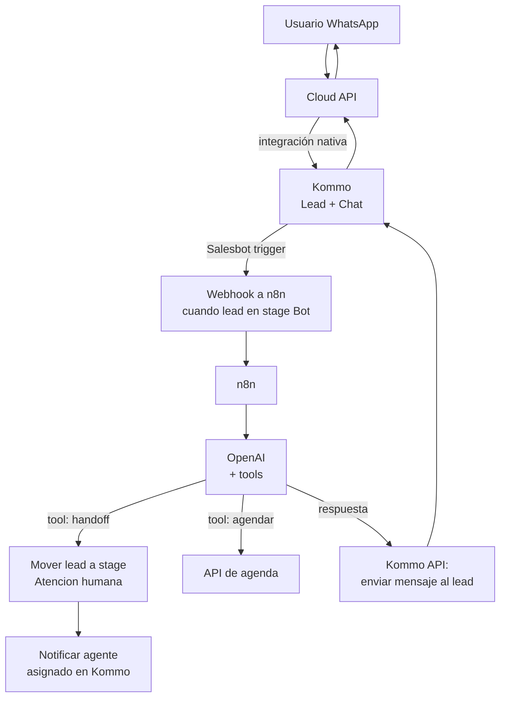

# Receta: Kommo + Cloud API + OpenAI con handoff

> **TL;DR:** Stack para PyMEs con agentes humanos donde Kommo es el CRM y la UI de atención, la Cloud API oficial es el transporte, n8n orquesta y OpenAI responde. El bot actúa hasta que decide escalar; el handoff es mover el lead al stage "Atención humana" y ahí el agente sigue desde la UI de Kommo. Cuando cierran el lead, el bot vuelve a operar.

## Caso de uso

Una clínica privada tiene 8 agentes humanos atendiendo WhatsApp en horario comercial. Quiere:

- Recepción 24/7 con bot (FAQ, derivación a sector, agendado básico).
- Que los agentes vean todo desde Kommo, no en una app aparte.
- Handoff automático cuando el caso lo amerita o el usuario lo pide.
- Métricas: leads creados, tiempo medio de primera respuesta, % resuelto por bot.
- Sin tener que reentrenar a los agentes en una herramienta nueva.

## Por qué este stack

- **Cloud API oficial**: HSM real, quality rating, sin riesgo de ban.
- **Kommo**: UI lista, pipelines, multi-agente, sin desarrollar frontend.
- **n8n** como orquestador: Salesbot de Kommo no alcanza para function calling complejo.
- **OpenAI**: respuestas naturales, intent detection, derivación inteligente.

## Arquitectura



## Pipelines y stages en Kommo

Crear un pipeline con esta estructura:

| Orden | Stage | Modo | Comportamiento |
|---|---|---|---|
| 1 | `Nuevo contacto` | Disparador inicial | Crea lead automáticamente al recibir primer mensaje |
| 2 | `Bot activo` | Trigger de Salesbot → webhook a n8n | Bot conversa con el usuario |
| 3 | `Calificado (espera respuesta)` | Espera | El bot ya hizo lo suyo, esperando próximo input |
| 4 | `Atención humana` | Asignado a agente humano | Bot pausado, agente operando |
| 5 | `Cerrado - resuelto` | Final | Conversación cerrada con éxito |
| 6 | `Cerrado - perdido` | Final | No respondió / no progresó |

**Clave de diseño:** el bot solo opera mientras el lead está en `Bot activo`. El handoff es **mover de stage**, lo que pausa al bot automáticamente porque deja de ser disparado por el Salesbot.

## Configuración del Salesbot (lado Kommo)

Bot mínimo en Kommo:

1. **Trigger**: lead creado o mensaje entrante con lead en stage `Bot activo`.
2. **Bloque webhook**: POST a `https://n8n.midominio.com/webhook/kommo-incoming` con:
   - `lead_id`, `contact_id`, `phone`, `last_message_text`, `pipeline_id`, `status_id`.
3. **Bloque condicional**: esperar respuesta del webhook (timeout 25s).
4. **Bloque mostrar mensaje** con el texto que n8n devuelva (o usar respuesta directa vía API de Kommo desde n8n; ambas funcionan).

**Recomendación:** que el bot **no envíe** desde Kommo y delegue a n8n la llamada a Kommo API. Salesbot queda solo como trigger, y todo el comportamiento vive en n8n. Más fácil de mantener.

## Workflow n8n

### Nodos principales

1. **Webhook trigger** (`POST /webhook/kommo-incoming`).
2. **Code**: extraer `lead_id`, `contact_id`, `phone`, `text`.
3. **Postgres**: upsert en `wa_conversations` (mismo schema que [`bot-atencion-handoff.md`](./bot-atencion-handoff.md) más columnas `kommo_lead_id`, `kommo_contact_id`).
4. **Postgres**: insertar mensaje entrante en `wa_messages`.
5. **Postgres**: `SELECT` últimos 10 mensajes.
6. **OpenAI Chat node**: system prompt + histórico + tools (`request_handoff`, `book_appointment`, `qualify_lead`).
7. **Switch** sobre tool call o respuesta libre.
8. Para cada rama, **HTTP Request** a Kommo:
   - Enviar mensaje al lead.
   - Cambiar stage si aplica.
   - Agregar nota interna con resumen para el agente.
9. **Postgres**: insertar mensaje saliente.
10. Responder al webhook con 200.

### Cómo enviar un mensaje al lead desde n8n vía Kommo API

```bash
curl -X POST \
  "https://{{KOMMO_SUBDOMAIN}}.kommo.com/api/v4/leads/chats" \
  -H "Authorization: Bearer {{KOMMO_LONG_LIVED_TOKEN}}" \
  -H "Content-Type: application/json" \
  -d '{
    "lead_id": {{LEAD_ID}},
    "text": "{{TEXTO}}"
  }'
```

| Placeholder | Descripción |
|---|---|
| `KOMMO_SUBDOMAIN` | Subdominio de la cuenta (`acme.kommo.com` → `acme`) |
| `KOMMO_LONG_LIVED_TOKEN` | Token long-lived de integración |
| `LEAD_ID` | ID del lead recibido en el webhook |

(El endpoint exacto puede variar: ver [`07-integraciones/kommo/api-rest.md`](../07-integraciones/kommo/api-rest.md) cuando esté.)

### Cómo mover el lead de stage (handoff)

```bash
curl -X PATCH \
  "https://{{KOMMO_SUBDOMAIN}}.kommo.com/api/v4/leads/{{LEAD_ID}}" \
  -H "Authorization: Bearer {{KOMMO_LONG_LIVED_TOKEN}}" \
  -H "Content-Type: application/json" \
  -d '{
    "status_id": {{STATUS_ATENCION_HUMANA_ID}},
    "pipeline_id": {{PIPELINE_ID}}
  }'
```

### Cómo agregar una nota interna con el contexto del handoff

```bash
curl -X POST \
  "https://{{KOMMO_SUBDOMAIN}}.kommo.com/api/v4/leads/{{LEAD_ID}}/notes" \
  -H "Authorization: Bearer {{KOMMO_LONG_LIVED_TOKEN}}" \
  -H "Content-Type: application/json" \
  -d '[{
    "note_type": "common",
    "params": {
      "text": "Handoff a humano. Motivo: {{REASON}}. Resumen reciente: {{SUMMARY}}"
    }
  }]'
```

Esto le da al agente humano contexto sin que tenga que leer todo el chat.

## System prompt

```
Sos el asistente virtual de {{CLINICA}}. Atendés por WhatsApp y trabajás
dentro de un CRM (Kommo) que maneja un equipo humano.

Tu objetivo: resolver consultas frecuentes y derivar al humano cuando
sea necesario. Sos cordial, breve (máx. 3 párrafos cortos), nunca inventás
información sobre precios, profesionales o disponibilidad.

Tools disponibles:
- request_handoff(reason, priority): cuando la consulta excede tu alcance
  o el usuario pide hablar con alguien.
- book_appointment(date, time, service): para agendar turnos.
- qualify_lead(intent, urgency, segment): para enriquecer el lead en Kommo
  con metadata útil antes del handoff.

Reglas:
- Si la consulta es médica (síntomas, diagnóstico), derivás SIEMPRE a humano.
- Si pregunta por precios sin contexto previo, ofrecés derivar a comercial.
- Si solo quiere información general (horarios, ubicación, servicios), respondés
  directamente con el contexto disponible.

Contexto del negocio:
{{CONTEXTO}}
```

## Tools (function calling)

```json
[
  {
    "type": "function",
    "function": {
      "name": "request_handoff",
      "description": "Escala la conversación a un agente humano cambiando el stage del lead en Kommo.",
      "parameters": {
        "type": "object",
        "properties": {
          "reason": { "type": "string" },
          "priority": { "type": "string", "enum": ["low", "normal", "high"] },
          "suggested_department": { "type": "string", "enum": ["comercial", "medico", "administracion", "facturacion"] }
        },
        "required": ["reason", "suggested_department"]
      }
    }
  },
  {
    "type": "function",
    "function": {
      "name": "qualify_lead",
      "description": "Etiqueta el lead con metadata útil para el agente humano.",
      "parameters": {
        "type": "object",
        "properties": {
          "intent": { "type": "string", "enum": ["info", "agendar", "reclamo", "facturacion", "otro"] },
          "urgency": { "type": "string", "enum": ["alta", "media", "baja"] },
          "segment": { "type": "string", "enum": ["paciente_nuevo", "paciente_existente", "interconsulta"] }
        },
        "required": ["intent"]
      }
    }
  },
  {
    "type": "function",
    "function": {
      "name": "book_appointment",
      "description": "Crea un turno tentativo (sujeto a confirmación humana) en el sistema de agenda.",
      "parameters": {
        "type": "object",
        "properties": {
          "preferred_date": { "type": "string", "format": "date" },
          "preferred_time": { "type": "string" },
          "service": { "type": "string" }
        },
        "required": ["preferred_date", "service"]
      }
    }
  }
]
```

## Plantillas HSM necesarias

| Nombre | Categoría | Body |
|---|---|---|
| `bienvenida_clinica` | Utility | `Hola {{1}}, gracias por contactarte con {{NEGOCIO}}. ¿En qué te podemos ayudar?` |
| `recordatorio_turno` | Utility | `Hola {{1}}, te recordamos tu turno del {{2}} a las {{3}}. Para reprogramar, respondé este mensaje.` |
| `reapertura_agente` | Utility | `Hola {{1}}, {{2}} continúa con tu consulta. ¿Cómo te puede ayudar?` |
| `seguimiento_post_consulta` | Marketing | `Hola {{1}}, esperamos que estés bien tras tu consulta. Si necesitás algo, respondé este mensaje.` |

Aprobación: ver [`05-plantillas-hsm/aprobacion.md`](../05-plantillas-hsm/aprobacion.md).

## Reanudación del bot

Tres opciones de cómo "soltar" el lead de vuelta al bot:

| Opción | Cómo se dispara | Pro | Contra |
|---|---|---|---|
| Auto al cerrar lead | Cerrar con éxito vuelve al pipeline inicial si vuelve a escribir | Cero fricción para agentes | Si el usuario insiste el mismo día, vuelve al bot |
| Auto por inactividad | n8n cron mueve leads sin actividad N horas | Limpio | Tiene latencia |
| Manual del agente | Botón / cambio de stage explícito | Control fino | Olvido humano |

Recomendado: **auto por inactividad** (24-48h) + **manual del agente** disponible. No usar reapertura inmediata si el agente "cerró por error" porque el bot puede pisar la conversación humana en curso.

## Variables de entorno

| Variable | Descripción | Secreto |
|---|---|---|
| `KOMMO_SUBDOMAIN` | Subdominio de la cuenta | No |
| `KOMMO_LONG_LIVED_TOKEN` | Token long-lived | Sí |
| `KOMMO_PIPELINE_ID` | ID del pipeline principal | No |
| `KOMMO_STAGE_BOT_ACTIVO_ID` | ID del stage `Bot activo` | No |
| `KOMMO_STAGE_ATENCION_HUMANA_ID` | ID del stage `Atención humana` | No |
| `KOMMO_DEPT_TO_AGENT_MAP` | JSON `{ "medico": 123, "comercial": 456 }` | No |
| `OPENAI_API_KEY` | API key | Sí |
| `OPENAI_MODEL` | Modelo (ej `gpt-4o-mini`) | No |
| `POSTGRES_URL` | DB de estado | Sí |
| `BUSINESS_CONTEXT_PATH` | Path al contexto de la clínica | No |

## Cómo probar

1. Verificar Salesbot disparando al webhook de n8n cuando lead entra a `Bot activo`.
2. Enviar mensaje desde un número de prueba al número de WA conectado a Kommo.
3. Verificar que se crea el lead en `Bot activo` y que el bot responde dentro de < 5s.
4. Pedir "quiero hablar con un humano" → confirmar que el lead pasa a `Atención humana` y que se crea la nota interna con motivo.
5. Como agente humano, responder desde Kommo y verificar que el bot NO interviene.
6. Cerrar el lead y enviar otro mensaje al día siguiente → confirmar que vuelve al pipeline inicial.

## Métricas a trackear

| Métrica | Cómo |
|---|---|
| Leads creados/día | `count` desde Kommo API filtrando por fecha |
| Tasa de resolución por bot | `leads cerrados sin pasar por Atención humana / total` |
| Tiempo medio de primera respuesta | `out - in` del primer turno |
| Distribución de motivos de handoff | Agrupar `reason` del tool call |
| Costo OpenAI por lead | Tokens × pricing |

## Errores comunes

| Error | Causa | Solución |
|---|---|---|
| Salesbot dispara, n8n no responde a tiempo | Salesbot tiene timeout corto | Responder rápido a Salesbot y procesar async |
| Bot responde después del handoff | Lead se quedó en stage `Bot activo` | Verificar que el cambio de stage se haya aplicado y commiteado en DB |
| Agente responde y aparece como mensaje del bot | Lógica que llama a Kommo API en lugar de dejar al agente operar | Distinguir `direction='out_agent'` vs `out_bot` |
| Salesbot envía mensaje y n8n también | Doble envío | Que el Salesbot solo dispare webhook y NO envíe |
| Notas internas no aparecen al agente | Permisos del usuario o `note_type` mal | Usar `common` y verificar permisos |
| Lead duplicado por cada mensaje | Salesbot crea lead nuevo cada vez | Configurar match por contacto telefónico |

## Variantes

| Variante | Cambio |
|---|---|
| Con RAG | Agregar Vector DB y embeddings antes del prompt → ver [`kommo-n8n-rag.md`](./kommo-n8n-rag.md) |
| Sin OpenAI | Reemplazar nodo OpenAI por Salesbot puro (limita drásticamente) |
| Multi-canal | Webhook unificado para WA + IG + Messenger (Kommo ya los recibe todos) |
| Sobre Evolution API | Cambiar transporte; perdés HSM reales |

## Referencias

- [Kommo Developers · Leads](https://developers.kommo.com/) — Verificado 2026-05-20.
- [Kommo · Salesbot](https://www.kommo.com/help/) — Verificado 2026-05-20.
- [`03-formas-de-uso/kommo-crm.md`](../03-formas-de-uso/kommo-crm.md)
- [`09-recetas/bot-atencion-handoff.md`](./bot-atencion-handoff.md) — versión sin CRM, mismo patrón.
- [`07-integraciones/kommo/`](../07-integraciones/kommo/)
