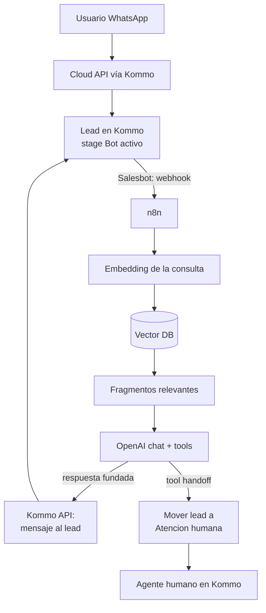

# Receta: Kommo + n8n + RAG

> **TL;DR:** El Salesbot de Kommo dispara un webhook a n8n; n8n hace RAG sobre la base de conocimiento del cliente (embeddings + vector DB) y responde con OpenAI; la respuesta vuelve al lead de Kommo. Combina la UI de agentes de Kommo con un cerebro RAG que el Salesbot nativo no puede dar. Handoff = cambio de stage.

## Caso de uso

Una empresa usa Kommo como CRM y tiene documentación extensa (catálogo técnico, FAQ, políticas). Quiere:

- Que el bot responda con precisión sobre la documentación, sin alucinar.
- Mantener Kommo como la herramienta de los agentes humanos.
- Handoff fluido a humano dentro de Kommo.
- Actualizar la documentación sin tocar el bot.

El Salesbot de Kommo no hace RAG ni function calling complejo: por eso n8n.

## Arquitectura



## Componentes

| Componente | Rol |
|---|---|
| Cloud API vía Kommo | Transporte oficial |
| Kommo | CRM, UI de agentes, pipeline |
| Salesbot de Kommo | Solo trigger: dispara webhook a n8n |
| n8n | Orquestación: RAG + LLM + Kommo API |
| OpenAI embeddings + chat | Vectorizar y responder |
| Vector DB (pgvector / Qdrant) | Base de conocimiento |
| Postgres | Estado de conversación + chunks |

Esta receta es la combinación de [`rag-kb.md`](./rag-kb.md) (el cerebro RAG) y [`kommo-cloudapi-openai-handoff.md`](./kommo-cloudapi-openai-handoff.md) (la integración con Kommo). Leer ambas primero.

## Pipeline en Kommo

Igual que en [`kommo-cloudapi-openai-handoff.md`](./kommo-cloudapi-openai-handoff.md):

| Stage | Modo |
|---|---|
| `Nuevo contacto` | Crea lead |
| `Bot activo` | Salesbot → webhook a n8n |
| `Atención humana` | Bot pausado |
| `Cerrado - resuelto` / `Cerrado - perdido` | Final |

El handoff es mover el lead a `Atención humana`.

## Salesbot: solo trigger

El Salesbot de Kommo se configura mínimo:

1. Trigger: mensaje entrante con lead en stage `Bot activo`.
2. Bloque webhook → POST a `https://n8n.midominio.com/webhook/kommo-rag` con `lead_id`, `contact_id`, `phone`, `last_message_text`.
3. n8n hace todo el trabajo y responde vía Kommo API.

No poner lógica de negocio en el Salesbot.

## Ingesta de la base de conocimiento

Igual que [`rag-kb.md`](./rag-kb.md):

1. Chunking de los documentos del cliente.
2. Embeddings con `text-embedding-3-small`.
3. Guardar en `kb_chunks` (pgvector) con `tenant_id`.

Schema `kb_chunks`: ver [`rag-kb.md`](./rag-kb.md#schema-con-pgvector).

Workflow de ingesta independiente, corre cuando se actualiza la doc.

## Workflow runtime en n8n

### Nodos

1. **Webhook trigger** (`POST /webhook/kommo-rag`).
2. **Code**: extraer `lead_id`, `contact_id`, `phone`, `text`.
3. **Postgres**: upsert conversación (`wa_conversations` con `kommo_lead_id`).
4. **Postgres**: insertar mensaje entrante.
5. **HTTP Request** OpenAI embeddings: vectorizar `text`.
6. **Postgres**: búsqueda de similitud en `kb_chunks` (filtrar por `tenant_id`, top-K, umbral).
7. **Code**: armar el bloque de contexto; detectar `noMatch`.
8. **Postgres**: cargar últimos N mensajes para contexto conversacional.
9. **HTTP Request** OpenAI chat: system prompt RAG + contexto KB + histórico + pregunta + tools.
10. **Switch** sobre respuesta:
    - Tool `request_handoff` → mover lead de stage + nota interna.
    - Respuesta libre → enviar al lead vía Kommo API.
11. **Postgres**: insertar mensaje saliente.
12. Responder 200 al webhook.

### System prompt

```
Sos el asistente de {{NEGOCIO}}. Atendés por WhatsApp dentro de Kommo,
donde un equipo humano puede tomar la conversación.

Respondé ÚNICAMENTE con la información del CONTEXTO. Si la respuesta no
está ahí, no inventes: usá la tool request_handoff para derivar a un
humano, o decí que vas a consultar.

Reglas:
- Español, cordial, breve (máx 3 párrafos cortos).
- Si el usuario pide hablar con una persona, usá request_handoff.
- Si detectás intención de compra clara, usá qualify_lead antes de derivar.
- No menciones "el contexto" ni "los documentos".

CONTEXTO:
{{FRAGMENTOS_RECUPERADOS}}
```

### Tools

| Tool | Función |
|---|---|
| `request_handoff(reason, department)` | Mover lead a `Atención humana` + nota |
| `qualify_lead(intent, urgency)` | Etiquetar el lead antes del handoff |

Si `noMatch` (RAG no encontró nada) y la consulta requiere info concreta, el modelo debería llamar `request_handoff` con `reason: "consulta fuera de la base de conocimiento"`.

Ver definición de tools en [`kommo-cloudapi-openai-handoff.md`](./kommo-cloudapi-openai-handoff.md#tools-function-calling).

## Enviar respuesta y mover stage

Reusar los endpoints de Kommo de [`kommo-cloudapi-openai-handoff.md`](./kommo-cloudapi-openai-handoff.md):

- Enviar mensaje al lead: `POST /api/v4/leads/chats`.
- Mover de stage: `PATCH /api/v4/leads/{{LEAD_ID}}`.
- Nota interna: `POST /api/v4/leads/{{LEAD_ID}}/notes`.

## Variables de entorno

| Variable | Descripción | Secreto |
|---|---|---|
| `KOMMO_SUBDOMAIN` | Subdominio | No |
| `KOMMO_LONG_LIVED_TOKEN` | Token | Sí |
| `KOMMO_STAGE_ATENCION_HUMANA_ID` | ID del stage de handoff | No |
| `OPENAI_API_KEY` | API key | Sí |
| `OPENAI_EMBED_MODEL` | `text-embedding-3-small` | No |
| `OPENAI_CHAT_MODEL` | `gpt-4o-mini` | No |
| `POSTGRES_URL` | Con pgvector | Sí |
| `RAG_SIMILARITY_THRESHOLD` | Umbral | No |
| `RAG_TOP_K` | Chunks a recuperar | No |
| `TENANT_ID` | Identificador del cliente en `kb_chunks` | No |

## Cómo probar

1. Indexar la documentación del cliente; verificar `kb_chunks`.
2. Configurar el Salesbot mínimo en Kommo.
3. Enviar un mensaje al número conectado a Kommo con una pregunta cubierta por la doc.
4. Verificar: lead creado en `Bot activo`, respuesta fundada en la doc.
5. Preguntar algo fuera de la doc → verificar handoff a `Atención humana` + nota interna.
6. Como agente, responder desde Kommo → verificar que el bot no interviene.
7. Actualizar la doc, re-indexar, verificar que la respuesta cambia.

## Métricas

| Métrica | Cómo |
|---|---|
| % consultas resueltas por RAG | Sin handoff / total |
| % consultas sin match en KB | `noMatch` / total → gaps de doc |
| Tiempo de respuesta | `out - in` |
| Tasa de handoff | Handoffs / total |
| Costo OpenAI por lead | Tokens × pricing |

## Costos

| Concepto | Estimación |
|---|---|
| Embeddings de ingesta | Centavos (una vez por actualización de doc) |
| Embedding por consulta | Despreciable |
| Chat por respuesta (con contexto RAG) | ~$0.0005-0.001 |
| Kommo | Suscripción del plan |
| Hosting (n8n + Postgres+pgvector) | ~$20-30/mes |
| 1.000 consultas/mes | ~$1-2 OpenAI + Kommo + hosting |

## Errores comunes

| Error | Causa | Solución |
|---|---|---|
| Bot responde sin fundamento | Contexto RAG vacío y prompt débil | Umbral + prompt estricto |
| Salesbot timeout | n8n tarda (embedding + búsqueda + chat) | Responder rápido al Salesbot, procesar y enviar async vía Kommo API |
| Lead no avanza tras handoff | PATCH de stage falló | Verificar `status_id` y `pipeline_id` |
| Cruza KB entre clientes | Falta `tenant_id` | Filtrar siempre |
| Respuestas lentas | Embedding + búsqueda + 2 llamadas LLM | Cachear embeddings de consultas frecuentes; usar 1 sola llamada de chat |
| RAG no encuentra info que sí está | Chunking malo o umbral alto | Revisar chunks, bajar umbral |

## Variantes

| Variante | Cambio |
|---|---|
| Sin Kommo | La receta base [`rag-kb.md`](./rag-kb.md) |
| Con catálogo de productos | Combinar con [`agente-ventas-catalogo.md`](./agente-ventas-catalogo.md) |
| RAG como tool | El LLM decide cuándo buscar (function calling) |
| Multi-tenant | Un `tenant_id` por cliente de Kommo |

## Referencias

- [`09-recetas/rag-kb.md`](./rag-kb.md)
- [`09-recetas/kommo-cloudapi-openai-handoff.md`](./kommo-cloudapi-openai-handoff.md)
- [`03-formas-de-uso/kommo-crm.md`](../03-formas-de-uso/kommo-crm.md)
- [`07-integraciones/kommo/`](../07-integraciones/kommo/)
