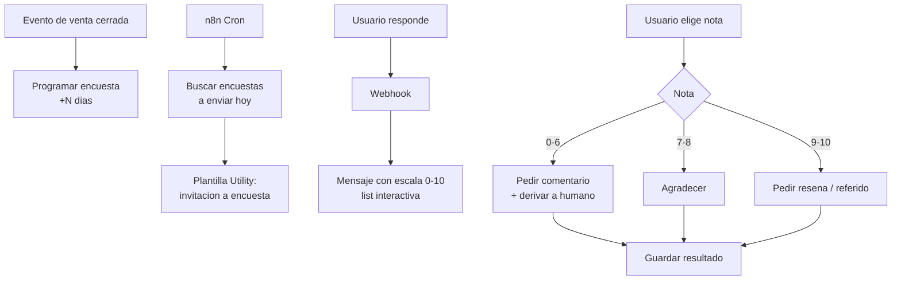

# Receta: Encuesta NPS post-venta

> **TL;DR:** Workflow que envía una encuesta NPS (escala 0-10) por WhatsApp X días después de una compra o servicio, captura la nota con botones/list, pide comentario abierto a los detractores, y agrega todo a un dashboard. Stack: Cloud API + n8n + Postgres. Plantilla Utility para abrir, free-form para el resto dentro de la ventana de 24h.

## Caso de uso

Un negocio quiere medir satisfacción sistemáticamente tras cada venta/servicio. Requisitos:

- Enviar encuesta 1-3 días después de la transacción.
- Capturar nota NPS (0-10) de forma simple.
- A los detractores (0-6), pedir feedback abierto y derivar a atención.
- A los promotores (9-10), invitar a dejar reseña.
- Consolidar resultados para reporting.

## Sobre NPS

| Categoría | Nota | Acción |
|---|---|---|
| Detractor | 0-6 | Recuperar: pedir feedback, derivar a humano |
| Pasivo | 7-8 | Agradecer |
| Promotor | 9-10 | Aprovechar: pedir reseña / referido |

`NPS = %promotores − %detractores`.

## Arquitectura



## Schema

```sql
CREATE TABLE nps_surveys (
  id UUID PRIMARY KEY DEFAULT gen_random_uuid(),
  customer_name TEXT NOT NULL,
  customer_phone TEXT NOT NULL,
  transaction_ref TEXT,                  -- id de la venta/servicio
  scheduled_for DATE NOT NULL,
  sent_at TIMESTAMPTZ,
  responded_at TIMESTAMPTZ,
  score INT,                             -- 0-10
  category TEXT,                         -- detractor | passive | promoter
  comment TEXT,
  status TEXT NOT NULL DEFAULT 'scheduled',
    -- scheduled | sent | awaiting_score | awaiting_comment | completed | expired
  created_at TIMESTAMPTZ DEFAULT now()
);

CREATE INDEX idx_nps_due ON nps_surveys(scheduled_for, status)
  WHERE status = 'scheduled';
```

## Plantilla HSM

| Atributo | Valor |
|---|---|
| Nombre | `encuesta_satisfaccion` |
| Categoría | **Utility** (responde a una transacción del usuario) |

Componentes:

| Componente | Contenido |
|---|---|
| Body | `Hola {{1}}, gracias por elegir {{NEGOCIO}}. ¿Nos ayudás con una breve encuesta sobre tu experiencia con {{2}}? Toma 30 segundos.` |
| Buttons | `QUICK_REPLY: Responder encuesta` · `QUICK_REPLY: Ahora no` |

Variables: `{{1}}` nombre, `{{2}}` producto/servicio.

> Nota: en algunos mercados las encuestas pueden requerir categoría Marketing. Si Meta la re-categoriza, aceptarlo. Ver [`05-plantillas-hsm/categorias.md`](../05-plantillas-hsm/categorias.md).

## Workflow 1: programar y enviar

### Programación

Cuando se cierra una venta (webhook del e-commerce / CRM / carga manual):

```sql
INSERT INTO nps_surveys (customer_name, customer_phone, transaction_ref, scheduled_for)
VALUES ('{{nombre}}', '{{telefono}}', '{{ref}}', current_date + interval '2 days');
```

### Envío (Cron)

1. **Cron**: una vez al día, en horario hábil.
2. **Postgres SELECT**:
   ```sql
   SELECT * FROM nps_surveys
   WHERE status = 'scheduled' AND scheduled_for <= current_date;
   ```
3. **Loop** con rate limiting.
4. **HTTP Request** a Cloud API: enviar plantilla `encuesta_satisfaccion`.
5. **Postgres UPDATE**: `status='sent', sent_at=now()`.

## Workflow 2: capturar respuestas

### Paso A: el usuario acepta responder

1. Webhook → parsear → `button_reply.id === 'Responder encuesta'`.
2. Buscar la encuesta `sent` de ese teléfono.
3. Enviar mensaje interactivo con la escala. Como list (0-10 son 11 opciones, una list permite 10 filas → usar dos secciones, o dividir):

Opción práctica: **list con 11 filas no entra** (máx 10). Alternativas:

| Alternativa | Detalle |
|---|---|
| Pedir que escriban un número 0-10 | Texto libre, parsear |
| List 0-10 dividida en 2 mensajes | Engorroso |
| List con rangos (`0-3`, `4-6`, `7-8`, `9-10`) | Pierde granularidad |
| **Recomendado:** texto libre "Respondé con un número del 0 al 10" | Simple, universal |

4. `status='awaiting_score'`.

### Paso B: el usuario manda la nota

1. Webhook → el usuario responde con un número.
2. Parsear y validar `0 <= score <= 10`. Si no es válido, repreguntar.
3. Calcular categoría:
   ```javascript
   const category = score <= 6 ? 'detractor'
                  : score <= 8 ? 'passive'
                  : 'promoter';
   ```
4. `UPDATE ... SET score, category, responded_at=now()`.
5. Ramificar según categoría.

### Paso C: ramas por categoría

| Categoría | Mensaje + acción |
|---|---|
| Detractor | `Lamentamos que la experiencia no haya sido buena. ¿Nos contás qué pasó? Tu comentario nos ayuda a mejorar.` → `status='awaiting_comment'` + alerta a atención |
| Pasivo | `¡Gracias por tu respuesta, {{nombre}}! Cualquier sugerencia es bienvenida.` → `status='completed'` |
| Promotor | `¡Nos alegra mucho, {{nombre}}! ¿Nos dejarías una reseña? {{LINK_RESEÑA}}` → `status='completed'` |

### Paso D: comentario del detractor

1. Webhook → texto libre del usuario en `status='awaiting_comment'`.
2. `UPDATE ... SET comment, status='completed'`.
3. Agradecer: `Gracias por tu tiempo. Un responsable se va a contactar con vos.`
4. Crear ticket / notificar a atención con el comentario.

## Manejo de no-respuesta

| Situación | Acción |
|---|---|
| Encuesta `sent` sin respuesta en 48h | `status='expired'` |
| `awaiting_score` sin respuesta en 24h | `status='expired'` |
| No reenviar | Una encuesta por transacción, sin insistir |

## Variables de entorno

| Variable | Descripción | Secreto |
|---|---|---|
| `WA_ACCESS_TOKEN` | Token System User | Sí |
| `WA_PHONE_NUMBER_ID` | ID del número | No |
| `WA_APP_SECRET` | Validación de firma | Sí |
| `POSTGRES_URL` | Connection string | Sí |
| `REVIEW_LINK` | URL de reseña (Google, etc.) | No |
| `SUPPORT_NOTIFY_WEBHOOK` | Canal para alertas de detractores | Sí |
| `BUSINESS_NAME` | Nombre del negocio | No |

## Cómo probar

1. Insertar una encuesta con `scheduled_for = current_date`.
2. Ejecutar el Cron → verificar plantilla recibida.
3. Tocar "Responder encuesta" → verificar mensaje pidiendo nota.
4. Responder `10` → verificar categoría `promoter` + mensaje con link de reseña.
5. Repetir con `3` → verificar `detractor`, pedido de comentario, alerta a soporte.
6. Mandar el comentario → verificar `status='completed'` y ticket creado.
7. Responder con texto inválido (`"genial"`) → verificar repregunta.

## Dashboard / reporting

Query base para el NPS del período:

```sql
SELECT
  count(*) FILTER (WHERE category = 'promoter')  AS promoters,
  count(*) FILTER (WHERE category = 'passive')   AS passives,
  count(*) FILTER (WHERE category = 'detractor') AS detractors,
  count(*) FILTER (WHERE score IS NOT NULL)      AS total_responses,
  round(
    100.0 * count(*) FILTER (WHERE category = 'promoter') / nullif(count(*) FILTER (WHERE score IS NOT NULL),0)
    - 100.0 * count(*) FILTER (WHERE category = 'detractor') / nullif(count(*) FILTER (WHERE score IS NOT NULL),0)
  , 1) AS nps
FROM nps_surveys
WHERE responded_at >= date_trunc('month', current_date);
```

| Métrica | Cálculo |
|---|---|
| NPS | `%promotores − %detractores` |
| Tasa de respuesta | `responded / sent` |
| Comentarios de detractores | Lista para acción cualitativa |

## Costos

| Concepto | Estimación |
|---|---|
| 1 conversación Utility por encuesta | ~$0.02-0.04 (AR) |
| 1.000 encuestas/mes | ~$20-40 |
| Hosting | ~$15-25/mes |

## Errores comunes

| Error | Causa | Solución |
|---|---|---|
| Nota fuera de rango aceptada | Sin validación | Validar `0-10`, repreguntar |
| Encuesta enviada 2 veces | Sin idempotencia por `transaction_ref` | UNIQUE constraint |
| Detractor sin seguimiento | Falta la alerta a soporte | Agregar notificación |
| Mensajes post-plantilla fallan | Ventana cerrada (usuario tardó > 24h) | Aceptar que la encuesta expire |
| Re-categorización a Marketing | Contenido percibido como promo | Aceptar o ajustar copy |

## Variantes

| Variante | Cambio |
|---|---|
| CSAT en vez de NPS | Escala 1-5 con emojis vía buttons (1-3 son ≤3 botones, usar list) |
| Con Flow | Encuesta multi-pregunta en un Flow ([`04-mensajeria/flows.md`](../04-mensajeria/flows.md)) |
| Con análisis de sentimiento | Pasar el comentario por OpenAI para clasificar y etiquetar |
| Sobre Kommo | La encuesta como etapa final del pipeline |

## Referencias

- [`04-mensajeria/interactivos.md`](../04-mensajeria/interactivos.md)
- [`05-plantillas-hsm/categorias.md`](../05-plantillas-hsm/categorias.md)
- [`06-politicas-y-calidad/ventana-24h.md`](../06-politicas-y-calidad/ventana-24h.md)
- [`09-recetas/recordatorios-turnos.md`](./recordatorios-turnos.md)
