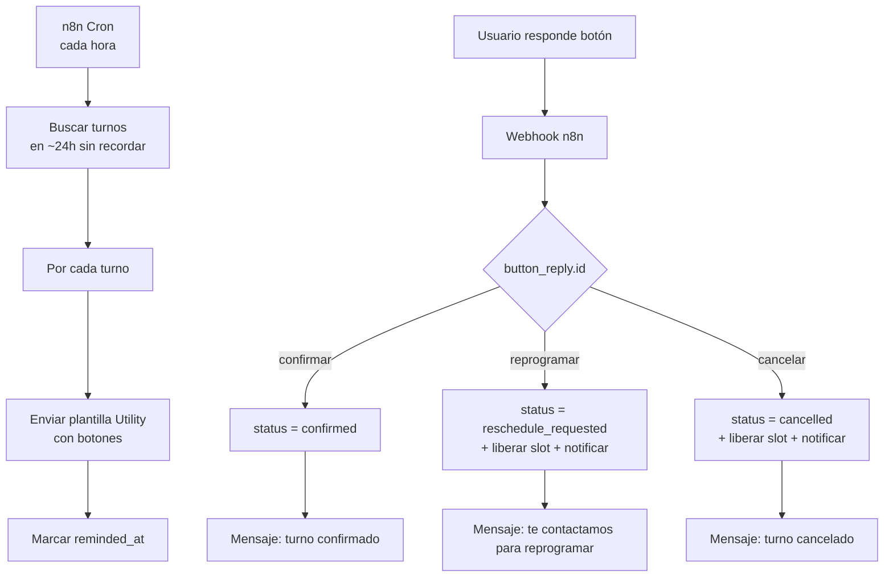

# Receta: Recordatorios de turnos con confirmación

> **TL;DR:** Workflow programado que envía una plantilla Utility recordando un turno, con botones Confirmar / Reprogramar / Cancelar. La respuesta del usuario actualiza el estado del turno en la base y dispara acciones (liberar slot, notificar al negocio). Stack: Cloud API + n8n + Postgres. No necesita IA.

## Caso de uso

Un consultorio / peluquería / taller agenda turnos y quiere reducir el ausentismo (no-shows). Requisitos:

- Enviar recordatorio 24h antes del turno.
- Botones para que el cliente confirme, reprograme o cancele.
- Si cancela o reprograma, liberar el slot automáticamente.
- Notificar al negocio de cancelaciones.
- Sin no-shows silenciosos.

## Por qué este stack

- **Cloud API**: plantilla Utility (transaccional, barata, alta aprobación).
- **n8n con Cron**: el disparo es programado, no reactivo.
- **Postgres**: fuente de verdad de los turnos.
- **Sin IA**: el flujo es determinístico; agregar OpenAI sería sobre-ingeniería.

## Arquitectura



## Schema de turnos

```sql
CREATE TABLE appointments (
  id UUID PRIMARY KEY DEFAULT gen_random_uuid(),
  customer_name TEXT NOT NULL,
  customer_phone TEXT NOT NULL,          -- E.164 sin +
  service TEXT NOT NULL,
  starts_at TIMESTAMPTZ NOT NULL,
  status TEXT NOT NULL DEFAULT 'scheduled',
    -- scheduled | confirmed | reschedule_requested | cancelled | completed | no_show
  reminded_at TIMESTAMPTZ,
  responded_at TIMESTAMPTZ,
  wa_message_id TEXT,                    -- wamid del recordatorio enviado
  created_at TIMESTAMPTZ DEFAULT now()
);

CREATE INDEX idx_appointments_reminder
  ON appointments(starts_at, status)
  WHERE reminded_at IS NULL;
```

## Plantilla HSM necesaria

| Atributo | Valor |
|---|---|
| Nombre | `recordatorio_turno` |
| Categoría | **Utility** |
| Idioma | `es_AR` (o el que corresponda) |

Componentes:

| Componente | Contenido |
|---|---|
| Body | `Hola {{1}}, te recordamos tu turno de {{2}} el {{3}} a las {{4}}. Por favor confirmá tu asistencia.` |
| Footer | `Si no podés asistir, avisanos con tiempo.` |
| Buttons | `QUICK_REPLY: Confirmar` · `QUICK_REPLY: Reprogramar` · `QUICK_REPLY: Cancelar` |

Variables: `{{1}}` nombre, `{{2}}` servicio, `{{3}}` fecha, `{{4}}` hora.

Sample para aprobación: `["María", "corte de pelo", "viernes 23/05", "15:30"]`.

Criterios de aprobación: ver [`05-plantillas-hsm/aprobacion.md`](../05-plantillas-hsm/aprobacion.md). Utility transaccional con acción del usuario → aprobación alta.

## Workflow 1: enviar recordatorios (Cron)

### Nodos

1. **Cron**: cada hora (o cada 30 min).
2. **Postgres SELECT**:
   ```sql
   SELECT * FROM appointments
   WHERE reminded_at IS NULL
     AND status = 'scheduled'
     AND starts_at BETWEEN now() + interval '23 hours'
                       AND now() + interval '25 hours';
   ```
3. **Loop / Split In Batches**: procesar de a uno (respetar rate limit).
4. **HTTP Request** a Cloud API: enviar plantilla `recordatorio_turno`.
   ```json
   {
     "messaging_product": "whatsapp",
     "to": "{{ $json.customer_phone }}",
     "type": "template",
     "template": {
       "name": "recordatorio_turno",
       "language": { "code": "es_AR" },
       "components": [{
         "type": "body",
         "parameters": [
           { "type": "text", "text": "{{ $json.customer_name }}" },
           { "type": "text", "text": "{{ $json.service }}" },
           { "type": "text", "text": "{{ fechaFormateada }}" },
           { "type": "text", "text": "{{ horaFormateada }}" }
         ]
       }]
     }
   }
   ```
5. **Postgres UPDATE**: `SET reminded_at = now(), wa_message_id = {{respuesta.messages[0].id}}`.
6. **Wait** entre envíos si el batch es grande.

### Ventana horaria

No enviar recordatorios de madrugada. En el Cron o en el SELECT, filtrar para que el envío caiga entre las 9 y las 21 hora local del cliente. Si el turno es a las 8 AM, el recordatorio de "24h antes" caería a las 8 AM del día previo: aceptable.

## Workflow 2: procesar respuestas (Webhook)

### Nodos

1. **Webhook trigger** (compartido con el resto del sistema, o dedicado).
2. **Validar firma + dedup** (ver [`07-integraciones/n8n/webhook-entrante.md`](../07-integraciones/n8n/webhook-entrante.md)).
3. **Parsear**: extraer `from`, `interactive.button_reply.id`, `context.id` (el wamid del recordatorio que se está respondiendo).
4. **Postgres SELECT**: buscar el turno por `wa_message_id = context.id` (o por `customer_phone` + turno futuro más cercano).
5. **Switch** sobre `button_reply.id`:

| `id` | Acción |
|---|---|
| `Confirmar` | `UPDATE ... SET status='confirmed', responded_at=now()` |
| `Reprogramar` | `UPDATE ... SET status='reschedule_requested', responded_at=now()` + liberar slot + notificar negocio |
| `Cancelar` | `UPDATE ... SET status='cancelled', responded_at=now()` + liberar slot + notificar negocio |

6. **HTTP Request** a Cloud API: responder al usuario (free-form, estamos dentro de la ventana de 24h porque el usuario acaba de escribir).

### Mensajes de respuesta

| Acción | Mensaje al usuario |
|---|---|
| Confirmar | `¡Gracias {{nombre}}! Tu turno quedó confirmado. Te esperamos.` |
| Reprogramar | `Perfecto, te contactamos a la brevedad para coordinar una nueva fecha.` |
| Cancelar | `Tu turno fue cancelado. Cuando quieras agendar de nuevo, escribinos.` |

### Notificación al negocio

Para reprogramar / cancelar, notificar al equipo (Slack, email, o mensaje WA a un número interno):

```
[Turno cancelado] María (5491133334444) · corte de pelo · viernes 23/05 15:30
```

## Manejo de no-respuesta

Si el cliente no responde el recordatorio:

| Opción | Implementación |
|---|---|
| Segundo recordatorio | Cron que reenvía 3h antes si `status` sigue `scheduled` y no `responded_at` |
| Marcar como riesgo | Reporte para el negocio de turnos sin confirmar |
| No-show automático | Tras la hora del turno, si nunca confirmó, `status='no_show'` (configurable) |

Cuidado: no abusar de recordatorios (máximo 2). Spam = quality drop.

## Variables de entorno

| Variable | Descripción | Secreto |
|---|---|---|
| `WA_ACCESS_TOKEN` | Token del System User | Sí |
| `WA_PHONE_NUMBER_ID` | ID del número | No |
| `WA_VERIFY_TOKEN` | Verify token webhook | Sí |
| `WA_APP_SECRET` | Para validar firma | Sí |
| `POSTGRES_URL` | Connection string | Sí |
| `BUSINESS_NOTIFY_WEBHOOK` | Slack / canal de notificación interna | Sí |
| `TIMEZONE` | Zona horaria del negocio | No |

## Cómo probar

1. Insertar un turno de prueba con `starts_at = now() + 24h` y `reminded_at = NULL`.
2. Ejecutar el workflow Cron manualmente → verificar que llega la plantilla con botones.
3. Verificar `reminded_at` actualizado.
4. Tocar "Confirmar" → verificar `status='confirmed'` y mensaje de respuesta.
5. Repetir con otro turno tocando "Cancelar" → verificar liberación de slot y notificación al negocio.
6. Probar el caso de turno con `starts_at` fuera de la ventana de 24h → no debe enviarse.
7. Re-ejecutar el Cron → verificar que NO reenvía a turnos ya `reminded_at`.

## Métricas a trackear

| Métrica | Cálculo |
|---|---|
| Tasa de confirmación | `confirmed / reminded` |
| Tasa de cancelación temprana | `cancelled / reminded` |
| Tasa de no-show | `no_show / total` |
| Reducción de no-shows | Comparar con baseline pre-recordatorios |

## Costos

| Concepto | Estimación |
|---|---|
| Conversación Utility por recordatorio | Según país; en AR ~$0.02-0.04 |
| 1.000 recordatorios/mes | ~$20-40 |
| Hosting (n8n + Postgres) | ~$15-25/mes |

ROI: cada no-show evitado suele valer mucho más que el costo del recordatorio.

## Errores comunes

| Error | Causa | Solución |
|---|---|---|
| Recordatorios duplicados | `reminded_at` no se actualiza o Cron solapa | UPDATE inmediato tras envío; lock en el SELECT |
| Recordatorio a las 3 AM | Sin filtro de ventana horaria | Filtrar por hora local |
| Respuesta del usuario no matchea el turno | `context.id` no guardado | Guardar `wa_message_id` al enviar |
| Plantilla rechazada | Categoría Marketing en vez de Utility | Re-enviar como Utility |
| Botón "Cancelar" no libera slot | Falta la lógica de liberación | Agregar UPDATE del slot |
| 131047 al responder | Confusión: el usuario tocó botón = ventana abierta | Responder free-form normal |

## Variantes

| Variante | Cambio |
|---|---|
| Con reprogramación self-service | Reemplazar "te contactamos" por un Flow de reserva ([`04-mensajeria/flows.md`](../04-mensajeria/flows.md)) |
| Multi-sucursal | Agregar `branch_id` al schema y a la notificación |
| Con IA para reprogramar | Bot conversacional que ofrece slots; ver [`bot-atencion-handoff.md`](./bot-atencion-handoff.md) |
| Sobre Kommo | Turnos como leads; recordatorio disparado por Digital Pipeline |

## Referencias

- [Send Message Templates](https://developers.facebook.com/docs/whatsapp/cloud-api/guides/send-message-templates) — Verificado 2026-05-20.
- [`05-plantillas-hsm/estructura.md`](../05-plantillas-hsm/estructura.md)
- [`06-politicas-y-calidad/ventana-24h.md`](../06-politicas-y-calidad/ventana-24h.md)
- [`07-integraciones/n8n/patrones.md`](../07-integraciones/n8n/patrones.md)
