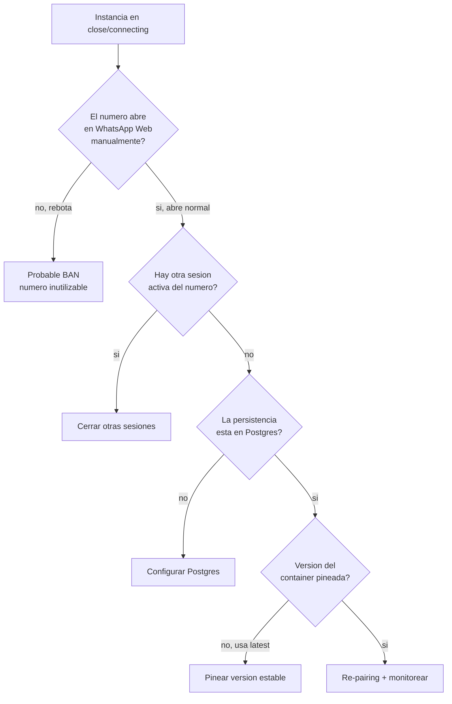

# Troubleshooting: Evolution API pierde la sesión

> **TL;DR:** Evolution se conecta como un dispositivo vinculado de WhatsApp; las caídas de sesión son inherentes a esa naturaleza. Causas frecuentes: múltiples sesiones del mismo número, persistencia mal configurada, versión del container con bugs, throttling de WhatsApp, o ban. Mitigación: persistencia en Postgres, pinear versión, un solo uso del número, reaccionar a `CONNECTION_UPDATE`.

## Contexto

A diferencia de Cloud API (gestionada por Meta, sin "sesión" que se caiga), Evolution mantiene una conexión WebSocket viva contra los servidores de WhatsApp, como lo haría WhatsApp Web. Esa conexión es frágil por diseño. Este documento es para distinguir un problema **resoluble** de un **ban**.

## Estados de conexión

`GET /instance/connectionState/{instance}` devuelve:

| Estado | Significado |
|---|---|
| `open` | Conectado y operativo |
| `connecting` | Intentando conectar |
| `close` | Desconectado |

El evento webhook `CONNECTION_UPDATE` reporta cambios en tiempo real.

## Árbol de diagnóstico



## Causa 1: múltiples sesiones del mismo número

La más común. WhatsApp permite varios dispositivos vinculados, pero Evolution + alguien abriendo WhatsApp Web + la app del celular puede generar conflictos y desconexiones.

| Síntoma | Solución |
|---|---|
| Sesión se cae cuando alguien usa el número | **Un solo uso**: el número es exclusivo de Evolution |
| Cae al escanear WhatsApp Web | No abrir WhatsApp Web con ese número |
| Cae al reinstalar la app en el celular | El celular del número no debe re-registrar WhatsApp |

**Regla:** un número dedicado solo a Evolution, sin nadie usándolo en paralelo.

## Causa 2: persistencia mal configurada

Si la sesión no se persiste, cada reinicio del container pide QR de nuevo.

| Check | Valor correcto |
|---|---|
| `DATABASE_PROVIDER` | `postgresql` |
| `DATABASE_CONNECTION_URI` | URI válida, schema dedicado |
| `CACHE_REDIS_ENABLED` | `true` |
| `CACHE_REDIS_URI` | URI válida |
| `INSTANCE_EXPIRATION_TIME` | `false` |
| `DEL_INSTANCE` | `false` |

Con esto, la sesión sobrevive a reinicios. Sin esto, tras cada redeploy hay que re-escanear.

## Causa 3: versión del container con bugs

WhatsApp cambia su protocolo del lado servidor; Baileys (base de Evolution) tiene que adaptarse. Una versión vieja o una `latest` recién publicada pueden tener bugs.

| Práctica | Detalle |
|---|---|
| Pinear versión | `atendai/evolution-api:v2.x.x`, no `:latest` |
| Seguir el repo | Issues de GitHub reportan regresiones |
| Actualizar planificado | No auto-actualizar en producción |
| Probar en staging | Antes de subir versión en prod |

## Causa 4: throttling de WhatsApp

Si Evolution manda muchos mensajes muy rápido, WhatsApp puede cortar la sesión como medida defensiva (antesala del ban).

| Síntoma | Solución |
|---|---|
| Cae durante envíos masivos | Bajar la cadencia drásticamente |
| Cae tras enviar a muchos números nuevos | No hacer blast; Evolution no es para eso |

Ver buenas prácticas anti-ban en [`03-formas-de-uso/evolution-api.md`](../03-formas-de-uso/evolution-api.md).

## Causa 5: ban del número

El peor caso. Cómo confirmarlo:

1. Tomar el número físicamente (el SIM/celular).
2. Intentar abrir WhatsApp normal con él.
3. Si WhatsApp dice "este número no puede usar WhatsApp" o rebota el registro → **banneado**.

Un número banneado **no se recupera** desde Evolution. Hay que:

- Usar otro número.
- Revisar qué causó el ban (blast, contenido, reportes) para no repetirlo.

## Cómo reconectar correctamente

Si descartaste ban y querés re-vincular:

```bash
# 1. Verificar estado
curl -X GET "https://{{EVO_HOST}}/instance/connectionState/{{INSTANCE}}" \
  -H "apikey: {{API_KEY}}"

# 2. Si esta en close, intentar reconectar
curl -X GET "https://{{EVO_HOST}}/instance/connect/{{INSTANCE}}" \
  -H "apikey: {{API_KEY}}"
```

`/instance/connect` devuelve QR o `pairingCode`.

**Preferir pairing code sobre QR**: más estable, no requiere cámara.

```bash
curl -X GET "https://{{EVO_HOST}}/instance/connect/{{INSTANCE}}?number={{NUMERO_E164}}" \
  -H "apikey: {{API_KEY}}"
```

Ingresar el code en el celular: WhatsApp → Dispositivos vinculados → Vincular dispositivo → Vincular con número de teléfono.

## Logout vs delete

| Operación | Efecto |
|---|---|
| `DELETE /instance/logout/{instance}` | Cierra sesión, **mantiene** la instancia y su config |
| `DELETE /instance/delete/{instance}` | Borra la instancia entera |

Para re-vincular sin perder configuración: logout, luego connect. No delete.

## Monitoreo proactivo

Reaccionar a `CONNECTION_UPDATE` por webhook:

```javascript
// En el handler del webhook de Evolution
if (body.event === 'connection.update') {
  const state = body.data?.state;
  if (state === 'close' || state === 'connecting') {
    await alertTeam(`Evolution instancia ${body.instance}: ${state}`);
  }
}
```

Healthcheck periódico (Cron en n8n cada 5 min):

```javascript
const res = await fetch(`${EVO_HOST}/instance/connectionState/${instance}`, {
  headers: { apikey: API_KEY }
});
const { instance: inst } = await res.json();
if (inst?.state !== 'open') {
  await alertTeam(`Evolution ${instance} no esta open: ${inst?.state}`);
}
```

## Backup de la sesión

Con persistencia en Postgres, la sesión vive en la DB. Backup regular:

```bash
pg_dump "{{DATABASE_URL}}" --schema=evolution > evolution-backup.sql
```

Si el container muere, al restaurar la DB y levantar de nuevo, la sesión se recupera **sin re-escanear** (si WhatsApp no la invalidó).

## Tabla resumen de causas

| Causa | Cómo se detecta | Resoluble |
|---|---|---|
| Múltiples sesiones | Cae al usar el número en otro lado | Sí: uso exclusivo |
| Persistencia mal | Pide QR tras cada reinicio | Sí: configurar Postgres |
| Versión con bug | Cae sin razón, issues en GitHub | Sí: pinear/actualizar |
| Throttling | Cae durante envíos rápidos | Sí: bajar cadencia |
| Ban | El número no abre WhatsApp ni manual | No: usar otro número |

## Cuándo migrar a Cloud API

Si la inestabilidad de Evolution te está costando más que lo que ahorrás, es señal de migrar:

| Señal | |
|---|---|
| Caídas frecuentes que afectan al cliente | |
| El cliente necesita confiabilidad real | |
| Estás haciendo envíos que justifican HSM | |
| El número ya fue banneado una vez | |

Ver [`03-formas-de-uso/cloud-api-oficial.md`](../03-formas-de-uso/cloud-api-oficial.md).

## Errores comunes

| Error / Síntoma | Causa | Solución |
|---|---|---|
| Pide QR tras cada redeploy | Sin persistencia | Configurar Postgres + Redis |
| `state: connecting` eterno | QR expirado o conflicto de sesión | Logout + connect con pairing code |
| Cae cada noche a la misma hora | Reinicio del container o cron interno | Revisar restart policy de Railway |
| Re-vinculé y se cae de nuevo en minutos | Probable ban | Verificar el número manualmente |
| `apikey` rechazada al reconectar | Header mal | Usar exactamente `apikey` |
| Funciona pero no llegan mensajes | Webhook desconfigurado tras reconexión | Re-setear webhook de la instancia |

## Referencias

- [Evolution API Docs](https://doc.evolution-api.com/) — Verificado 2026-05-20.
- [Evolution API · GitHub Issues](https://github.com/EvolutionAPI/evolution-api/issues) — Verificado 2026-05-20.
- [`03-formas-de-uso/evolution-api.md`](../03-formas-de-uso/evolution-api.md)
- [`08-despliegue/railway/plantilla-evolution-api.md`](../08-despliegue/railway/plantilla-evolution-api.md)
