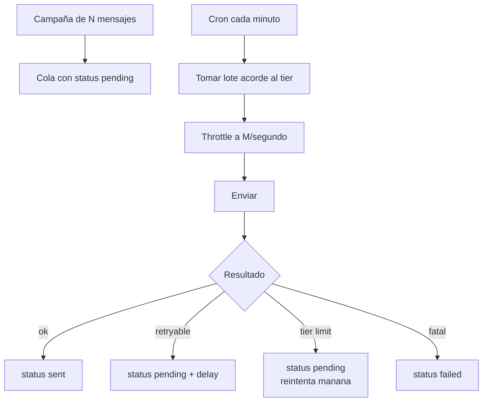

# Troubleshooting: rate limits

> **TL;DR:** Tres familias de límite: **throughput** de la API (mensajes/segundo), **tier de mensajería** (conversaciones nuevas/día), y **pair rate limit** (mensajes al mismo usuario en poco tiempo). Códigos: 4, 80007, 130429, 131056, 131048. Solución: throttling client-side + backoff exponencial + respetar el tier + no insistir al mismo usuario.

## Tipos de límite

| Límite | Qué mide | Código típico |
|---|---|---|
| Throughput de la API | Requests / mensajes por segundo | 80007, 130429 |
| App-level rate limit | Calls totales de la App | 4 |
| Tier de mensajería | Conversaciones business-initiated nuevas / 24h | 131045 |
| Pair rate limit | Mensajes al mismo destinatario en poco tiempo | 131056 |
| Spam rate limit | Calidad muy baja | 131048 |

## 1. Throughput de la API

### Cuál es el límite

Cloud API soporta picos altos pero con un techo. Como referencia práctica:

| Métrica | Valor referencial |
|---|---|
| Burst corto | Hasta ~80 mensajes/segundo por número |
| Sostenido | Depende del tier; mantener < 50/s sostenido como regla |

**Verificado: 2026-05-20** — Meta ajusta esto; no hardcodear suposiciones.

### Síntoma

- Error `80007` (`Rate limit hit`) o `130429` (`Too many messages`).
- Aparece en envíos masivos rápidos.

### Solución

| Técnica | Detalle |
|---|---|
| Throttling client-side | Limitar a N envíos/segundo desde tu lado |
| Cola con concurrencia | n8n queue mode con `concurrency` acotada |
| Espaciar batches | Split In Batches + Wait |
| Backoff al recibir el error | Pausar y reintentar |

Throttle simple con token bucket en Redis:

```javascript
async function acquireSlot(phoneNumberId, maxPerSecond = 40) {
  const now = Math.floor(Date.now() / 1000);
  const key = `wa:rate:${phoneNumberId}:${now}`;
  const count = await redis.incr(key);
  if (count === 1) await redis.expire(key, 2);
  if (count > maxPerSecond) {
    await sleep(1000);
    return acquireSlot(phoneNumberId, maxPerSecond);
  }
}
```

## 2. App-level rate limit (código 4)

### Síntoma

- Error `4` (`Application request limit reached`).
- Suele aparecer cuando la **App** (no solo el número) hace demasiadas calls, incluyendo lecturas (`GET` de plantillas, números, etc.).

### Solución

| Técnica | Detalle |
|---|---|
| Cachear lecturas | No consultar plantillas / estado en cada mensaje; cachear con TTL |
| Reducir polling | No pollear estados cada segundo |
| Distribuir en el tiempo | Tareas batch fuera de horario pico |
| Backoff | Esperar y reintentar |

El header `X-Business-Use-Case-Usage` (en respuestas de Graph API) trae porcentajes de uso; monitorearlo permite anticipar el límite.

## 3. Tier de mensajería (código 131045)

### Síntoma

- Error `131045` (`messaging limit reached`).
- Llegaste al tope diario de conversaciones business-initiated nuevas.

### Solución

| Técnica | Detalle |
|---|---|
| Respetar el tier | Consultar `messaging_limit_tier` antes de planificar campañas |
| Distribuir | Repartir envíos a lo largo de 24h |
| Spillover | Lo que no entra hoy, mañana |
| Subir de tier | Mantener volumen + calidad; ver [`02-numeros-y-conexion/tiers-mensajeria.md`](../02-numeros-y-conexion/tiers-mensajeria.md) |
| Multi-número | Repartir audiencia entre varios números |

No es un límite que se resuelve con backoff: si llegaste al tope, esperás 24h.

## 4. Pair rate limit (código 131056)

### Síntoma

- Error `131056` (`pair rate limit hit`).
- Enviaste demasiados mensajes al **mismo destinatario** en poco tiempo.

### Causa

| Causa frecuente | Detalle |
|---|---|
| Loop / bug que reenvía | El bot manda 10 mensajes en 2 segundos |
| Reintentos sin control | Cada fallo dispara otro envío |
| Bot que responde a sus propios mensajes | Procesar tus `out` como `in` |

### Solución

| Técnica | Detalle |
|---|---|
| Lock por usuario | Redis lock mientras procesás a ese destinatario |
| Consolidar mensajes | Un mensaje en vez de cinco |
| Throttle por par | Contador `wa:pair:{user}` con TTL |
| No reintentar este error | `131056` no se resuelve reintentando rápido |

Pattern de consolidación: en vez de mandar "Hola" + "¿Cómo estás?" + "Te cuento las opciones" + lista, mandar **un** mensaje bien armado.

## 5. Spam rate limit (código 131048)

### Síntoma

- Error `131048` (`spam rate limit hit`).
- El número tiene calidad muy baja; Meta restringe envíos.

### Solución

No es throttling: es un problema de **calidad**.

| Acción | Detalle |
|---|---|
| Pausar campañas | Frenar envíos business-initiated |
| Revisar opt-in | Ver [`06-politicas-y-calidad/opt-in.md`](../06-politicas-y-calidad/opt-in.md) |
| Recuperar quality rating | Ver [`06-politicas-y-calidad/quality-rating.md`](../06-politicas-y-calidad/quality-rating.md) |
| Esperar | La recuperación lleva días |

## Backoff exponencial

Para errores transitorios (`4`, `80007`, `130429`, `131016`):

| Intento | Espera |
|---|---|
| 1 | 2s |
| 2 | 4s |
| 3 | 8s |
| 4 | 16s |
| 5+ | Abandonar, enviar a cola de revisión |

```javascript
async function sendWithBackoff(payload, maxRetries = 4) {
  let delay = 2000;
  for (let attempt = 0; attempt <= maxRetries; attempt++) {
    const result = await send(payload);
    if (result.ok) return result;
    const code = result.error?.code;
    const retryable = [4, 80007, 130429, 131000, 131016].includes(code);
    if (!retryable || attempt === maxRetries) return result;
    await sleep(delay);
    delay *= 2;
  }
}
```

Agregar jitter (±20% aleatorio) si tenés muchos clientes para no sincronizar reintentos.

## Errores que NO se resuelven con backoff

| Código | Por qué |
|---|---|
| 131045 | Tier agotado: esperar 24h |
| 131048 | Problema de calidad: arreglar la causa |
| 131056 | Pair limit: dejar de insistir a ese usuario |
| 131026 | Número no usable: saltear |
| 132xxx | Plantilla: arreglar la plantilla |

## Diseño defensivo para envíos masivos



Características:

- La campaña es una cola, no un loop.
- El ritmo lo marca el Cron + throttle, no la velocidad de n8n.
- Se puede pausar/reanudar sin perder progreso.
- Cada error se clasifica: reintentar / posponer / abandonar.

## Monitoreo

| Señal | Cómo |
|---|---|
| `X-Business-Use-Case-Usage` header | Loggear el % de uso por categoría |
| Tasa de errores 4/80007/130429 | Si sube, bajar throughput |
| Conversaciones usadas vs tier | Alertar al 80% del tier |
| Errores 131056 | Indica bug de loop; investigar |

## Errores comunes

| Error | Causa | Solución |
|---|---|---|
| Campaña se llena de errores 80007 | Sin throttle | Limitar a < 40/s |
| 131045 a mitad de campaña | Tier subestimado | Consultar tier, distribuir |
| 131056 en testing | Loop que reenvía al mismo número | Revisar lógica, agregar lock |
| Backoff infinito | Reintentás errores no-retryables | Clasificar antes de reintentar |
| Reintentos sincronizados (todos a la vez) | Sin jitter | Agregar aleatoriedad |

## Referencias

- [Rate Limiting · Graph API](https://developers.facebook.com/docs/graph-api/overview/rate-limiting) — Verificado 2026-05-20.
- [Error Codes · Cloud API](https://developers.facebook.com/docs/whatsapp/cloud-api/support/error-codes) — Verificado 2026-05-20.
- [`10-troubleshooting/codigos-error.md`](./codigos-error.md)
- [`02-numeros-y-conexion/tiers-mensajeria.md`](../02-numeros-y-conexion/tiers-mensajeria.md)
